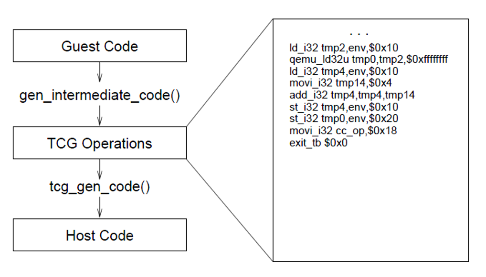
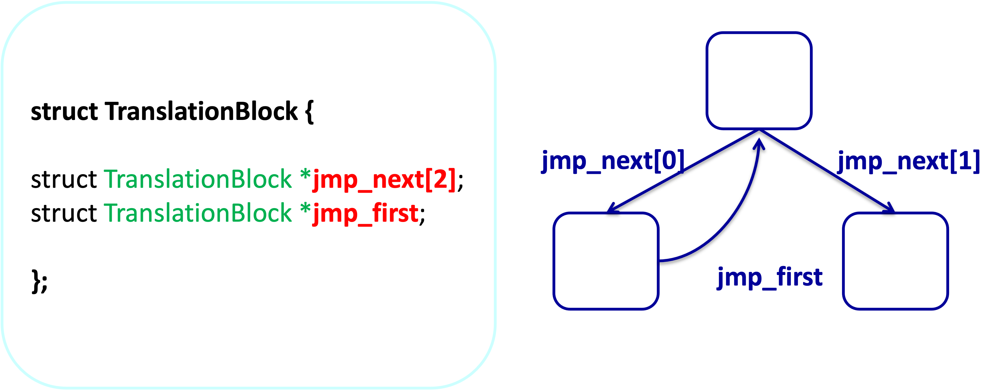

<!-- theme: gaia -->
<!-- _class: lead -->

# 开源操作系统实践


<br>
<br>

向勇
清华大学计算机系
xyong@tsinghua.edu.cn

<br>
<br>


2022年7月

---

<!-- header: ''-->

## 第一讲 二进制翻译与QEMU模拟器

1. 课程介绍
2. 实验介绍
3. 二进制翻译
4. QEMU模拟器
5. QEMU的改进和扩展

---

<!-- header: ''-->

### 1. 课程介绍

#### 教学人员

* 向勇
    * 主讲教师
    * xyong@tsinghua.edu.cn
* 王文智
    * 指导教师
    * wwzcherry@gmail.com
---

<!-- header: '1. 课程介绍'-->

#### 教学交流平台

* 教学操作系统源代码
    * [uCore](https://learningos.github.io/uCore-Tutorial-Guide-2022S/index.html)
    * [rCore](https://learningos.github.io/rCore-Tutorial-Guide-2022S/index.html)
* 课程交流讨论
    * 雨课堂: https://www.yuketang.cn/web/?index
    * 微信群: OsTrain2022summer
    * 石墨文档: https://shimo.im/docs/dPkpKBBow1Sez5qO

---

#### 教学目标

* 通过参与操作系统开源社区的内核开发实践，达到
    * 知识训练
        * 操作系统内核的功能实现
        * 掌握内核开发流程
        * 培养从事内核研发兴趣
    * 能力培养
        * 培养寻找问题、分析问题和解决问题的能力；
        * 开源项目开发中的协作与交流能力
    * 价值塑造：独立思考、认真做事、发现潜力

---

#### 课程介绍

* 教学环节主要包括:
    * 老师讲解
        * 与实验内容相关的知识和背景信息;
    * 同学报告
        * 对已有开发结果的分析情况和测试结果;
        * 同学报告实验设计方案;
* 教学方法的理论基础
    * 项目式学习、自主学习、反思、合作 --《[准备](https://book.douban.com/subject/35110221/)》
    * 目标、现状、选择、意愿 --《[高绩效教练](https://book.douban.com/subject/21264215/)》

---

#### 课程实验选择

完成一件没有现成答案的与操作系统内核相关的工作
* 内核重现、注释、测试和改进
    * 对一项已有的开源操作系统工作进行重现、注释、测试 和改进
    * 查出和修正小错误
* 内核功能扩展
    * 在教学操作系统上扩展你感兴趣的功能
* 自选题目
    * 开源操作系统社区项目

---

#### 课程实验报告提交要求

* 3000字的实验报告
* 在github或gitee上提交
    * 提交结果供大家参考， github上的提交结果可以补充和修改。
* 最迟提交时间：周六(2022-08-06)

---

#### 实验零:选课问卷
* 选课目的问卷:
    * 为什么学开源操作系统实践课？如何学？对自己什么要求？
* 基本情况问卷:
    * 你的学籍类型是什么？以前学习情况？对计算机的看法是什么?
* 教学内容问卷:
    * 你希望在开源操作系统实践课上学到什么知识和什么能力?
    * 你的开源操作系统实践选题意向是什么?
* 自我管理能力问卷:
    * 要求同学具备必要的时间管理能力。你认为这个要求合理吗?

---

#### 2022暑期开源操作系统实践课选课问卷

问卷填写链接：
http://oscourse2019.mikecrm.com/iOJsKhZ

访问密码：
B72kCYzj

---

<!-- header: ''-->

### 2. 实验介绍
1. 课程介绍
2. 实验介绍
3. 二进制翻译
4. QEMU模拟器
5. QEMU的改进和扩展

---

<!-- header: '2. 实验介绍'-->

##### 开源操作系统实践课的实验目标

* 课程目标
    * 知识训练、能力培养、价值塑造
* 教学操作系统实验目标
    * 普适:适用于多种设备和平台
    * 网络:支持多种有线和无线网络
    * 构件化:小系统启动和下载扩展功能
---

<!-- header: '2. 实验介绍'-->

##### 开源操作系统实践课的具体目标

* OS功能完善和扩展
* OS的新硬件平台移植
* OS在线实验平台开发和完善
* OS开发和跟踪分析工具移植
* 开源操作系统社区项目

---

##### OS模块化功能完善

* 可加载内核模块支持的完善
* 将OS中的多种内核模块改成可加载内核模块，并规范模块间的接口。
    * 文件系统(yaffs,fat,sfs:支持多个mount point)
    * 虚拟存储管理中的置换算法
    * 处理机调度算法(cfs, stride, fifo等)
    * 有线网络驱动
* OS动态链接库支持
    * 扩展Rust OS上支持uclibc、bionic libc、图形库等用户库的能力

---

##### OS的新硬件平台移植
* 已支持的板子
    * K210
    * [D1-H哪吒开发板](https://d1.docs.aw-ol.com/d1_dev/)
* 希望支持的RISC-V芯片
    * [勘智k510](https://canaan-creative.com/product/%E5%8B%98%E6%99%BAk510)
    * [SiFive Freedom U740](https://www.sifive.com/cores/u74)
        * [HiFive Unmatched](https://www.sifive.com/boards/hifive-unmatched)
            * Memory: 16GB DDR4
        * StarFive：[VisionFive](https://www.starfivetech.com/site/boards)（昉·星光AI单板计算机）

---

##### OS在线实验平台开发和完善

* 基于虚拟机、docker的实验环境控制和信息采集
* 基于浏览器的RISC-V模拟器
* 基于浏览器的在线实验编程和内核调试环境

---

##### OS开发和跟踪分析工具移植

改进操作系统内核开发工具来检查错误、提高开发效率
* 内核跟踪工具
    * eBPF, ftrace、SystemTap、gprof
* 内核性能和功能分析工具
    * [Callgrpah](https://xyongcn.gitbooks.io/cg-rtl-manual/content/), S2E
    * AddressSanitizer, ThreadSanitizer, MemorySanitizer, etc.
    * [LEP](https://github.com/linuxep/linuxep)： Linux Easy Profiling
* 内核自动测试
    * [Compass-CI](https://gitee.com/openeuler/compass-ci)

---

##### 开源操作系统社区项目
* 全国全国大学生操作系统设计比赛
    * https://github.com/oscomp/os-competition-info
    * https://gitee.com/oscomp/os-competition-info
* 中国软件开源创新大赛
    * https://www.opengcc.org/Content/56.html
* 开源软件供应链点亮计划
    * https://summer.iscas.ac.cn/#/org/projectlist

---

##### 2022春季学期进展

1. 孙宇涛、赖瀚宇、安一帆：[Enclave模式的Rust-TEEOS](https://github.com/OS-2022S-F-1/develop-log/blob/main/%E6%9C%9F%E6%9C%AB%E7%AD%94%E8%BE%A9.pdf)
2. 王之栋、项晨东、孙迅：[基于Intel x86用户态中断的高效进程间通信](https://github.com/OS-F-4/usr-intr/blob/main/ppt/2022-6-11.pptx)
3. 郝子胥、刘宇淏：[rCore Tracing via eBPF](https://github.com/latte-c/conf/blob/main/rCore%20Tracing%20via%20eBPF%20Final.pptx)
4. 刘松铭、于子淳：[zCore多核异步调度器](https://github.com/OSLab-zCore/OSLab-Docs)
5. 李东阳、周宜晖、陈云逸：[FreeRTOS in rust](https://github.com/LDYang694/RFREERTOS/blob/master/docs/R-FreeRTOS%E6%9C%80%E7%BB%88%E6%B1%87%E6%8A%A5.pptx)

---

<!-- header: ''-->

### 3. 二进制翻译

1. 课程介绍
2. 实验介绍
3. 二进制翻译
    1. 图灵机和软件模拟器
    2. 什么是二进制翻译？
    3. 二进制翻译工作原理
    4. 二进制翻译优化
4. QEMU模拟器
5. QEMU的改进和扩展

---

<!-- header: '3. 二进制翻译 - 图灵机和软件模拟器'-->

#### 3.1 图灵机和软件模拟器


[图灵机](https://www.geeksforgeeks.org/turing-machine-in-toc/)：图灵机是一个虚拟的机器。
* 无穷的纸带：纸带上面的每个格子处理数据0、1或者空白三种状态。
* 由有限状态控制的探头：可以执行信息读取、写入和左右移动这3个基本操作。

---

##### 图灵机的机械模装置

[图灵机的机械模装置](https://medium.com/creative-automata/classic-turing-machine-with-tape-erasure-e14870ad154e)


图灵机模拟装置的[演示视频](https://www.zhihu.com/zvideo/1287337736785944576)

---

##### 现代处理器的有限状态机

Intel x86的[通用寄存器组成](https://www.intel.com/content/www/us/en/architecture-and-technology/64-ia-32-architectures-software-developer-vol-3a-part-1-manual.html)和指令集


---


##### 软件模拟器需要解决的问题

- 如何在X86系统上模拟RISC-V指令的执行？
- 如何提高指令翻译的性能？
- 如何减少翻译和执行的切换次数？
- 如何模拟中断及其处理？

---

<!-- header: '3. 二进制翻译 - 什么是二进制翻译？'-->

#### 3.2 什么是二进制翻译？

把一种指令集的二进制代码翻译为另一种指令集的二进制代码的技术

* 常规编译器是，输入源代码，输出目标指令集二进制；二进制翻译器是，一种特殊编译器：输入是二进制，输出也是二进制
* 用软件数据结构和主机指令模拟目标CPU的状态变化


---


##### 二进制翻译技术分类


<!--
| 翻译范围 | 进程级<br>二进制翻译 | 模拟CPU和进程执行环境<br>可进一步细分为同OS、不同OS等 |
| ------ | ------------- | ----------------------------------- |
|        | 系统级<br>二进制翻译      | 模拟完整电脑，包括CPU、内存和设备                  |
| 翻译时机 | 静态二进制翻译       | 通过分析可执行文件实现离线翻译，像翻译著作               |
|        | 动态二进制翻译       | 边运行边翻译，像现场实时同声翻译                    |
|        | 动静结合二进制翻译     | 两者结合                                |
-->

实例：QEMU同时支持进程级翻译和系统级翻译; 属于动态翻译器

---

##### 进程级二进制翻译 vs 系统级二进制翻译


---

##### 静态翻译 vs 动态翻译


---

##### 二进制翻译技术的用途

* 软件兼容：新指令集推广过程中广泛采用这个技术来兼容已有代码 
    * 英特尔：IA32EL翻译i386代码到安腾；Houdini翻译Arm到X86
    * 苹果：Rosetta1翻译PowerPC到X86, Rosetta2翻译X86到Arm
    * 龙芯：X86/MIPS/Arm翻译到LoongArch
* 虚拟化加速：Vmware用二进制翻译解决X86不可经典虚拟化的问题
* 程序分析
    * 辅助调试、性能分析、动态优化、安全加固、反编译等等
    * 相关技术：二进制插桩、二进制重写、JIT(Just In Time)、AOT(Ahead of Time)等
---

<!-- header: '3. 二进制翻译 - 二进制翻译工作原理'-->

#### 3.3 二进制翻译工作原理

##### 如何‘执行’另一种CPU的代码？

* 用一个软件结构模拟目标CPU的所有状态
    * 执行目标CPU指令即根据该指令语义修改这个结构
```C
struct X86CPU {
    reg_t  regs[8];
    reg_t  eip;
    seg_t  segs[6];
    ....
} cpu
```
<!--
* 创造一个模拟运行环境
    * 进程级：内存、OS调用
    * 系统级：内存、设备
-->
---

##### 解释执行


* 每条指令需要百条以上主机指令去解释，效率（解释执行速度/原生执行速度）小于1%
* 案例：开源软件Bochs、shell/perl/java各种解释执行语言

---

##### 二进制翻译（以进程级为例）

模拟目标CPU（仅用户级指令） + 进程执行环境（系统调用、信号等）

* CPU‘执行’
    * 把每条指令翻译为若干条主机指令，达到操纵目标CPU状态的目的
    * 以基本块为单位翻译、缓存翻译结果、静态翻译等优化措施


* 好的翻译器可以做到平均翻译一条目标指令仅用1.x条主机指令
* Rosetta2 >70%；Qemu 定点10%-30%

---

##### 执行


---

##### 执行：运行时环境(以进程级动态翻译为例)

* 处理OS接口
    * 系统调用、信号等


---

<!-- header: '3. 二进制翻译 - 二进制翻译优化'-->

#### 3.4 二进制翻译优化

##### 代码缓存：避免重复翻译


---

##### 以基本块为单位翻译

基本块(basic block)：减少冗余操作，增加优化机会
* 连续的指令
* 以分支/跳转结束


---

##### 寄存器映射(Register Mapping)

X86寄存器映射为指定的LA寄存器，减少访存操作


---

##### 寄存器映射（续）

保存和装入翻译器上下文


---

##### 基本块链接(Block Chaining)

目标：减少切换


---

<!-- header: ''-->

### 4. QEMU模拟器

1. 课程介绍
2. 实验介绍
3. 二进制翻译
4. QEMU模拟器
    1. QEMU框架结构
    2. 动态指令翻译
    3. 块链接
    4. 中断时的块链接取消
5. QEMU的改进和扩展

---

<!-- header: '4. QEMU模拟器 - QEMU框架结构'-->

#### 4.1 QEMU框架结构


##### Virtualization

* OS: A machine is defined by **ISA**
* Compiler: A machine is defined by **ABI** (User ISA + OS calls)
* Application: A machine is defined by **API** (User ISA + Library calls)


---

##### QEMU linux user-mode

* Perform guest/host mapping at the ABI (ISA + system calls) level
* Encapsulate guest process in process-level runtime
* Issues
    * Memory architecture
    * Exception architecture
    * OS call emulation
    * Overall VM architecture
<!--
    * High performance implementation
    * System environments
-->


---

##### Computer System in QEMU


---

##### Implementation of QEMU Linux User-mode


---

<!-- header: ''-->

#### 4.2 动态指令翻译

##### QEMU CPU Events

[Ref](http://www.cs.nthu.edu.tw/~ychung/conference/ICPADS2011.pdf)


---

<!-- header: '4. QEMU模拟器 - 动态指令翻译'-->

##### Shared Resources in CPU Events


<!--
Translated Block (TB)

TCG translation engine (TCG): it is the binary translation engine in system emulator, used by Build for new TB generation or Restore for guest architecture state recovery.

Code Cache (CC): the storage space for TB output after Build, code translation phase. Chain and Unchain will patch the last branch instruction of a TB directly in code cache; while Flush and Invalidate erase one or more TB.

TB Descriptor (TBD): it holds the meta-information of a TB in code cache, e.g. starting guest PC value of TB. It is an identification for TB and being initialized in Build, updated at Chain or Unchain (to the fields of chaining status), and reset in Flush or Invalidate.

TB Descriptor Array (TBDA): to simplify the management of TB descriptors, array of descriptors will be pre- allocated during QEMU initialization phase. Build will consume one entry for the new TB. If no entry is available, Flush will be triggered to reclaim all descriptors, by dropping all TBs in code cache.

TB Hash Table (TBHT): it is the central hash table in key of guest PC value that Find Slow searches after Find Fast fails. Every in-use TBD has an index in this hash table to reference to, and states modifying a TBD would update its index, correspondingly.

TB Descriptor Pointer (TBDP): it is a field private to each guest core that holds the index (duplicated from previous hash table) to recently-used TBD. It speeds up the TB lookup for guest loop code, as Find Fast will check this field first before Find Slow searches the central hash table.

Memory Page Descriptor (MPD): to accelerate the detection of guest SMC activity, emulator must efficiently find all offended TBs for every guest write that changes the guest code already being translated in code cache. QEMU uses this descriptor to record TBs having codes lying in the same guest page. Only the TBs in the same MPD will be check for possible SMC write. Again, Build inserts new TB to a descriptor; while Invalidate and Flush delete them.
-->

---

##### QEMU JIT: code generation and system emulation

* TCG (Tiny Code Generator)
    * a generic backend for a C compiler. It was simplified to be used in QEMU.
* Translation Block (TB)
    * A TCG "basic block" corresponds to a list of instructions **terminated by a branch instruction**.
* 16Mb code cache size

<!--
QEMU: Just-In-Time code generation and system emulation
-->

---

##### QEMU JIT: Prologue & Epilogue


<!--
prologue
①Literature 序言
②(to a race, fight, debate)开端

epilogue
①Literature 后记
②figurative (conclusion)总结
-->

---

##### QEMU JIT – code gen flow 

* Front-end: qemu/tcg/tcg.c
* gen_intermediate_code -> disas_XXX_insn
    * Interprete source instruction and translate to micro-ops.
* Translation stops when a conditional branch is encountered.


<!--
-->

---

##### QEMU JIT – code gen flow

* tcg_liveness_analysis
    * Remove dead code.
        * Ex. `and_i32 t0, t0, $0xffffffff`
        * Ex. `add_i32 t0, t1, t2  add_i32 t0, t0, $1  mov_i32 t0, $1`



<!--
-->

---

##### QEMU JIT – code gen flow

* Register mapping
    * register struct CPUNDS32State *env asm(r14);
    * register target_ulong T0 asm(r15);
    * register target_ulong T1 asm(r12);
    * register target_ulong T2 asm(r13);


<!--
-->

---

<!-- header: ''-->

#### 4.3 块链接

##### QEMU JIT – Block chaining

* Avoid context-switch overhead
* Every time a block returns, try to chain it.
* tb_add_jump(): back-patch the native jump address


<!--
-->

---

<!-- header: '4. QEMU模拟器 - 块链接'-->

##### How block chaining is done?

QEMU uses the last two bits of the **pointer** to TranslationBlock to encode the direction of block chaining:
* 0 -> branch taken
* 1 -> branch not taken
* 2 -> EOF



<!--
-->

---

<!-- header: ''-->

#### 4.4 中断时的块链接取消

##### When block unchaining is needed?

* Host SIGALRM, DMA, IO Thread, Single step…
    * cpu_exit -> **cpu_unlink_tb**
* Virtual device raise interrupt: cpu_interrupt -> **cpu_unlink_tb**
* Invalidate TB: tb_phys_invalidate -> **tb_jmp_remove**
    * Before doing tb_jmp_remove, we need
        1. Remove tb from tb_phys_hash
        2. Remove tb from it’s corresponding guest page
        3. Remove tb from tb_jmp_cache


<!--
-->

---

<!-- header: '4. QEMU模拟器 - 中断时的块链接取消'-->

##### Example - cpu_interrupt

* cpu_interrupt does two things:
    * Raise env->interrupt_request
    * cpu_unlink_tb(env)


<!--
-->

---

##### Funny issues of QEMU

* Generate execution traces to drive timing models
    * Try to integrate timing models
* Improve optimization, say, by retaining chaining across interrupts
* TCG Optimization. 
    * Code cache management
    * Optimization passes of micro-op
* Multi-core emulate multi-core

<!--
-->

---

<!-- header: ''-->

### 5. QEMU的改进和扩展

1. 课程介绍
2. 实验介绍
3. 二进制翻译
4. QEMU模拟器
5. QEMU的改进和扩展
    1. 基于QEMU的自动函数调用跟踪
    2. x86平台的指令频度统计
    3. 软硬协同的RISC-V用户态中断
    4. 基于Intel x86用户态中断的高效进程间通信

---

#### 5.1 基于QEMU的自动函数调用跟踪

* 修改QEMU模拟器
    * 在**多种平台**下，判断函数调用和返回指令
    * 输出跟踪信息
    * 解析地址信息
* 自动上传和执行场景测试脚本
    * 用户上传脚本
    * 修改操作系统映像中的**自动执行脚本**

<!--
-->

---

<!-- header: '5. QEMU的改进和扩展 - 基于QEMU的自动函数调用跟踪'-->

##### 对QEMU的修改

* 增加日志功能的新选项
* 与平台**无关**代码修改
* 与平台**相关**代码修改


<!--
-->

---

##### 自动上传和执行场景测试脚本

* 通过web页面将测试用例（包括脚本和目标文件）上传到服务器
* 将目标文件中的符号导入数据库中，用于事后解析
* 自动执行测试


<!--
-->

---

<!-- header: '5. QEMU的改进和扩展 - x86平台的指令频度统计'-->

#### 5.2 x86平台的指令频度统计

##### 指令频度统计的场景测试流程


<!--
-->

---

##### 录制测试用例：Sikuli

Sikuli是以Python为基础，在Java环境下运行的自动化测试软件。


<!--
-->

---

##### 指令流处理、指令频度统计


<!--
-->

---

##### 指令频度统计结果


<!--
-->

---

##### 指令频度统计的性能

* **字符**界面Ubuntu系统可成功跟踪和统计
* **图形**界面Ubuntu系统跟踪时常导致应用出错
* 跟踪会输出大量中间数据并且十分缓慢
    * 字符界面不加跟踪的运行时间是3分54秒
    * 全面跟踪字符界面的操作系统运行，跟踪时间是17个小时左右
    * 产生的数据量是300GB左右

<!--
-->

---

<!-- header: '5. QEMU的改进和扩展 - 软硬协同的RISC-V用户态中断'-->

#### 5.3 软硬协同的RISC-V用户态中断

软硬协同的[用户态中断](https://gallium70.github.io/rv-n-ext-impl/intro.html)扩展（[尤予阳](https://github.com/Gallium70/final-project/blob/master/%E8%AE%BA%E6%96%87.pdf)、贺锟鹏）

* 基于RISC-V用户态中断扩展草案，对其完善后在模拟器和 FPGA上进行实现
* 基于用户态中断在内核中实现优化的信号机制，在用户态实现一个硬件驱动


<!--
-->

---

##### 软硬协同的用户态中断扩展（尤予阳、贺锟鹏）


<!--
-->

---

##### 驱动吞吐率测试
* 所用串口理论吞吐率`625KB/s`
* 裸机(无操作系统)环境下的驱动性能优于有操作系统的情形
* 内核态中断模式的驱动性能远低于用户态驱动的性能
* 用户态轮询模式驱动性能最好，但CPU占用率高


<!--
-->

---

##### 读取字符延时


<!--
-->

---

##### 中断处理延时


<!--
-->

---

<!-- header: '5. QEMU的改进和扩展 - 基于Intel x86用户态中断的高效进程间通信'-->

#### 5.4 基于Intel x86用户态中断的高效进程间通信

王之栋、项晨东、孙迅：[基于Intel x86用户态中断的高效进程间通信](https://github.com/OS-F-4/usr-intr/blob/main/ppt/2022-6-11.pptx)

* Intel® [Architecture Instruction Set Extensions and Future Features](https://www.intel.com/content/www/us/en/develop/download/intel-architecture-instruction-set-extensions-programming-reference.html)
* Linux内核的[用户态中断补丁](https://lore.kernel.org/lkml/20210913200132.3396598-1-sohil.mehta@intel.com/)
* [QEMU-uintr](https://github.com/OS-F-4/qemu-uintr)

<!--
-->

---

##### 问题以及探究[过程](https://github.com/OS-F-4/usr-intr/blob/main/ppt/qemu%E5%B7%A5%E4%BD%9C%E6%96%87%E6%A1%A3%E5%88%86%E5%9D%97/%E9%97%AE%E9%A2%98%E4%BB%A5%E5%8F%8A%E6%8E%A2%E7%A9%B6%E8%BF%87%E7%A8%8B.md)

* QEMU代码分析
* 指令捕捉和二进制翻译
* Uintr相关的寄存器状态和状态控制
* 新的硬件特性识别
* 内存读写
* 中断定位
* 指令相关的硬件逻辑实现
* senduipi

---

##### 

<!-- header: ''-->

<!-- theme: gaia -->
<!-- _class: lead -->


谢谢！

<br>
<br>

<!-- footer: '' -->

<!-- paginate: false -->

