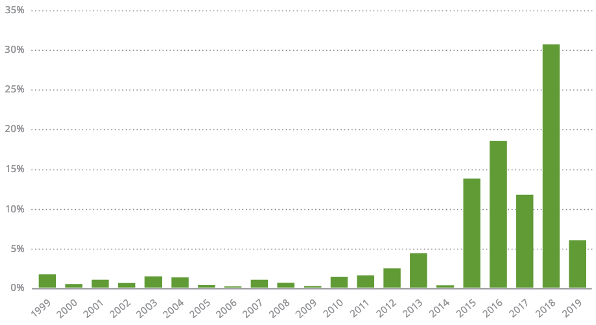
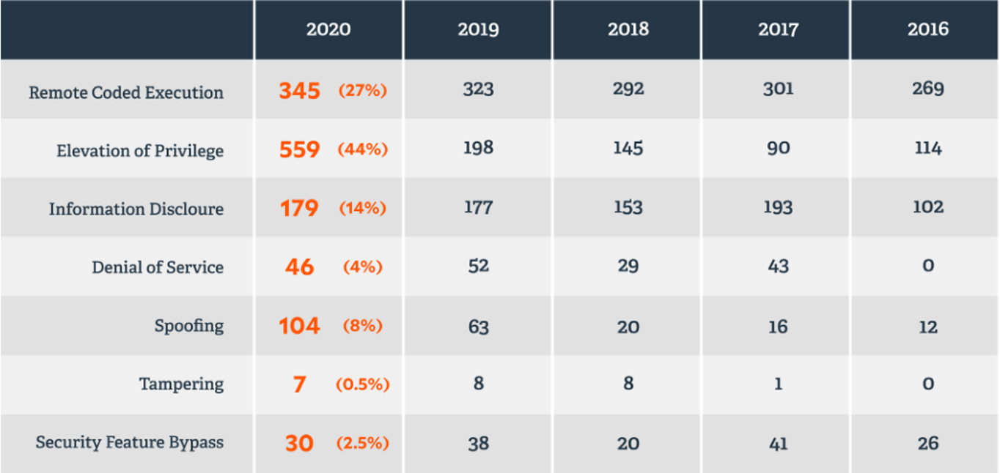
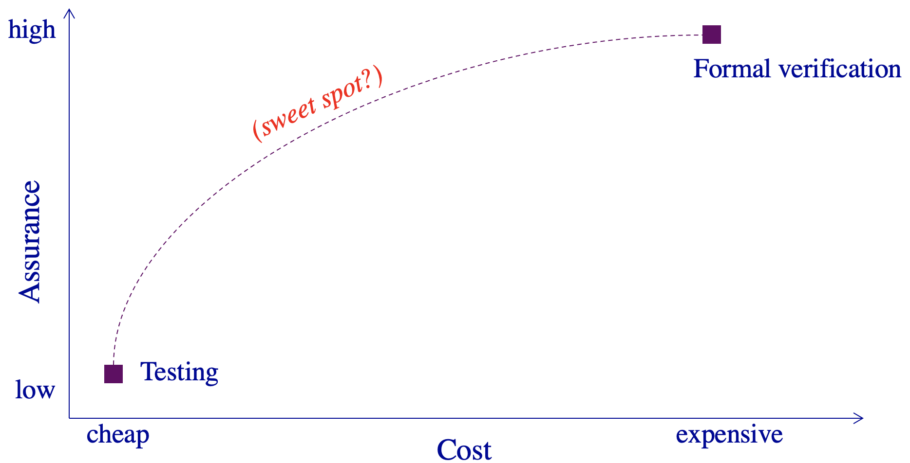
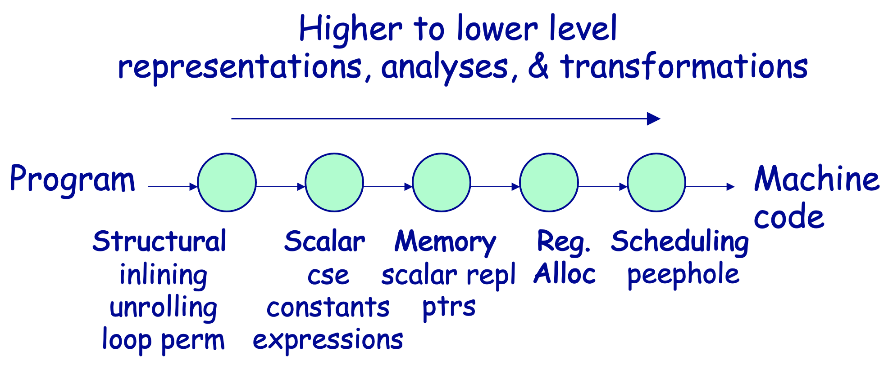
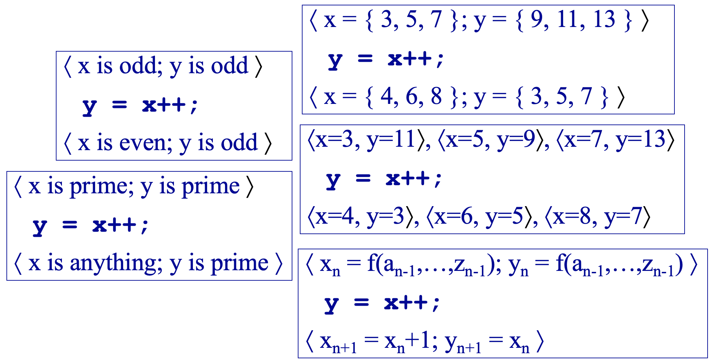
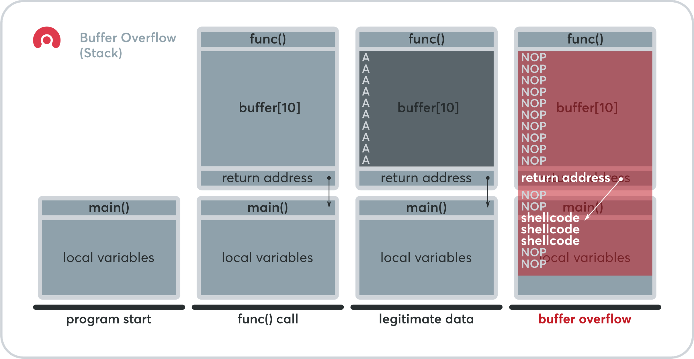
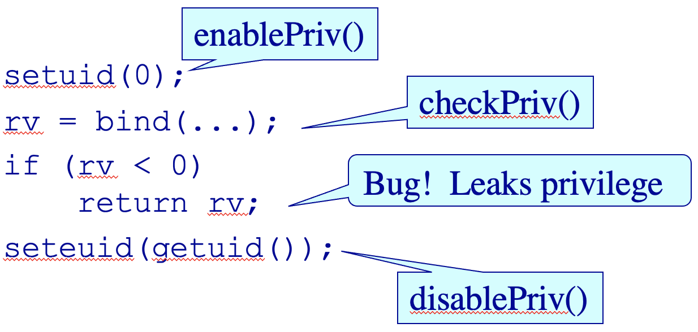
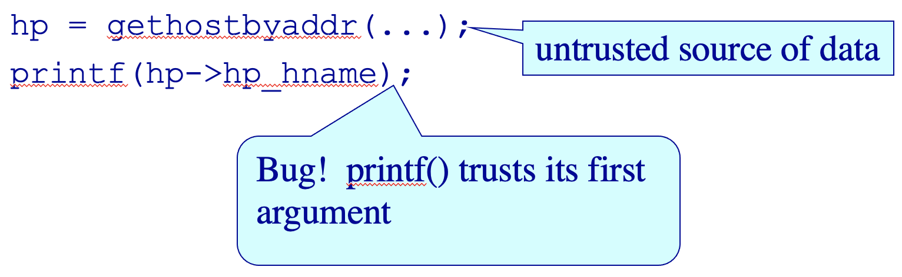
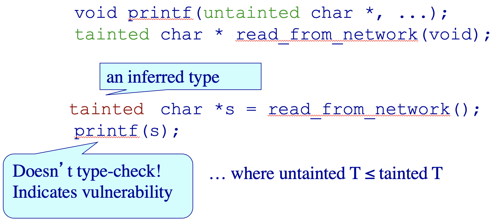

<!-- theme: gaia -->
<!-- _class: lead -->
<!-- footer: '' -->

# 开源操作系统实践
## 第二讲 内核静态分析

<br>
<br>

向勇
清华大学计算机系
xyong@tsinghua.edu.cn

<br>
<br>


2022年7月


---

<!-- header: ''-->
<!-- footer: '向勇：开源操作系统实践 - 第二讲 内核静态分析' -->

## 第二讲 内核静态分析
1. Background
2. Static Analysis
3. A Perfect Work


---

<!-- header: ''-->

### 1. Background
1. **Background**
    * **LINT: A Programming Tool**
    * The Problem
    * Compiler
2. Static Analysis
3. A Perfect Work


---

<!-- header: '1. Background - 1.1 LINT: A Programming Tool'-->

##### DOUBLE-CHECKING PROGRAMS: [LINT](https://en.wikipedia.org/wiki/Lint_(software))

Checks your program more thoroughly than **cc** does: 
```
Utility : lint { fileName }* 
```
Lint scans the specified source files and displays any potential errors that it finds. 
```
$ lint  reverse.c			---> check “reverse.c”. 
reverse  defined ( reverse.c(12) ), but never used 

$ lint palindrome.c			---> check “palindrome.c”. 
palindrome  defined ( palindrome.c ( 12 ) ), but never used reverse used ( palindrome.c(14) ), but not defined
```

---

##### DOUBLE-CHECKING PROGRAMS: LINT

```
$ lint  main2.c			---> check “main2.c”. 
main2.c(11) : warning: main() returns random value to invocation environment 
printf returns value which is always ignored 
palindrome used ( main2.c(9) ), but not defined 

$ lint  main2.c  reverse.c  palindrome.c ---> check all modules together.
main2.c: 
min2.c(11): warning: main() returns random value to invocation environment
reverse.c: 
palindrome.c: 
Lint pass2: 
printf returns value which is always ignored 
$ _
```


---

<!-- header: '1. Background'-->

#### 1.2 The Problem
1. Background
    * LINT: A Programming Tool
    * **The Problem**
    * Compiler
2. Static Analysis
3. A Perfect Work

---

<!-- header: '1. Background - 1.2 The Problem'-->
##### Possible Programming Bugs

* Application
* Programming Language
* User lib & Syscall
* Compiler
* Hardware

---

##### Landscape for all discovered CVE in [2019](https://landing.edgescan.com/hubfs/BCC030%2520Vulnerability%2520Stats%2520Report%2520(2020)_WEB.pdf)



---

##### Vulnerabilities by Category ([2016-2020](https://www.beyondtrust.com/assets/documents/BeyondTrust-Microsoft-Vulnerabilities-Report-2021.pdf))



---

##### The Problem

* Building secure systems is hard
    * 2/3 of Internet servers have gaping security holes
* The problem is buggy software
    * And a few pitfalls account for many vulnerabilities
* Challenge: Improve programming technology
    * Need way to gain assurance in our software
    * Static analysis can help!

[List of tools for static code analysis](https://en.wikipedia.org/wiki/List_of_tools_for_static_code_analysis)

<!--
http://www.cs.berkeley.edu/~daw/talks/sas01.ppt
Static Analysis and Software Assurance
https://en.wikipedia.org/wiki/List_of_tools_for_static_code_analysis#C,_C++
-->

---

##### Existing Paradigms



---

##### What Makes Security Hard?

Security is hard because of…
* buffer overruns
* privilege pitfalls
* untrusted data
* ……


---

<!-- header: '1. Background - 1.3 Compiler'-->

#### 1.3 Compiler
1. Background
    * LINT: A Programming Tool
    * The Problem
    * **Compiler**
2. Static Analysis
3. A Perfect Work
---

##### What is a compiler?

* A program that translates a program in one language to another language
    * The essential interface between applications & architectures
* Typically lowers the level of abstraction
    * analyzes and reasons about the program & architecture
* We expect the program to be optimized, i.e., better than the original
    * ideally exploiting architectural strengths and hiding weaknesses

<!--
http://www.cs.utexas.edu/users/mckinley/380C/lecs/01.ppt
compiler
-->

---

##### Role of compilers

* **Bridge** complexity and evolution in architecture, languages, & applications
* **Help programmers** with correctness, reliability, program understanding
* Compiler **optimizations** can significantly improve performance
    * 1 to 10x on conventional processors
* **Performance stability**: one line change can dramatically alter performance
    * unfortunate, but true

---

##### Optimization

What should it do?

1. improve running time, or
2. decrease space requirements
3. decrease power consumption

How does it do it?

---

##### Example optimizations

* Division of optimizations
    1. Machine independent
    2. Machine dependent
* Faster code optimizations
    * common subexpression elimination
    * constant folding
    * dead code elimination
    * register allocation
    * scheduling
<!--
    * loop transformations
-->

---

##### Analysis

Scope of program analysis
1. within a basic block (local)
2. within a method (global)
3. across methods (interprocedural)

---

##### Analysis
1. control flow graph - dominators, loops, etc.
2. dataflow analysis - flow of values
3. [static-single-assignment](https://www.cs.cmu.edu/~fp/courses/15411-f08/lectures/09-ssa.pdf) – transform programs such that each variable has a unique definition
4. alias analysis - pointer memory usage
5. dependence analysis - array memory usage

---

##### Basic Compiler Structure




---

<!-- header: ''-->

### 2. Static Analysis
1. Background
2. **Static Analysis**
    * **Concept**
    * Buffer Overrun
    * Pitfalls of Privileges
    * Untrusted Data
 3. A Perfect Work


---

<!-- header: '2. Static Analysis'-->

#### 2.1 Concept

##### Static Analysis - Concept

* Examples: compiler optimizations, program verifiers
* Examine program text (no execution)
* Build a **model** of program state
    * An abstraction of the run-time state
* Reason over possible behaviors
    * E.g., “run” the program over the abstract state

---

<!-- header: '2. Static Analysis - 2.1 Concept'-->
##### Abstract interpretation

* Typically implemented via dataflow analysis
* Each program statement’s transfer function indicates how it transforms state
* Example: What is the transfer function for `y = x++;`?

---

##### Selecting an abstract domain




---

##### Research challenge: Choose good abstractions

* The abstraction determines the **expense** (in time and space)
* The abstraction determines the **accuracy** (what information is lost)
    * Less accurate results are poor for applications that require precision
    * Cannot conclude all true properties in the grammar

<!--
Challenge:  choose good abstractions and transfer functions.  (I am lumping in the transfer function with the abstraction.)
Selecting summaries is important, too.
-->

---

##### Static analysis: Characteristic

* Slow to analyze large models of state, so use abstraction
* Conservative: account for abstracted-away state
* Sound: (weak) properties are guaranteed to be true
    * Some static analyses are not sound


---

<!-- header: '2. Static Analysis - 2.2 Buffer Overruns'-->

#### 2.2 Buffer Overruns
1. Background
2. Static Analysis
    * Concept
    * **Buffer Overrun**
    * Pitfalls of Privileges
    * Untrusted Data
 3. A Perfect Work

---

##### [What Is a Buffer Overflow](https://www.acunetix.com/blog/web-security-zone/what-is-buffer-overflow/)


---

##### Buffer Overflow

* An example bug

```C
main(int argc, char *argv[]) {
  func(argv[1]);
} 
void func(char *v) { 
  char buffer[10];
  strcpy(buffer, v);
} 
```
* Command line：
```
$ vulnprog AAAAAAAAAAAAAAAAAAAAAAAAAAAAAAAA
```

---

##### Buffer Overflow



<!--
https://us-cert.cisa.gov/ncas/bulletins
-->

---

##### Static Detection of Overruns

* Introduce implicit variables:
    * `alloc(buf) = # bytes allocated for buf`
    * `len(buf) = # bytes stored in buf`
    * Safety condition: `len(buf) ≤ alloc(buf)`

---

##### Current Status

* Experimental results
    * Found new bugs in sendmail (30k LOC), others
    * Analysis is fast, but many false alarms (1/kLOC)
* Research challenges
    * Pointer analysis (support strong updates)
    * Integer analysis (infer linear relations, flow-sensitivity)
    * Soundness, scalability, real-world programs


---

<!-- header: '2. Static Analysis - 2.3 Pitfalls of Privileges'-->

#### 2.3 Pitfalls of Privileges
1. Background
2. Static Analysis
    * Concept
    * Buffer Overrun
    * **Pitfalls of Privileges**
    * Untrusted Data
 3. A Perfect Work

---

##### Pitfalls of Privileges

* Spot the bug:

```C
setuid(0);
rv = bind(...);
if (rv < 0)
   return rv;
seteuid(getuid());
```
---
##### Pitfalls of Privileges

* Spot the bug:



---

##### A Common Language

* Various interpretations are possible
    * C: enablePriv(p) lasts until next disablePriv(p)
    * Java: … or until containing stack frame is popped
    * checkPriv(p) throws fatal error if p not enabled

---

##### Static Privilege Analysis

* Some problems in privilege analysis:
    * Privilege inference (auditing, bug-finding)
        * Find all privileges reaching a given program point
    * Enforcing privilege-safety (cleanliness of new code)
        * Verify statically that no checkPriv() operation can fail
        * … or that program behaves same under C & Java styles

---

##### Future Directions

* Research challenges
    * Experimental studies on real programs
    * Handling data-directed privilege properties
    * Other access control models


---

<!-- header: '2. Static Analysis'-->

#### 2.4 Untrusted Data
1. Background
2. Static Analysis
    * Concept
    * Buffer Overrun
    * Pitfalls of Privileges
    * **Untrusted Data**
3. A Perfect Work

---

<!-- header: '2. Static Analysis - 2.4 Untrusted Data'-->
##### Manipulating Untrusted Data

* Spot the bug:

```
hp = gethostbyaddr(...);
printf(hp->hp_hname);
```

---
##### Manipulating Untrusted Data

* Spot the bug:



---

##### Trust Analysis

* Security involves much mental “bookkeeping”
    * Problem: Help programmer keep track of which values can be trusted
* One approach: static taint analysis
    * Extend the C type system
    * Qualified types express annotations: e.g., `tainted char *` is an untrusted string
    * Typechecking enforces safe usage
    * Type inference reduces annotation burden

---

##### A Tiny Example

```C
void printf(untainted char *, ...);
tainted char * read_from_network(void);

tainted char *s = read_from_network();
printf(s);
```

---

##### After Type Inference…



---

##### Current Status

* Experimental results
    * Successful on real programs
        * Able to find many previously-known format string bugs
        * Cost: 10-15 minutes per application
    * Type theory seems useful for security engineering
* Research challenges
    * Richer theory to support real programming idioms
    * More broadly-applicable discipline of good coding
    * Finer-grained notions of trust

---

##### Concluding Remarks

* Static analysis can help secure our software
    * Buffer overruns, privilege bugs, format string bugs
    * Hits a sweet spot: cheap and proactive
* Security as a source of interesting problems?
    * Motivations for better pointer, integer analysis
    * New problems: privilege analysis, trust analysis

---

<!-- header: '3. A Perfect Work'-->

### 3. A Perfect Work

* Improving Integer Security for Systems with KINT
    * https://www.usenix.org/conference/osdi12/technical-sessions/presentation/wang
* Towards Optimization-Safe Systems: Analyzing the Impact of Undefined Behavior
    * http://sigops.org/sosp/sosp13/program.html

---

##### References

1. [Lint, a C Program Checker](http://files.cnblogs.com/bangerlee/10.1.1.56.1841.pdf)
2. [Towards Optimization-Safe Systems: Analyzing the Impact of Undefined Behavior](http://adl.csie.ncu.edu.tw/adlab/ppt/553_Towards%20Optimization-Safe%20Systems%20%E2%80%94%20Analyzing%20the%20Impact%20of%20Undefined%20Behavior.pptx)
3. [Improving Integer Security for Systems with KINT](http://pdos.csail.mit.edu/~xi/papers/kint-osdi12-slides.pptx)
4. [Static Analysis and Software Assurance](http://www.cs.berkeley.edu/~daw/talks/sas01.ppt)
5. [Static and dynamic analysis: synergy and duality](http://courses.cs.washington.edu/courses/cse503/10wi/lectures/lecture1-static-dynamic.ppt)
6. [compiler](http://www.cs.utexas.edu/users/mckinley/380C/lecs/01.ppt)
7. [Static/Dynamic Analysis Tools](http://www.csl.sri.com/users/shankar/VGC05/Aiken.ppt)
8. [C Programming Tools](http://www.csun.edu/~andrzej/COMP421/lectures/tools.ppt)

---

##### 

<!-- header: ''-->

<!-- theme: gaia -->
<!-- _class: lead -->


谢谢！

<br>
<br>

<!-- footer: '' -->

<!-- paginate: false -->