<!-- theme: gaia -->
<!-- _class: lead -->
<!-- footer: '' -->

# 开源操作系统实践
## 第三讲 内核动态跟踪

<br>
<br>

向勇
清华大学计算机系
xyong@tsinghua.edu.cn

2022年7月

[Ref](http://courses.cs.washington.edu/courses/cse503/10wi/lectures/lecture1-static-dynamic.ppt): Michael Ernst, "Static and dynamic analysis: synergy and duality"

---

<!-- header: ''-->
<!-- footer: '向勇：开源操作系统实践 - 第三讲 内核动态分析' -->

提纲

### 1. Background
2. gprof
3. DTrace
4. SystemTap
5. ftrace
6. S2E
7. Vmxice
8. eBPF

---

<!-- header: '1. Background'-->

##### Dynamic Tracing
* Execute program (over some inputs)
    * The compiler provides the semantics
* Observe executions
    * Requires **instrumentation infrastructure**
* Must choose **what to measure**, and **what test runs**

---

##### Research challenge: What to measure?
* Coverage or frequency
    * Statements, branches, paths, procedure calls, types, method dispatch
* Values computed
    * Parameters, array indices
* Run time, memory usage
* Like abstraction, determines what is reported

---

##### Research challenge: Choose good tests
* The test suite determines the **expense** (in time and space)
* The test suite determines the **accuracy** (what executions are never seen)
    * Less accurate results are poor for applications that require correctness

---

##### Linux故障分析实例
谢宝友： Linux故障分析方法（[上](https://mp.weixin.qq.com/s/Z9WOmH8f8XXmD5itAFHeFw)、[中](https://mp.weixin.qq.com/s/tGzftejTYi-TWcLq84D7jQ)、[下](https://mp.weixin.qq.com/s/Aw6ELkuQWIJPm9IP3mG_4w)）
* [linux2.6.1内核源码注释](https://download.csdn.net/download/xiebaoyou/7017755)
* 线程引用计数故障
* 堆栈溢出故障
* IP转发邻居表溢出故障
* SMP调度死机故障
* 内存故障


---

##### [Linux Performance Observability Tools](https://www.brendangregg.com/Perf/linux_observability_tools.png)


<!--
https://www.brendangregg.com/Perf/linux_observability_tools.png
http://www.brendangregg.com/linuxperf.html
-->
---

##### 课堂问答

1. 假定你自己写的一个程序，运行结果与预期不一致。请问，你如何进行故障定位？
2. 在故障定位的过程中，你遇到的最大困难是什么？

<!--
-->
---

<!-- header: ''-->

提纲

1. Background
### 2. gprof
3. DTrace
4. SystemTap
5. ftrace
6. S2E
7. Vmxice
8. eBPF

---

<!-- header: '2. gprof'-->

##### [GNU gprof Profiler](http://binf.gmu.edu/jsolka/fall08/csi605/csi605-profiling.ppt)
* Detail **time** statistics for each subroutine.
* Create **callgraph** for all subroutines.
* Analysis the program bottleneck.
* Increase about 30% extra time cost.

<!--
Profile
noun
1 an outline of something, esp. a person's face, as seen from one
-->

---

##### Steps for Profiling a program with gprof
* Compile and link a program with profiling enabled
    * Program is compiled with `-pg` option
    * Every function to call **mcount** as one of its first operations
    * mcount routine records in **an in-memory callgraph table**
    * profil() system call **examines the user's program counter** (PC) every virtual 10 milliseconds
* Execute a program to generate its profile data
    * Generating the file ‘**gmon.out**’
* Run gprof to **analyze** the profile data

<!--
    * gprof’s symbol table, an array of Sym structures, is built
-->

---

##### GNU gprof time profiler

* Recompile the original source code

```
gcc –pg SourceCode –o ExecutableFile
[ykhong@vangogh home]$ gcc –pg test2.c –o test2
```
`-pg`: This option affects both compiling and linking.

* Add additional commands into source code when
compiling code in order to **trace all subroutines**.
* Add essential initial settings and **statistical processes**
when linking the objects.

---

##### GNU gprof time profiler
* Convert produced profile data into text file
```
gprof ListOfOptions ExecuteFile StatFiles > OutputFile  
[ykhong@vangogh home]$ gprof –b test2 gmon.out > output.txt
```
* `ListOfOptions` can be omitted.
* `ExecuteFile` can be omitted when the file name is a.out.
* `StatFiles` can be omitted when the file name is gmon.out.

---

##### Tracing method of gprof

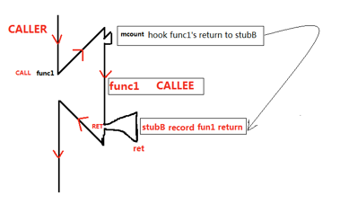

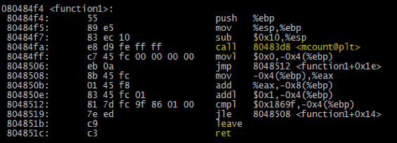


<!--
http://os.cs.tsinghua.edu.cn/hgj/Interface/analysis/PaperList#head-4f9d1b3fa37f96cf79230e31ee571c85c14839ff
基于硬件虚拟化的内核动态追踪系统
-->


---

##### GNU gprof time profiler: callgraph

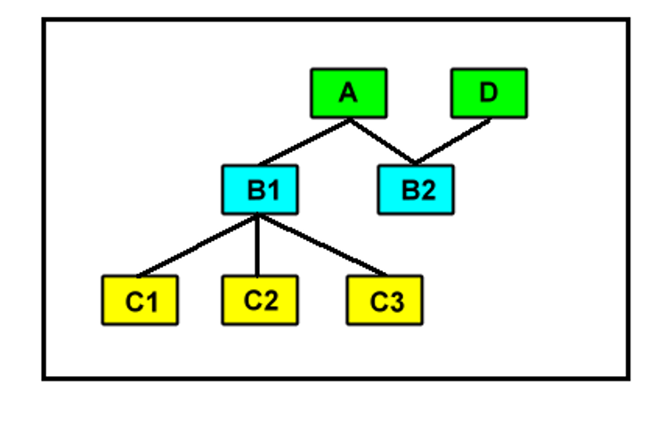


---

##### GNU gprof time profiler

```
[ykhong@vangogh home]$ gcc –pg test.c –o test
[ykhong@vangogh home]$ ./test
[ykhong@vangogh home]$ gprof –b test gmon.out > output
[ykhong@vangogh home]$ more output
Each sample counts as 0.01 seconds.
  %    cumulative   self            self    total           
 time   seconds    seconds  calls  s/call   s/call  name    
 71.90   30.17      30.17     1    30.17    30.17   C3
 19.42   38.32       8.15     2     4.07     4.07   B2
  7.99   41.67       3.35     1     3.35     3.35   C2
  0.00   41.67       0.00     1     0.00    37.60   A
  0.00   41.67       0.00     1     0.00    33.52   B1
  0.00   41.67       0.00     1     0.00     0.00   C1
  0.00   41.67       0.00     1     0.00     4.07   D
```

<!--
% time: the percent of self seconds from total program elapsed time. 
     cumulative seconds: the seconds cumulate from self seconds.
     self seconds: total elapsed time called by its parents, not 
                                  including its children’s elapsed time.
                                  equal to (self s/call)*(calls)
 calls: total number for each subroutine called by its parents.
     self s/call: elapsed time for each time called by its parents, 
                                not including its children’s elapsed time.
     total s/call: total elapsed time called by its parents, 
                                   including its children’s elapsed time.
     name: subroutine name.
-->

---

##### GNU gprof time profiler

```
                   Call graph
index  %time   self   children   called   name
                                              <spontaneous>
[1]    100.0   0.00    41.67              main[1]
               0.00    37.60      1/1         A[2]
               0.00     4.07      1/1         D[6]
------------------------------------------------------------------
               0.00    37.60      1/1        main[1]
[2]     90.2   0.00    37.60      1       A[2]
               0.00    33.52      1/1        B1[3]
               4.07     0.00      1/2        B2[5]
------------------------------------------------------------------
```

---

##### [gprof2dot](https://blog.csdn.net/u012927281/article/details/51132064)

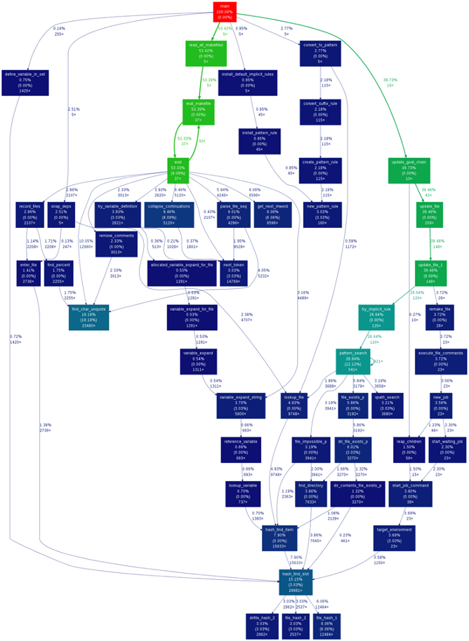

<!--
https://github.com/jrfonseca/gprof2dot
-->

---

<!-- header: ''-->

提纲

1. Background
2. gprof
### 3. DTrace
4. SystemTap
5. ftrace
6. S2E
7. Vmxice
8. eBPF

---

<!-- header: '3. DTrace'-->

##### Overview of [DTrace](](http://www.geo.uzh.ch/~jbrazile/jazoon07-dtrace-conference.ppt))
* DTrace – a **dynamic tracing environment for Solaris**
* Can be used to troubleshoot **performance and logic problems** in user applications
* Features of tracing
    * Uses **dynamic binary instrumentation**
    * Inserts instrumentation code in **running processes**
* Has specialized C-like language, D language
* Specific to Solaris (requires extensive OS kernel modification)

<!--
* Terminology
    * Probes: points of instrumentation
    * Providers: make probes available
-->

---

##### DTrace: History
* 1996: conceived of by Bryan Cantrill while **an undergrad** at Brown
* 2001: Started work on Dtrace wth Michael W. Shapiro
* 2002: Early prototype, Adam H. Leventhal joined development
* 2004: Appears in **Solaris**
* 2005: Sun releases DTrace **source code**, initial java support (dvm)
* 2006: Ported to **FreeBSD** by John Birrell
* 2007: To be released in **MacOSX** 10.5 “Leopard” and basis of Xray

---

##### DTrace Usage

* Users **write D programs** that collect information at runtime
* Users invoke dtrace to **insert instrumentation code** in kernel and user processes
    * Security mechanism ensures code can be inserted only by **authorized users**
* When **events occur at runtime**, user’s D code is executed by the DTrace providers, which causes
    * Information to be recorded
    * Data to be printed
    * Whatever else users defines in their D programs!

<!--
* **Many, many providers** exist for getting lots of different data from running programs
-->

---

##### Dtrace features
* **Provides** (>30k) instrumentation points…
    * …in the kernel
    * …in the C runtime library (libc.so)
* **Safe** (probes not allowed to crash system)
* Predicates **avoid retaining** (copying, and storing) unneeded data
* Provides **scalable aggregation** (sum, min, avg, quantize, count, etc.)
* **Extensible** (users can implement their own instrumentation points)

<!--
* **Provides** (>30k) instrumentation points…
    * …in the kernel
    * …in the C runtime library (libc.so)
    * …in the Java VM (libjvm.so)
    * …in Java itself (starting with Java 1.6)
* High level awk-like language, called D

Retain
(continue to have)保留 ‹property, salary, right›; 保持 ‹control, dignity, independence›
-->


---

##### DTrace Architecture

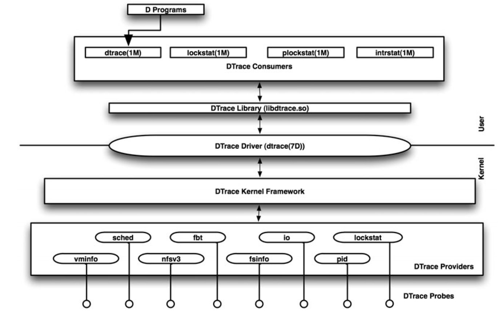


---

##### D Language

* Simplified C-like language
    * Uses C formatting conventions
    * No conditionals or functions/methods/classes
* The D language provides convenient features for
    * Gathering and Aggregating data, Speculative tracing
* Structure of a D program
    * **Probe** description that tells which provider to use
    * **Predicate** that says when this probe should be executed
    * **Action** statements that make up the body of the probe

<!--
* The D language provides convenient features for
    * Gathering and statistical information
    * Aggregating data
    * Displaying function arguments or timing information (printf-like syntax)
    * Speculative tracing

Speculative
(of an investment) involving a high risk of loss.
-->

---

##### Example DTrace Providers
* `syscall`: makes a probe available at the entry to and return from every **system call**
* `vminfo`: makes a probe available on **VM activity** (page out, page faults, etc)
* `profile`: makes a probe available that can run **every X milliseconds**
* Users can also create their **own providers** by using the DTrace API
    * Ex: provide probes before/after a request is serviced in a web server or database server

<!--
* `fpuinfo`: makes a probe available when **hardware floating point operations** are emulated in software
-->

---

##### Example one-liners
* System call count, by process
    * `dtrace -n 'syscall:::entry { @num[pid,execname] = count(); }'`
* Files opened by process
    * `dtrace -n 'syscall::open*:entry { printf("%s %s",execname,copyinstr(arg0)); }'`
* Sample java stack at 1001 Hertz (aka profile)
    * `dtrace -n 'profile-1001 /pid == $target/ { @num[jstack()] = count(); }' -p PID`

<!--
* Number of bytes read, by process
    * `dtrace -n 'sysinfo:::readch { @bytes[execname] = sum(arg0); }'`
* Write size distribution, by process
    * `dtrace -n 'sysinfo:::writech { @dist[execname] = quantize(arg0); }'`
-->

---

##### Example Toy D Program
```
/*
  Count off and report the 
  number of seconds elapsed
*/
dtrace:::BEGIN
{
 i = 0;
}
profile:::tick-1sec
{
 i = i + 1;
 trace(i);
}
dtrace:::END
{
 trace(i);
}
```
---

##### Output of Example Toy D Program

```
# dtrace -s counter.d
dtrace: script ’counter.d’ matched 3 probes
CPU ID    FUNCTION:NAME
0   25499 :tick-1sec     1
0   25499 :tick-1sec     2
0   25499 :tick-1sec     3
0   25499 :tick-1sec     4
0   25499 :tick-1sec     5
0   25499 :tick-1sec     6
^C
0   2     :END           6
#
```


---

##### More Realistic Program
D code to time `read()` and `write()` syscalls
```
syscall::read:entry,
syscall::write:entry
/pid == $1/
{
 ts[probefunc] = timestamp;
}
syscall::read:return,
syscall::write:return
/pid == $1 && ts[probefunc] != 0/
{
 printf("%d nsecs", timestamp - ts[probefunc]);
}
```

---

##### More Realistic Program: Output

```
# dtrace -s rwtime.d 'pgrep -n ksh'
dtrace: script 'rwtime.d' matched 4 probes
CPU ID FUNCTION:NAME
0   33 read:return  22644 nsecs
0   33 read:return  3382 nsecs
0   35 write:return 25952 nsecs
0   33 read:return  916875239 nsecs
0   35 write:return 27320 nsecs
0   33 read:return  9022 nsecs
0   33 read:return  3776 nsecs
0   35 write:return 17164 nsecs
...
```

---

##### Good points of DTrace
* **Does not require application modification**, can trace any PID onthe system
* Can use on production Solaris systems
* Can add and remove probes **without having to restart applications**
* Authors claim **low overhead** when a handful of probes are enabled
* D code provides a bit of flexibility when tracking down problems
* Uses simple ASCII output (good for sed/awk/grep/perl support)
---

##### Bad points of DTrace

* Users must learn new D language
* **Tied very closely to Solaris kernel**
* Only low-level (OS-level) information provided
* Users have to write a lot of D code for operations that are much easier to get in other tools
    * E.g., using prof/gprof vs. dtrace alone
* Can’t easily track time spent by user code
    * Poor source code correlation
    * Best case: function name and byte offset from stack dumps
---

<!-- header: ''-->

提纲

1. Background
2. gprof
3. DTrace
### 4. SystemTap
5. ftrace
6. S2E
7. Vmxice
8. eBPF

---

<!-- header: '4. SystemTap'-->

##### [SystemTap](http://www.redbooks.ibm.com/redpapers/pdfs/redp4469.pdf)
* Can **examine or modify** any parameters and local variables visible at the probe point
* **Statistics gathering** capabilities built in
* Automatically communicates with a user-level process
```
global count
probe kernel.function("generic_make_request") { count++; }
probe begin { log("starting probe") }
probe end { printf("generic_make_request() called %d times.",count); }
```
<!--
* A number of safety features make it far harder to crash a running kernel
-->

---

##### SystemTap process

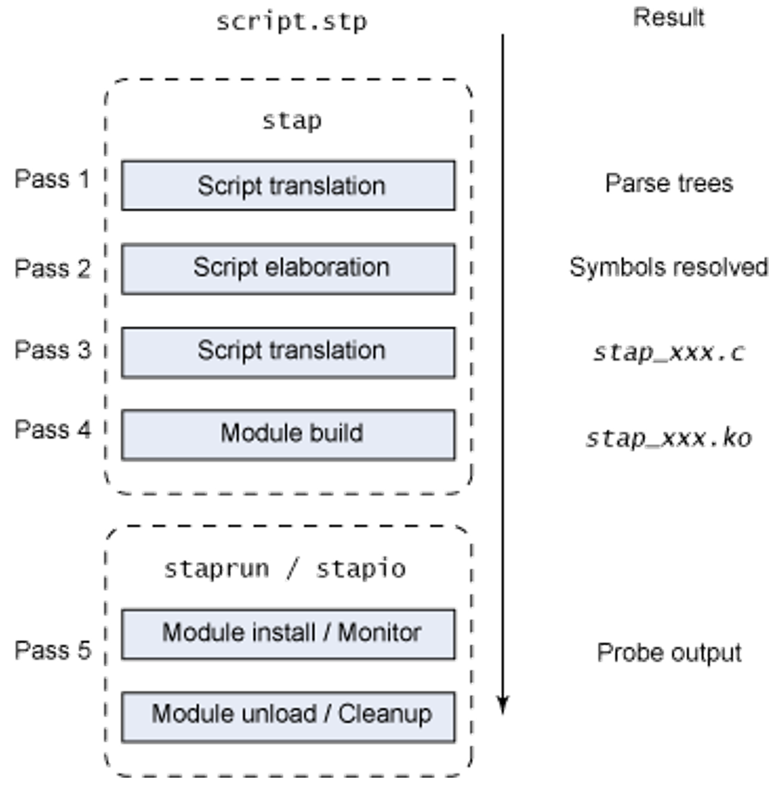

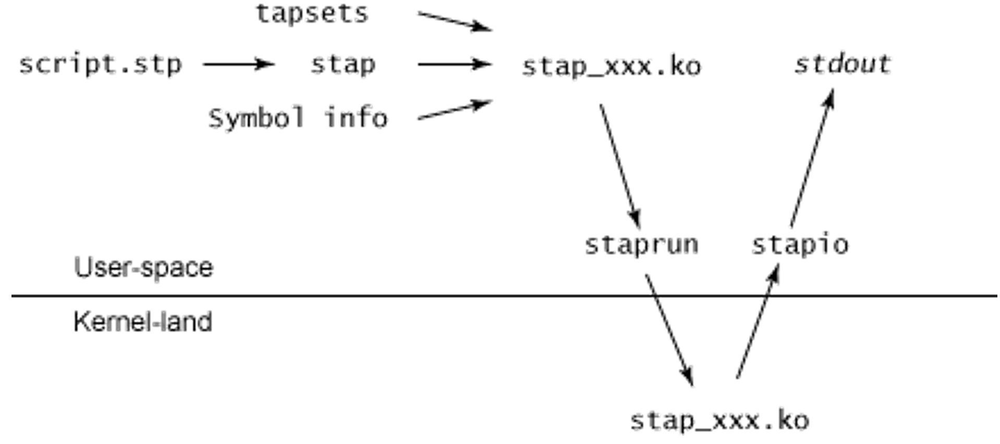


---

##### Systemtap processing steps

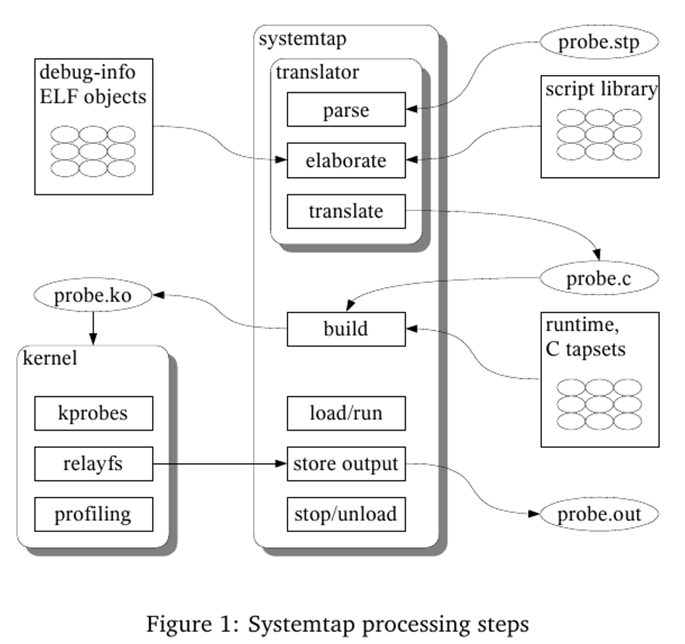

---

##### How it works
1. SystemTap parses your code and identifies probe points and identifiers using the kernel debug info
2. The script is translated into C code
3. The C code is compiled into a KProbe module
4. A root-privileged deamon called “stpd” is started
5. The compiled kernel module is inserted
6. The module exports output via the “relayfs” virtual file system to stpd
7. The stpd service delivers this data to the user process to output


---

##### Where to probe
* Systemtap supports a number of built-in events.

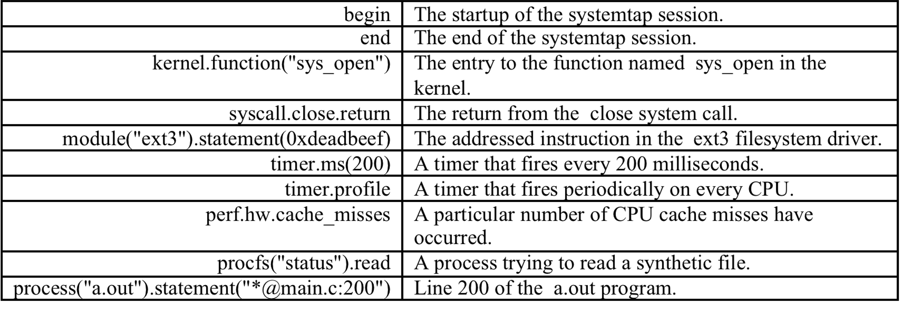


---

##### What to do with it?
* Use SystemTap-derived data to make real-time decisions about CPU scaling
* Two approachs:
    * Statistical: Given a set of kernel metrics `x1..xn`, find a function `f(x1..xn)` that yields the ideal CPU frequency
    * Algorithmic: Given a performance metric `p(x1..xn)`, adjust the CPU frequency tentatively while observing feedback from `p`.

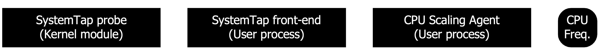

---

<!-- header: ''-->

提纲

1. Background
2. gprof
3. DTrace
4. SystemTap
### 5. ftrace
6. S2E
7. Vmxice
8. eBPF

---

<!-- header: '5. ftrace'-->

##### What is Ftrace?
* Provides a **generic framework** for tracing
    * Infrastructure for defining **tracepoints**
    * Ability to **register** different kinds of tracers
    * Specialized data structure (**ring buffer**) for trace data storage

<!--
SystemTap 设计比较复杂
不当的使用和 SystemTap 自身的不完善都有可能导致系统崩溃

ftrace 代码量很小，稳定可靠。
ftrace 有定义良好的 ASCII 接口，可以直接阅读
ftrace 对所有 tracer 都采用同一个 ring buffer
Ftrace 的实现依赖于其他很多内核特性，比如 tracepoint[3]，debugfs[2]，kprobe[4]，IRQ-Flags[5] 等。
-->


---

##### [Ftrace](https://www.kernel.org/doc/html/latest/trace/ftrace.html) Components

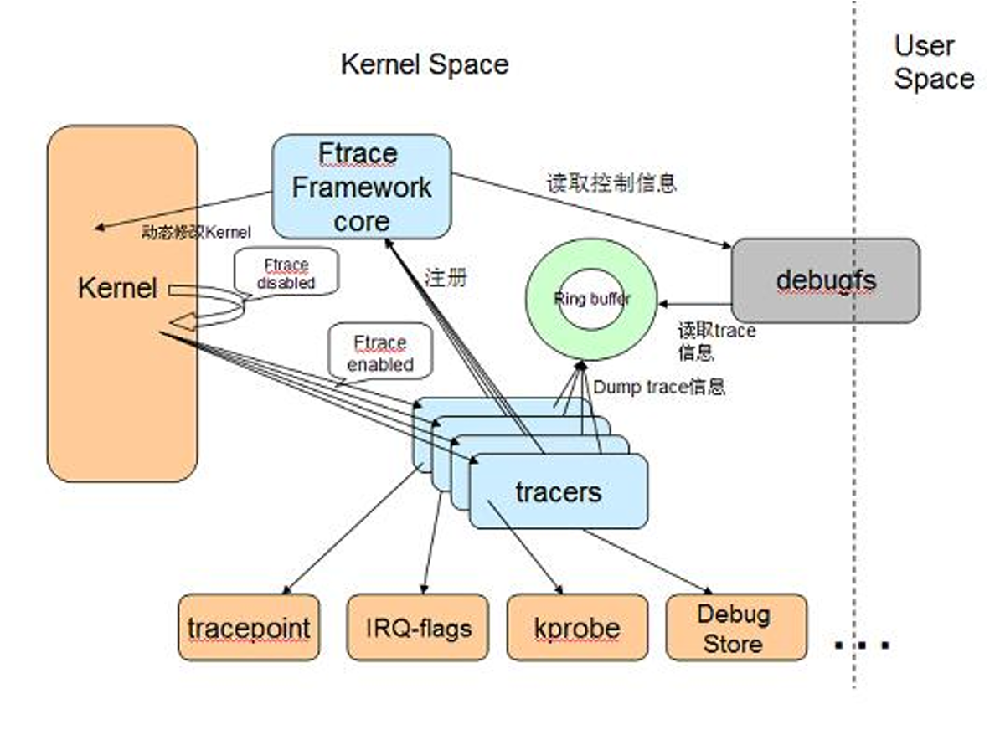

<!--
https://www.kernel.org/doc/html/latest/trace/ftrace.html
https://opensource.com/article/21/7/linux-kernel-ftrace
https://zhuanlan.zhihu.com/p/479823151
https://www.cnblogs.com/slgkaifa/p/6919967.html
https://zhuanlan.zhihu.com/p/27190018
-->

---

##### `mcount()` Routine
* `mcount()` is called by every kernel function
    * Except inlines and a few special functions
* Must be a low-overhead routine
* Incompatible with some compiler optimizations
    * E.g. cannot omit frame-pointers on ARM
    * Compiler disables some optimizations automatically
    * Analysis of assembly indicates that mcount callers have well-defined frames

---

##### Diagram of Trampoline

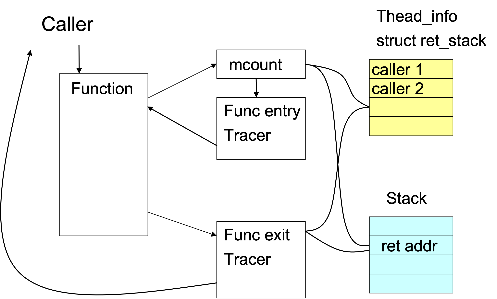


---

##### Code to Call mcount: Disabling

```00000570 <sys_sync>:
570: e1a0c00d mov ip, sp
574: e92dd800 stmdb sp!, {fp, ip, lr, pc}
578: e24cb004 sub fp, ip, #4 ; 0x4


57c: e3a00001 mov r0, #1 ; 0x1
580: ebffffa0 bl 408 <do_sync>
584: e3a00000 mov r0, #0 ; 0x0
588: e89da800 ldmia sp, {fp, sp, pc}
```

---

##### Code to Call mcount: Enabling

```
00000570 <sys_sync>:
570: e1a0c00d mov ip, sp
574: e92dd800 stmdb sp!, {fp, ip, lr, pc}
578: e24cb004 sub fp, ip, #4 ; 0x4

57c: e1a0c00e mov ip, lr
580: ebfffffe bl 0 <mcount>
584: 00000028 andeq r0, r0, r8, lsr #32

588: e3a00001 mov r0, #1 ; 0x1
58c: ebffff9d bl 408 <do_sync>
590: e3a00000 mov r0, #0 ; 0x0
594: e89da800 ldmia sp, {fp, sp, pc}
```


---

##### Trace setup at run-time
* Pseudo-files in debugfs
    * e.g. `mount debugfs –t debugfs /debug`
* Select a tracer
    * e.g. `echo function_duration >current_tracer`
* Set tracing parameters
    * e.g. `echo 100 >tracing_threshhold`
    * `echo duration-proc >trace_options`

---

##### Trace Data Capture - Ring Buffer
* Specialized structure for collecting trace data
    * Manages buffer as list of pages
* Latest version is **lockless** for writing
    * Ability to atomically reserve space for an event
* Automatic **timestamp** management
* **Per-cpu buffers**
    * Avoids requiring cross-CPU synchronization
    * Also avoids cache collisions
        * Very important for performance
<!--
-->

---

##### Filtering by Duration
* Created new 'function_duration' tracer
* Method:
    * Don't save function entries to trace log at all
        * Only save call time on function return stack
    * At function exit, compare duration to threshhold
    * Omit exit entry events for **short duration functions**
* Results in simpler, and faster code
* Only issue is that log is displayed in order of function exit (not function entry)
<!--
    * Can be solved with a simple sort on trace output
-->

---

##### Trace Output
* Output is human readable text
    * No special tools required to collect trace data
* Examples:
    * `cat trace`
        * Returns EOF at end of trace data
    * `cat trace_pipe | grep foo >log.txt`
        * Blocks at end of trace data
* Quick enable/disable
    * `echo 0 >tracing_enabled`

---

##### Example of Use

```
$ mount debugfs -t debugfs /debug
$ cd /debug/tracing
$ cat available_tracers
function_graph function_duration function sched_switch nop
$ echo 0 >tracing_enabled
$ echo 100 >tracing_thresh
$ echo function_duration >current_tracer
$ echo 1 >tracing_enabled ; do
ls /bin | sed s/a/z/g ; done ; echo 0 >tracing_enabled
$ echo duration-proc >trace_options
$ cat trace >/tmp/trace.txt
$ cat /tmp/trace.txt | sort –k3 > /tmp/trace.txt.sorted
```

---

##### Function Duration Results (sorted)

```
# tracer: function_duration
#
# CPU  TASK/PID        CALLTIME       DURATION                  FUNCTION CALLS
# |    |    |            |              |   |                     |   |   |   |
 0)    sed-562     |   502.854252393 |  ! 436.833 us  |      bprm_mm_init
 0)    sed-562     |   502.854254893 |  ! 321.500 us  |        mm_alloc
 0)    sed-562     |   502.854270893 |  ! 296.500 us  |          mm_init
 0)    sed-562     |   502.854279393 |  ! 266.166 us  |            get_pgd_slow
 0)    sed-562     |   502.854744059 |  ! 229.500 us  |      prepare_binprm
 0)    sed-562     |   502.854765393 |  ! 198.666 us  |        kernel_read
 0)    sed-562     |   502.854769226 |  ! 183.333 us  |          vfs_read
 0)    sed-562     |   502.854780393 |  ! 142.000 us  |            do_sync_read
 0)    sed-562     |   502.854785559 |  ! 120.667 us  |              nfs_file_read
 0)    sed-562     |   502.854982393 |  ! 538.000 us  |      copy_strings_kernel
 0)    sed-562     |   502.854985726 |  ! 521.667 us  |        copy_strings
```

<!--
 0)    sed-562     |   502.854993893 |  ! 470.000 us  |          get_arg_page
 0)    sed-562     |   502.854997226 |  ! 455.500 us  |            get_user_pages
 0)    sed-562     |   502.855000059 |  ! 421.667 us  |              __get_user_pages
 0)    sed-562     |   502.855031393 |  ! 285.666 us  |                handle_mm_fault
 0)    sed-562     |   502.855037726 |  ! 101.833 us  |                  __pte_alloc
-->

---

##### Post-trace analysis
* fdd tool is provided to analyze data
* What fdd shows:
    * function counts, total time, average duration
    * sub-routine with the longest duration, how many times it was called
    * Local time = total time minus sub-routine total time
        * Is **approximately** the cost of the local execution of a function

<!--
* Notes:
    * Total time may be wrong if process is scheduled out or if a filter was active
        * May need an option to subtract time that function was scheduled out
    * You can filter, sort, select output columns,etc.
-->

---

##### fdd Output

```
$ fdd /tmp/trace.txt –n 15
Function                            Count Time       Average  Local     
----------------------------------- ----- ---------- -------- ----------
schedule                               59 1497735270 25385343 1476642939
sys_write                              56 1373722663 24530761    2892665
vfs_write                              56 1367969833 24428032    3473173
tty_write                              54 1342476332 24860672 1212301170
do_path_lookup                         95 1076524931 11331841   34682198
__link_path_walk                       99 1051351737 10619714    6702507
rpc_call_sync                          87 1033211085 11875989    1700178
path_walk                              94 1019263902 10843233    3425163
rpc_run_task                           87  960080412 11035407    2292360
rpc_execute                            87  936049887 10759194    2316635
__rpc_execute                          87  932779083 10721598   11383353
do_lookup                             191  875826405  4585478    9510659
```

<!--
call_transmit                         100  785408085  7854080    5871339
__nfs_revalidate_inode                 38  696216223 18321479    1652173
nfs_proc_getattr                       38  690552053 18172422    1234634
-->

---

##### Performance issues
* Overhead of tracing can be big
    * Average function duration = 3.22 μs
    * Overhead = 11.4 microseconds per function
* Use a CPU-bound test to measure overhead
    * `find /sys >/dev/null`
    * With an I/O-bound test (or a real-workload), the ratio of overhead to average function duration should be lower
* With ftrace compiled into kernel, but the 'NOP' tracer selected, the overhead in my test was about 12%

---

##### 真实手机Nexus5上的动态跟踪数据获取

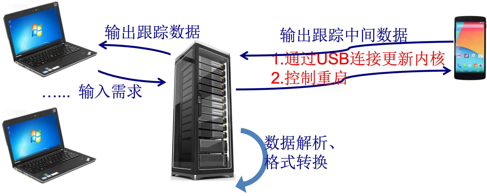

---

##### 真实手机Nexus5上的动态跟踪数据获取

* 全自动的内核编译、下载、运行、跟踪
    * 通过adb和fastboot实现自动刷机与重启
    * 脚本控制手机开启USB替代网络
    * 通过USB输出中间数据至服务器
* 特点
    * 跟踪所有的内核函数调用情况
    * 用户选择内核版本、提供测试代码，后台返回数据


---

##### 全面跟踪函数调用的问题和解决方法

* 问题：跟踪数据量太大
* 措施
    * 减少数据传输量：中间数据压缩输出
    * 延迟数据处理：事后解析中间数据
    * 使用USB替代wifi输出数据
    * 降低追踪数据生成速率
    * 优化Ftrace数据输出代码
* 效果：完整跟踪3~4分钟数据（无丢失情况）


<!--
为什么只有3~5分钟：
Ftrace影响了网络输出速度，不能充分使用网络带宽
当缓冲区满后，即停止ftrace运行（不停止的话会产生数据丢失）
Ftrace停止后，剩余数据继续输出
-->


---

##### 运用实例

能耗监测数据
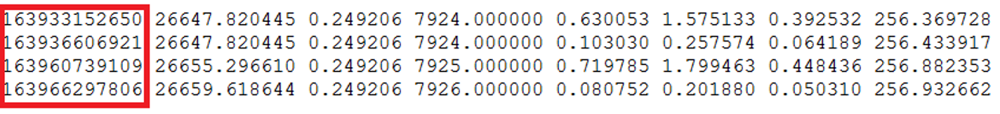
Ftrace跟踪数据：利用时间和进程号进行对应
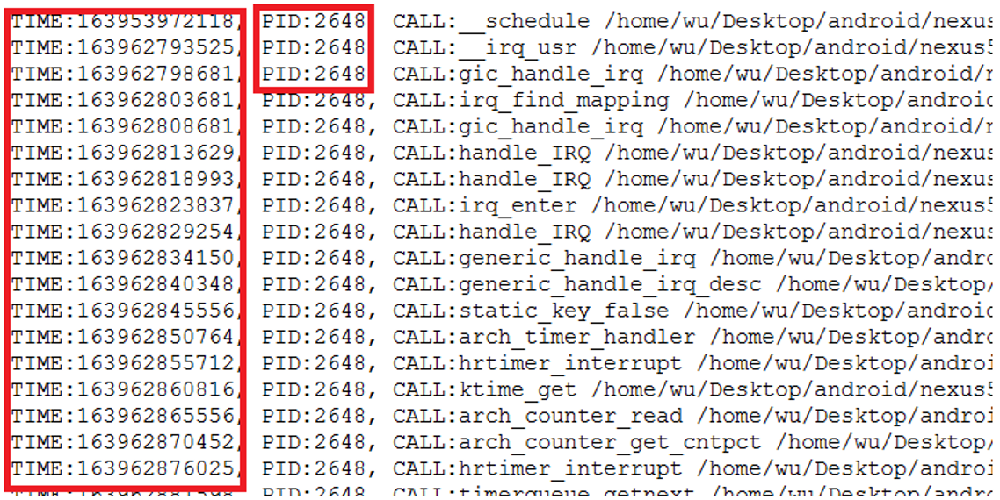


---

<!-- header: ''-->

提纲

1. Background
2. gprof
3. DTrace
4. SystemTap
5. ftrace
### 6. S2E
7. Vmxice
8. eBPF

---

<!-- header: '6. S2E'-->

<!--
##### QEMU Overview
* Created by Fabrice Bellard in 2003
* Function-level emulation
    * Faster than “cycle-accurate” simulators.
    * Good enough to use applications written for another CPU.
* Just-in-time (JIT) compilation support to achieve high performance
* Lots of peripherals support (VGA, serial, and Ethernet, etc…)
* Lots of target hosts and targets support (full system emulation)
* Good enough to use applications written for another CPU.
* User mode emulation: can run applications for another CPU.

* Lots of target hosts and targets support (full system emulation)
    * x86, arm, mips, sh4, cris, sparc, powerpc, nds32, …
    * qemu/hw/* contain all of the supported boards.

---
-->

##### S2E: platform for analyzing software systems

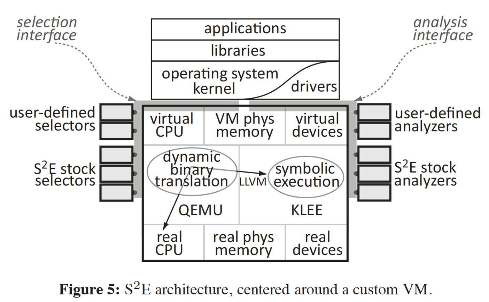

<!--
http://infoscience.epfl.ch/record/163071/files/s2e.pdf
S2E: A Platform for In-Vivo Multi-Path Analysis of Software Systems
ACM SIGARCH Computer Architecture News - ASPLOS '11
Volume 39 Issue 1, March 2011 
Pages 265-278
-->

---

##### DBCG-RTL: A Database-based online Call Graph Tool

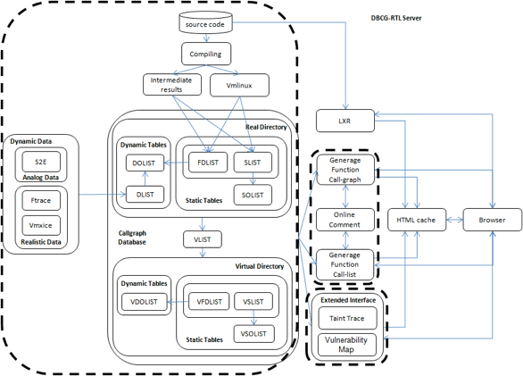

<!--
20130819-DCG-RTL.pptx
-->

---

<!-- header: ''-->

提纲

1. Background
2. gprof
3. DTrace
4. SystemTap
5. ftrace
6. S2E
### 7. Vmxice
8. eBPF

---

<!-- header: '7. Vmxice'-->

##### Intel VT

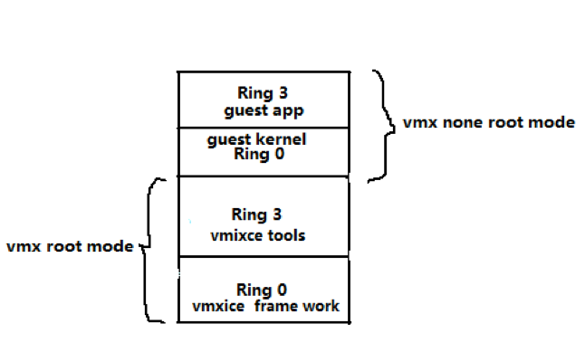

---

##### BTF(Branch Trace Flag) in IA32 DebugCtrl MSR

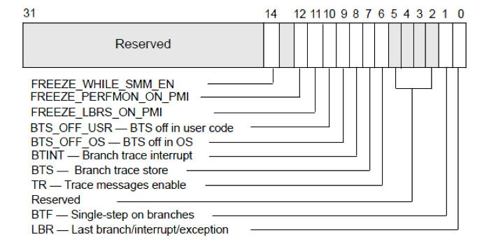

[Ref](https://pdos.csail.mit.edu/6.828/2005/readings/ia32/IA32-3.pdf): IA-32 Intel® Manual Volume 3: System Programming Guide

<!--
http://www.openrce.org/blog/view/535/Branch_Tracing_with_Intel_MSR_Registers
Some time ago I was flipping through the IA-32 Intel Architecture Softwre Developer's Manual Volume 3 when I came across the following information in section 15.5 (page 515, specific to the provided link)
-->
---

##### vmxice: 基于IntelVT技术的Linux内核调试器

* [Hyperdbg](https://github.com/rmusser01/hyperdbg)
* [2012年西安邮电大学 本科毕业设计孟学政](http://www.zeuux.com/blog/content/4617/)
* [2013年操作系统课程设计-VMXICE](http://os.cs.tsinghua.edu.cn/oscourse/OS2013/projects/U17)

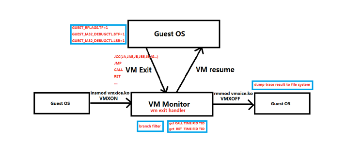


---

<!-- header: ''-->

提纲

1. Background
2. gprof
3. DTrace
4. SystemTap
5. ftrace
6. S2E
7. Vmxice
### 8. eBPF

---

<!-- header: '8. eBPF'-->

##### BPF - [打通用户态与内核态的机制](https://gitee.com/oscomp/seminar16-20210808/blob/main/README.md#2021%E6%93%8D%E4%BD%9C%E7%B3%BB%E7%BB%9F%E5%A4%A7%E8%B5%9B%E5%86%B3%E8%B5%9B%E9%98%B6%E6%AE%B5%E7%AC%AC%E4%B8%89%E6%AC%A1%E6%8A%80%E6%9C%AF%E6%8A%A5%E5%91%8A%E5%92%8C%E4%BA%A4%E6%B5%81)

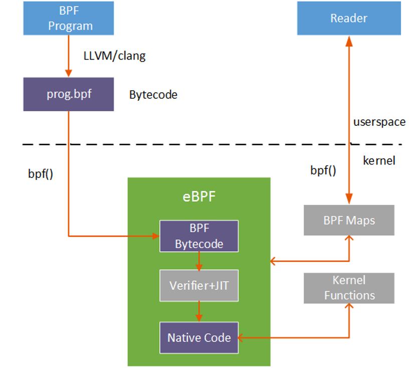

<!--
https://gitee.com/oscomp/seminar16-20210808/blob/main/README.md#2021操作系统大赛决赛阶段第三次技术报告和交流
-->


---

##### eBPF 年鉴

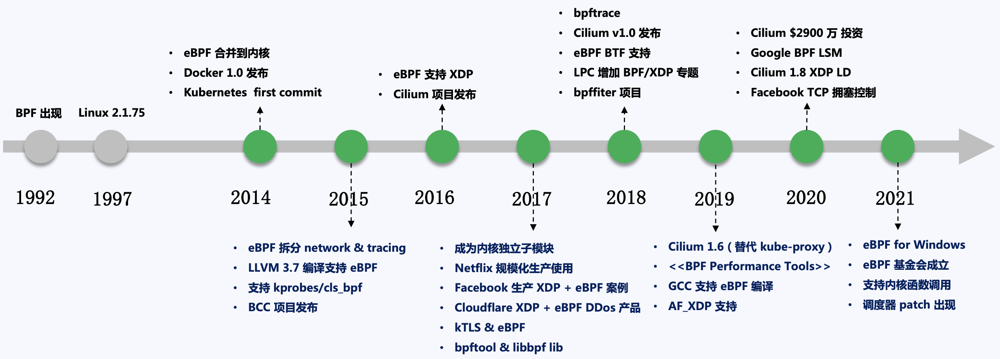

<!--
head_first_bpf_v4.pdf
eBPF 技术简介
狄卫华 2022.5.20
-->
---

##### eBPF的[架构图](https://www.brendangregg.com/Slides/BSidesSF2017_BPF_security_monitoring.pdf)

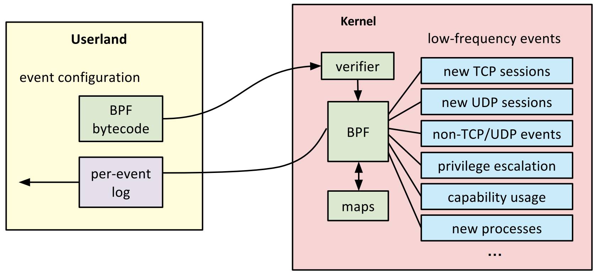

<!--
https://www.brendangregg.com/Slides/BSidesSF2017_BPF_security_monitoring.pdf
-->
---

##### eBPF技术架构图

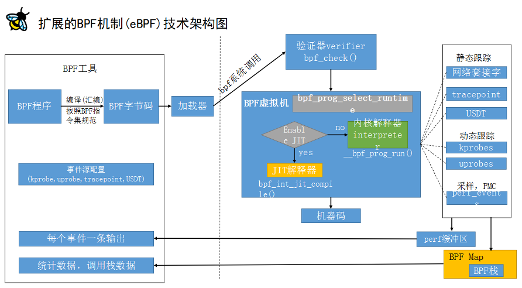


---

##### 用BPF观测内核

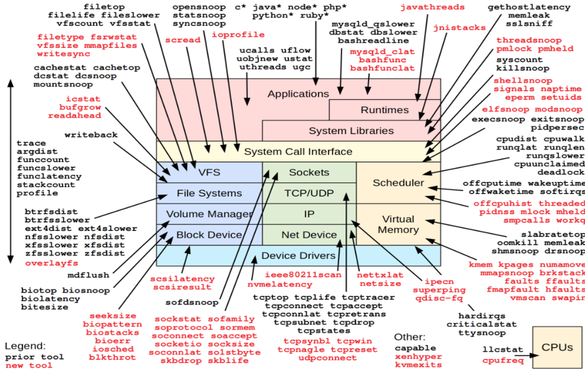


---

##### 监控NUMA Balancing

* NUMA Balancing原理
    * 进程迁移
    * 内存迁移
* 监控的意义
    * 迁移内存对内存密集型程序影响较重
    * 可通过监控迁移的次数和时间对性能影响进行量化分析

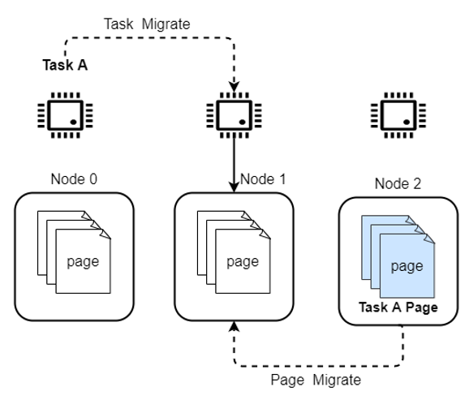


---

##### eBPF应用举例

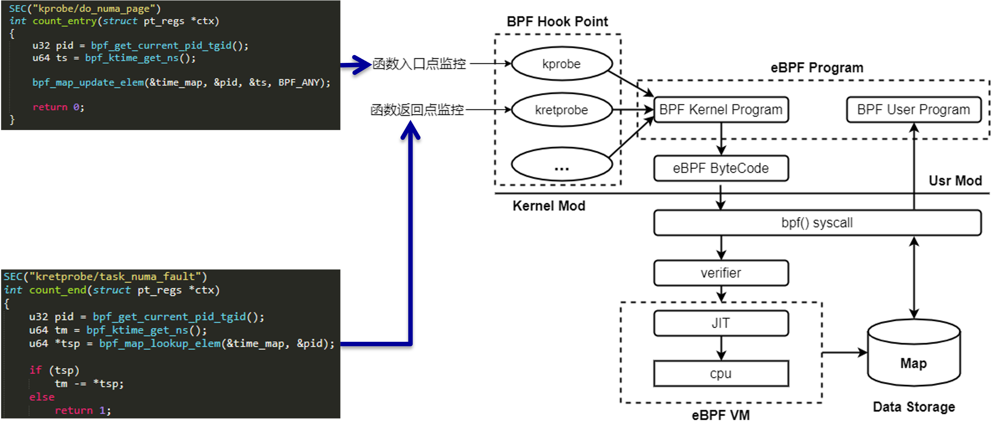


---

##### BPF监控程序运行结果

BPF程序数据输出示例
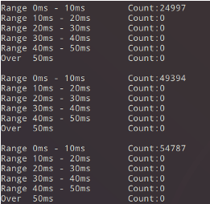

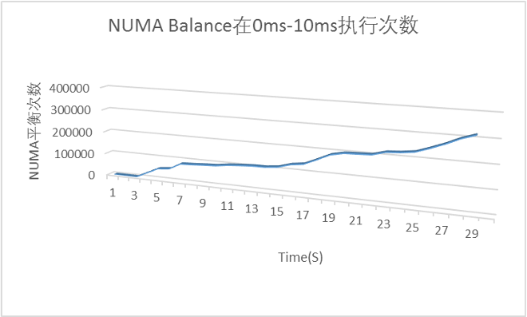

---
<!--
##### 问卷

我们在这次课中讲解了7种内核动态跟踪方法。请以选择填写（多选）的方式回答各种方法所具体的特征。

gprof
DTrace
SystemTap
ftrace
S2E
Vmxice
eBPF

可能特征

探针注入方式：静态编译、动态代码注入、硬件支持、模拟器
数据采集准确性：周期采集、精确事件触发、
数据过滤方式：不过滤、内核可加载模块、虚拟机、

---
-->

<!-- header: ''-->

### Reference

* [Dynamic Analysis](http://courses.cs.washington.edu/courses/cse503/10wi/lectures/lecture1-static-dynamic.ppt)
* gprof
    * [gprof](http://www.skyfree.org/linux/references/gprof.pdf)
    * [GNU gprof Profiler](http://binf.gmu.edu/jsolka/fall08/csi605/csi605-profiling.ppt)
* Dtrace
    * [http://www.geo.uzh.ch/~jbrazile/jazoon07-dtrace-conference.ppt](http://www.geo.uzh.ch/~jbrazile/jazoon07-dtrace-conference.ppt)
    * [http://www.hcs.ufl.edu/upc/archive/toolevals/Overviews/dtraceOverview.ppt](http://www.hcs.ufl.edu/upc/archive/toolevals/Overviews/dtraceOverview.ppt)

---

<!-- header: ''-->

### Reference

* SystemTap
    * [http://fortknox.csc.ncsu.edu/files/Applying-SystemTap.ppt](http://fortknox.csc.ncsu.edu/files/Applying-SystemTap.ppt)
    * [http://www.redbooks.ibm.com/redpapers/pdfs/redp4469.pdf](http://www.redbooks.ibm.com/redpapers/pdfs/redp4469.pdf)
    * [http://dirlt.com/systemtap.html](http://dirlt.com/systemtap.html)
* ftrace
    * [http://elinux.org/images/e/e8/Bird-Ftrace.ppt](http://elinux.org/images/e/e8/Bird-Ftrace.ppt)

---

<!-- header: ''-->

### Reference

* S2E
    * [http://os.cs.tsinghua.edu.cn/oscourse/CallGraph2012/ReadMe](http://os.cs.tsinghua.edu.cn/oscourse/CallGraph2012/ReadMe)
    * [http://infoscience.epfl.ch/record/163071/files/s2e.pdf](http://infoscience.epfl.ch/record/163071/files/s2e.pdf)
    * [http://people.cs.nctu.edu.tw/~chenwj/slide/QEMU/Introduction%20to%20QEMU.pptx](http://people.cs.nctu.edu.tw/~chenwj/slide/QEMU/Introduction%20to%20QEMU.pptx)

---

##### 

<!-- header: ''-->

<!-- theme: gaia -->
<!-- _class: lead -->


谢谢！

<br>
<br>

<!-- footer: '' -->

<!-- paginate: false -->