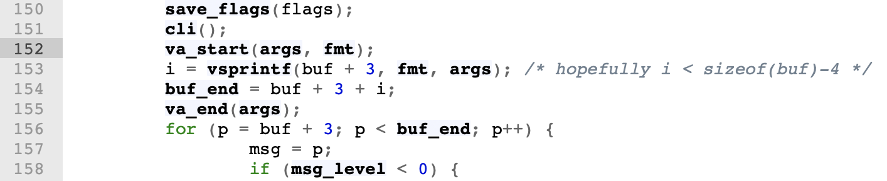
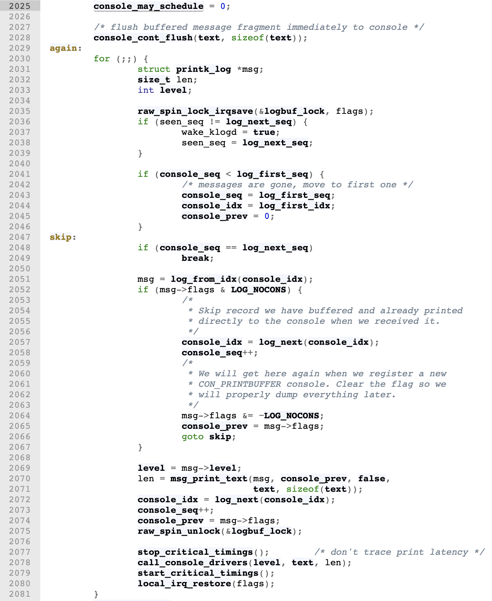
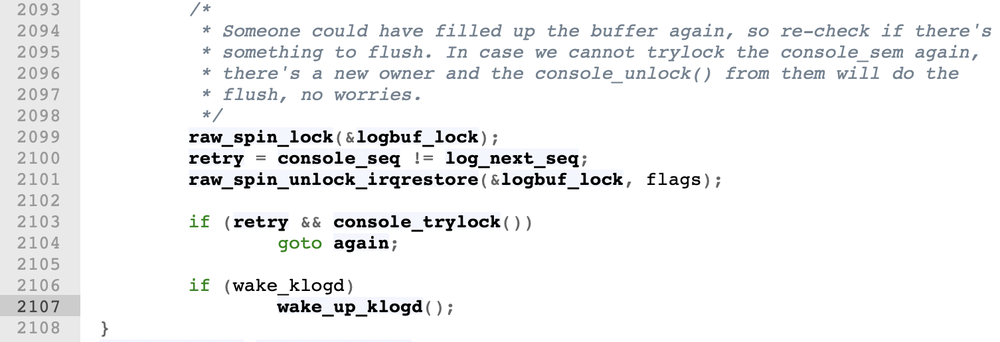

<!-- theme: gaia -->
<!-- _class: lead -->
<!-- footer: '' -->

# 开源操作系统实践
## Lecture 4: printk() - The most useful tool

<br>

向勇
清华大学计算机系
xyong@tsinghua.edu.cn
2022年7月
<br>

Ref: [Steven Rostedt](https://elinux.org/images/7/7c/Elce-printk-v1.pdf), Sergey Senozhatsky

---

<!-- header: ''-->
<!-- footer: '向勇：开源操作系统实践 - Lecture 4: printk()' -->

Outline

### 1. printk() in Linux v1.0
2. Multiprocessor Support from Linux 2.1.80
3. Scheduler, NMI and printk()
4. printk() within a printk()?
5. Choosing what printk()

<!--
-->

---

<!-- header: '1. printk() in Linux v1.0'-->

##### What is printk()?
* Basically it is the printf() of the kernel
    * Writes text to the console (VGA screen, serial UART, network, etc)
* Does not use libc! (all code is implemented in the kernel)
* Used to display information (devices coming on line)
* Used to show stack traces (Warnings)
* Used to show panics (when all else fails)

<!--
-->

---

##### 课堂练习

请尝试对Linux内核v1.0版本中的printk()的54行的Linux代码进行分析，并形成分析文档。分析文档的内容建议：
1. 这个函数的流程图；
2. 函数涉及的全局变量和局部变量在函数执行过程中的变化情况；
3. 函数中调用的其他函数的功能；
4. 这个函数实现的不足；

如果有同学想接受进一步的挑战，可以在完成上述函数分析后，分析Linux内核v3.13.11版本中的printk()的源代码。


---

##### Linux v1.0 - /kernel/printk.c

Linux v1.0 - /kernel/printk.c - [Line 142](https://elixir.bootlin.com/linux/1.0/source/kernel/printk.c#L142)

```C
asmlinkage int printk(const char *fmt, ...)
{
	va_list args;
	int i;
	char *msg, *p, *buf_end;
	static char msg_level = -1;
	long flags;

	save_flags(flags);
	cli();
	va_start(args, fmt);
	i = vsprintf(buf + 3, fmt, args); /* hopefully i < sizeof(buf)-4 */
	buf_end = buf + 3 + i;
	va_end(args);
	for (p = buf + 3; p < buf_end; p++) {
		msg = p;
		if (msg_level < 0) {
			if (
				p[0] != '<' ||
				p[1] < '0' || 
				p[1] > '7' ||
				p[2] != '>'
			) {
				p -= 3;
				p[0] = '<';
				p[1] = DEFAULT_MESSAGE_LOGLEVEL - 1 + '0';
				p[2] = '>';
			} else
				msg += 3;
			msg_level = p[1] - '0';
		}
```

<!--
-->

---

##### save_flags() and cli()

Linux v1.0 - /kernel/printk.c - [Line 150](https://elixir.bootlin.com/linux/1.0/source/kernel/printk.c#L150)


<!--
-->

---

##### Handle variable argument list

Linux v1.0 - /kernel/printk.c - [Line 152](https://elixir.bootlin.com/linux/1.0/source/kernel/printk.c#L152)



<!--
[handle variable argument list](https://www.man7.org/linux/man-pages/man0/stdarg.h.0p.html)
The va_start() macro is invoked to initialize ap to the beginning of the list before any calls to va_arg().
[vprintf()](https://elixir.bootlin.com/linux/1.0/source/kernel/vsprintf.c#L119)
-->

<!--
-->

---

##### sizeof(buf)

Linux v1.0 - /kernel/printk.c - [Line 153](https://elixir.bootlin.com/linux/1.0/source/kernel/printk.c#L153)


<!--
-->

---

##### msg

Linux v1.0 - /kernel/printk.c - [Line 156](https://elixir.bootlin.com/linux/1.0/source/kernel/printk.c#L156)


<!--
-->

---

##### msg_level

Linux v1.0 - /kernel/printk.c - [Line 158](https://elixir.bootlin.com/linux/1.0/source/kernel/printk.c#L158)


<!--
-->

---

##### Set msg_level Tag

Linux v1.0 - /kernel/printk.c - [Line 160](https://elixir.bootlin.com/linux/1.0/source/kernel/printk.c#L160)


<!--
-->

---

##### msg-start-position

Linux v1.0 - /kernel/printk.c - [Line 170](https://elixir.bootlin.com/linux/1.0/source/kernel/printk.c#L170)


<!--
-->

---

##### Set msg_level

Linux v1.0 - /kernel/printk.c - [Line 171](https://elixir.bootlin.com/linux/1.0/source/kernel/printk.c#L171)


<!--
-->

---

##### log_buf

Linux v1.0 - /kernel/printk.c - [Line 173](https://elixir.bootlin.com/linux/1.0/source/kernel/printk.c#L173)


<!--
-->

---

##### LOG_BUF_LEN

Linux v1.0 - /kernel/printk.c - [Line 174](https://elixir.bootlin.com/linux/1.0/source/kernel/printk.c#L174)


<!--
-->

---

##### log_size

Linux v1.0 - /kernel/printk.c - [Line 176](https://elixir.bootlin.com/linux/1.0/source/kernel/printk.c#L176)


<!--
-->

---

##### return

Linux v1.0 - /kernel/printk.c - [Line 180](https://elixir.bootlin.com/linux/1.0/source/kernel/printk.c#L180)


<!--
-->

---

##### console_loglevel

Linux v1.0 - /kernel/printk.c - [Line 183](https://elixir.bootlin.com/linux/1.0/source/kernel/printk.c#L183)


<!--
-->

---

##### console_print_proc

Linux v1.0 - /kernel/printk.c - [Line 186](https://elixir.bootlin.com/linux/1.0/source/kernel/printk.c#L186)


<!--
-->

---

##### Next msg

Linux v1.0 - /kernel/printk.c - [Line 190](https://elixir.bootlin.com/linux/1.0/source/kernel/printk.c#L190)


<!--
-->

---

##### wake_up_interruptible

Linux v1.0 - /kernel/printk.c - [Line 193](https://elixir.bootlin.com/linux/1.0/source/kernel/printk.c#L193)


<!--
-->

---

##### printk() basically does the same thing today

* Has log levels
* Has a fixed size ring buffer
* Sends to a console
* Wakes up a user space task (syslogd) if one is waiting

<!--
-->

---

##### 8 printk Log Levels: Set how much verbosity you want to print

* KERN_EMERG “0”
* KERN_ALERT “1”
* KERN_CRIT “2”
* KERN_ERR “3”
* KERN_WARNING “4”
* KERN_NOTICE “5”
* KERN_INFO “6”
* KERN_DEBUG “7”

<!--
-->

---

##### Log Levels (back then through to today)
* Set how much verbosity you want to print
    * Default level to print is < 7 (can be changed by config option)
        * Only levels less than the number will print
        * Lowest log level is 1 (EMERG is always printed)
    * Can set how much to print from kernel command line as well
    * Log levels are “prefixed” to the format string of the printk
        * `printk(KERN_WARNING “Something bad happened\n”);`
        * (old way) `printk(“<4>” “Something bad happened\n”);`
        * (new way) `printk(“\001” “4” “Something bad happened\n”);`

<!--
-->

---

##### The printk ring buffer
* Single fixed size ring buffer
* Size can be changed by “log_buf_len” on kernel command line
* No longer a simple buffer
    * Made up of “messages”
    * Messages contain timestamp, loglevel, other meta data, and the print output
* Protected by a spinlock (must not be called from NMI)
    * Can happen but it can deadlock if it happens during a printk
    * New printk_safe() mode can be used (explained later)

<!--
Braille
noun
uncountable 布莱叶盲文
a Braille book
盲文写成的书
-->

---

##### Sending to the console
* Needs to go over some output medium
    * The monitor
    * Frame Buffers
    * UART / Serial console
    * Network console
    * Braille console

<!--
-->

---

##### Sending to the console

* Uses a different locking mechanism
    * The console_lock
    * It is not a spinlock, but a **weird semaphore (mutex)**
    * The owner of the lock will print all remaining data in the ring buffer
    * The owner of the lock will print new data that comes in while held
* Consoles can have their own lock too!

<!--
-->

---

##### syslogd (or other task waiting to read dmesg)

* If a task is waiting to record kernel messages it needs to be woken up
* Something like syslogd (or journald)
* When a print occurs a wake up must happen
* This task writes to the journal or syslog (/var/log/syslog)

---

<!-- header: ''-->

Outline

1. printk() in Linux v1.0
### 2. Multiprocessor Support from Linux 2.1.80
3. Scheduler, NMI and printk()
4. printk() within a printk()?
5. Choosing what printk()

<!--
-->

---

<!-- header: '2. Multiprocessor Support from Linux 2.1.80'-->

##### Then multiprocessors happened
* In January 1998 - Linux 2.1.80
    * spin_lock was introduced to printk()
* All prints were serialized
    * If two CPUs called printk at the same time
    * The second one has to wait for the first one to finish
    * This does not scale
    * All CPUs can be halted waiting its turn to print
* Remember, printk can be very slow!

<!--
-->

---

##### 课堂练习

使用办公室的**公用打印机**有哪些限制？如何提高打印机的利用效率？

---

##### Sharing the printk lock


<!--
-->

---

##### The console_lock semaphore

* In September of 2001 - Linux 2.4.10
    * The console_lock semaphore was added
    * A logbuf_lock spinlock was added
* The logbuf_lock spinlock
    * Used to add data to the ring buffer
    * Then perform a trylock on the console_lock semaphore
    * Then release the logbuf_lock spinlock

<!--
-->

---

##### The console_lock semaphore

* The first holder would do all the printing
    * Tasks would grab logbuf_lock, write into log
    * Try to take the console_lock, if it fails, then just exit printk()
        * Someone else will finish
    * The console_lock owner would finish all the printing

<!--
-->

---

##### The console_lock semaphore (Con't)

* This is where the magic happens to get to the consoles 
* printk() tries to do a console_trylock()
    * If it fails, it just exits (someone else is doing the print)
    * If it gets the lock, others will not print
```C
if (console_trylock())
    console_unlock();
```
* console_unlock() is where the real work happens

<!--
-->

---

##### console_unlock()

Linux v3.13.11 - /kernel/printk/printk.c - [Line 2012](https://elixir.bootlin.com/linux/v3.13.11/source/kernel/printk/printk.c#L2012)


<!--
-->

---

##### console_unlock() - up_console_sem

Linux v3.13.11 - /kernel/printk/printk.c - [Line 2020](https://elixir.bootlin.com/linux/v3.13.11/source/kernel/printk/printk.c#L2020)


<!--
-->

---

##### console_unlock() - console_may_schedule

Linux v3.13.11 - /kernel/printk/printk.c - [Line 2025](https://elixir.bootlin.com/linux/v3.13.11/source/kernel/printk/printk.c#L2025)



<!--
-->

---

##### console_unlock() - console_locked

Linux v3.13.11 - /kernel/printk/printk.c - [Line 2082](https://elixir.bootlin.com/linux/v3.13.11/source/kernel/printk/printk.c#L2082)


<!--
-->

---

##### console_unlock() - exclusive_console

Linux v3.13.11 - /kernel/printk/printk.c - [Line 2086](https://elixir.bootlin.com/linux/v3.13.11/source/kernel/printk/printk.c#L2086)


<!--
-->

---

##### console_unlock() - logbuf_lock

Linux v3.13.11 - /kernel/printk/printk.c - [Line 2099](https://elixir.bootlin.com/linux/v3.13.11/source/kernel/printk/printk.c#L2099)


<!--
-->

---

##### console_unlock() - log_next_seq

Linux v3.13.11 - /kernel/printk/printk.c - [Line 2100](https://elixir.bootlin.com/linux/v3.13.11/source/kernel/printk/printk.c#L2100)


<!--
-->

---

##### console_unlock() - wake_klogd

Linux v3.13.11 - /kernel/printk/printk.c - [Line 2107](https://elixir.bootlin.com/linux/v3.13.11/source/kernel/printk/printk.c#L2107)



<!--
-->

---

##### the console_lock


<!--
-->

---

##### exclusive_console (Added March 2011)

* console=tty1 console=ttyMFD2 console=ttyS0 earlyprintk=mrst
* Each console registered would cause a reprint of the logbuf on other consoles
* The console “start” location would get reset when new console is registered
    * When sending to all consoles would send repeated data
* exclusive_console set to registered console
    * Only this console will do the print on the next console_unlock()
    * (Note, new printks, wont go over other consoles here!)

<!--
-->

---

##### exclusive_console (Added March 2011)

* printk message rewrite (for journald) (May 2012)
    * caused excluse_console to be obsolete
    * why is it still there?
    * Nobody noticed it was obsolete
        * I noticed this while reviewing these slides (today!)


---

<!-- header: ''-->

Outline

1. printk() in Linux v1.0
2. Multiprocessor Support from Linux 2.1.80
### 3. Scheduler, NMI and printk()
4. printk() within a printk()?
5. Choosing what printk()

<!--
-->

---

<!-- header: '3. Scheduler, NMI and printk()'-->

##### Printk and the scheduler

* We want printk to work most everywhere
* Now printk has locks
    * This is an issue with NMIs

<!--
-->

---

##### Printk with semaphore and the scheduler

* There are callers of the console_lock that blocks (does not use trylock)
* Releasing the console lock may require to do a wake up
* A wake up grabs the scheduler runqueue locks
* A printk may happen in the scheduler!


<!--
-->

---

##### Printk and the scheduler
* originally called printk_sched()
    * now called printk_deferred()
* Originally wrote to separate per_cpu buffers
    * now writes directly into the printk ring buffer (taking the logbuf_lock)
* Originally waited for the next jiffy tick to trigger to print
    * now uses irq_work to do the print (on some archs, that is still the jiffy tick)
* Still can not do output while holding a scheduler runqueue lock

<!--
-->

---

##### NMI - Non-Maskable Interrupt
* Printk can happen in an NMI
* NMI watchdog can detect a lockup (deadlock)
* echo ‘l’ > /proc/sysrq-trigger
    * Dumps a back trace of all active CPUs (via NMI)
* Remember, printk takes a spinlock
    * If NMI tries to do a printk when it interrupted a printk
    * Can cause a deadlock to the system
* For years it was mostly a crap shoot that it would work

<!--
-->

---

##### BUST Spinlocks!
* From v2.4 through to 4.11
* Also called “zap_locks()”
* Sets oops_in_progress = 1
    * Lets the system know it is dieing
    * Try to get output to the screen as best as possible

<!--
-->

---

##### BUST Spinlocks!
```C
static void zap_locks(void)
{
    static unsigned long oops_timestamp;
    if (time_after_eq(jiffies, oops_timestamp) &&
        !time_after(jiffies, oops_timestamp + 30 * HZ))
        return;
    oops_timestamp = jiffies;
    debug_locks_off();
    /* If a crash is occurring, make sure we can't deadlock */
    raw_spin_lock_init(&logbuf_lock);
    /* And make sure that we print immediately */
    sema_init(&console_sem, 1);
}
```

<!--
bust: (break) 弄坏
-->

---

##### Introduction of seq_buffer (v3.19)

* Used by the tracing facility
* Allows to pass a buffer descriptor between functions
* Can use any allocated buffer
* Can be used by NMI printk
    * A buffer per CPU
    * NMI printk writes to the seq_buffer and not to console
    * A “safe” place reads NMI seq_buffers and prints to console
    * Unfortunately, if system dies no output will come from NMIs
    * Used by sysrq-’l’ - stable output (not for system crashes)
---

##### Introduction of seq_buffer (v3.19)

* Printk now is determined by per CPU what it will do

```C
static int nmi_vprintk(const char *fmt, va_list args)
{
    struct nmi_seq_buf *s = this_cpu_ptr(&nmi_print_seq);
    unsigned int len = seq_buf_used(&s->seq);
    seq_buf_vprintf(&s->seq, fmt, args);
    return seq_buf_used(&s->seq) - len;
}
```

<!--
-->

---

##### seq_buffers and NMIs


<!--
-->

---

##### What about other NMI code?

* The seq_buffer method worked for sysrq-t for simple back traces What about panics
* What about WARN() calls?
* None of these are safe
* Need another Method

<!--
-->

---

##### nmi_vprintk (v4.7)
* printk_nmi_enter/exit() functions
    * Called when an NMI starts and exits
    * Switches printk to use vprintk_nmi()
* Flushes the nmi buffer via a irq_work
    * When interrupts are enabled again, the print will happen
    * Unfortunately, this makes NMI hard lockup detector no longer work
    * works if not all CPUs are locked up hard (infinite loop with interrupts disabled)

<!--
-->

---

##### nmi_vprintk (v4.7)

```C
avoid printk_nmi_enter(void)
{
    this_cpu_write(printk_func, vprintk_nmi);
}
void printk_nmi_exit(void)
{
    this_cpu_write(printk_func, vprintk_default);
}
```

---

<!-- header: ''-->

Outline

1. printk() in Linux v1.0
2. Multiprocessor Support from Linux 2.1.80
3. Scheduler, NMI and printk()
### 4. printk() within a printk()?
5. Choosing what printk()

<!--
-->

---

<!-- header: '4. printk() within a printk()?'-->

##### printk() within a printk()?
* printk() does a console_unlock which wakes up pending tasks
* the scheduler code can warn (scheduling while atomic, etc)
* What happens if the scheduler does a printk when waking up printk?


<!--
-->

---

##### lockdep

* Lock validator in Linux
* Would catch possible deadlock situations
    * lock A taken before lock B where someplace else takes lock B first
* When it detects a possible deadlock, it would print the problem

<!--
-->

---

##### lockdep

* printk() has three types of locks
    * logbuf_lock
    * console_lock
    * the consoles have their own locks
* If printk() causes a deadlock, and lockdep reports it
    * It will cause its own deadlock!

<!--
-->

---

##### printk_safe (v4.11)
* Similar to the NMI printk
* Manually mark areas in printk that can recurse
* Add a counter
    * incremented before “unsafe” regions of printk
    * decremented after “unsafe” regions of printk
    * When > 0, it uses a separate buffer
    * Uses irq_work to flush out the buffer

<!--
-->

---

##### printk_safe (v4.11)

* printk_func() no longer a function pointer, but a multiplexer
* per-CPU context flags and counter to know what function to use
    * Whenever the logbuf spinlock is held, increment the counter, decrement when released
    * Increment the counter when releasing the console_lock
* Knows if NMI can write to the printk ring buffer directly
    * If the per-CPU context counter is zero, the current CPU does not have the logbuf lock
    * If the per-CPU context counter is not zero, check if the logbuf_lock is held


<!--
-->

---

##### printk_safe (v4.11)

```C
void printk_nmi_enter(void)
{
    if ((this_cpu_read(printk_context) & PRINTK_SAFE_CONTEXT_MASK) && 
        raw_spin_is_locked(&logbuf_lock)) {
            this_cpu_or(printk_context, PRINTK_NMI_CONTEXT_MASK);
    } else {
        this_cpu_or(printk_context, PRINTK_NMI_DEFERRED_CONTEXT_MASK);
    }
}
void printk_nmi_exit(void)
{
    this_cpu_and(printk_context,
        ~(PRINTK_NMI_CONTEXT_MASK |
        PRINTK_NMI_DEFERRED_CONTEXT_MASK));
}
```

<!--
-->

---

##### printk_safe (v4.11)

* printk_func() no longer a function pointer, but a multiplexer
* Uses per-CPU context flags and counter to know what function to use
    * Whenever the logbuf spinlock is held, increment the counter, decrement when released
    * Increment the counter when releasing the console_lock

<!--
-->

---

##### printk_safe (v4.11)

* Knows if NMI can write to the printk ring buffer directly
    * If the per-CPU context counter is zero, the current CPU does not have the logbuf lock
    * If the per-CPU context counter is not zero, check logbuf_lock

```C
void printk_nmi_enter(void)
{
    If printk_safe is active (CONTEXT_MASK > 0) and logbuf_lock is locked oid
        then use the vprintk_nmi() function
    else
        Use the vprintk_deferred() function
}
```

---

<!-- header: ''-->

Outline

1. printk() in Linux v1.0
2. Multiprocessor Support from Linux 2.1.80
3. Scheduler, NMI and printk()
4. printk() within a printk()?
### 5. Choosing what printk()

<!--
-->

---

<!-- header: '5. Choosing what printk()'-->

##### Choosing what printk() should do

```C
int vprintk_func(const char *fmt, va_list args)
{
    /* Use extra buffer in NMI when logbuf_lock is taken or in safe mode. */
    if (this_cpu_read(printk_context) & PRINTK_NMI_CONTEXT_MASK)
        return vprintk_nmi(fmt, args);
    /* Use extra buffer to prevent a recursion deadlock in safe mode. */
    if (this_cpu_read(printk_context) & PRINTK_SAFE_CONTEXT_MASK)
        return vprintk_safe(fmt, args);
    /*Use the main logbuf when logbuf_lock is available in NMI.
    * But avoid calling console drivers that might have their own locks. */
    if (this_cpu_read(printk_context) & PRINTK_NMI_DEFERRED_CONTEXT_MASK)
        return vprintk_deferred(fmt, args);
    /* No obstacles. */
    return vprintk_default(fmt, args);
}
```

<!--
-->

---

##### In the mean time...

* systemd can write to the printk ring buffer
    * To store prints between init ramdisk and normal boot
* The interface is via /proc/kmsg
* The limited size of the ring buffer can overflow
    * due to user space writes
    * Loss of important kernel information can result

<!--
-->

---

##### early_printk
* Printk doesn’t print to consoles until consoles are set up
    * happens relatively late in the boot up sequence
    * If the kernel crashes before then, you will see no output
* Add to kernel command line: earlyprintk=ttyS0,1152008n
    * or serial,0x3F8,115200
    * or other types: vga, efi, usb, etc (See Documentation/admin-guide/kernel-parameters.txt)
* Serial port is rather easy to set up
    * That’s what is commonly used

<!--
-->

---

##### early_printk

* early printk stops when consoles are set up
* Add “,keep” to command line to keep the early printk going after consoles set up
* Code out there that has “force_early_printk” to replace printk to always use it

<!--
-->

---

##### Death of the UART

* Serial ports is sadly a thing of the past (for the desktop)
    * Hard to find even mother boards with a UART
* Simplest way to get crash data out
    * Especially if you have X running (will not see the output from the screen)

<!--
-->

---

##### Methods for crash data out

* Other methods:
    * network console - If you can get it working
    * delay print (to slowly see what’s on the screen)
    * kexec / kdump
        * Really great if you can get it to work
        * Uses “crash” utility as a gdb that knows how to parse kernel cores (can read the printk buffer)

<!--
-->

---

##### Summary

* A way to display data to the screen (especially for a kernel oops)
* Log kernel events (drivers coming on line, etc)
* Output in all context (normal, interrupt, NMI)
* Must retain serial order of events
* Ideally, get as much info out as possible before the machine dies

---

##### 

<!-- header: ''-->

<!-- theme: gaia -->
<!-- _class: lead -->


谢谢！

<br>
<br>

<!-- footer: '' -->

<!-- paginate: false -->