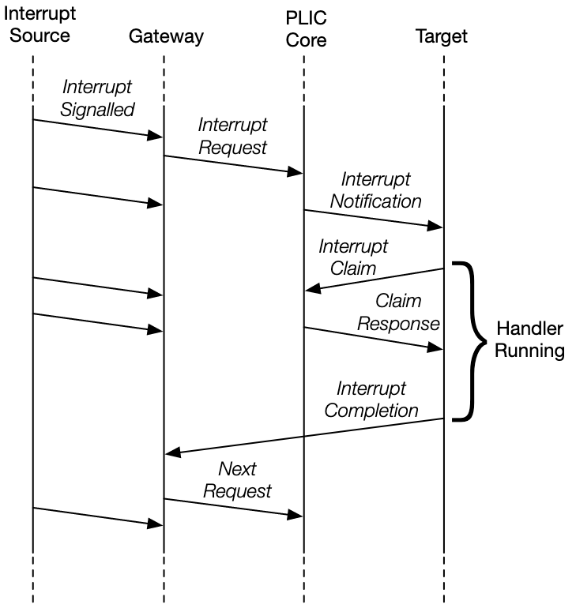
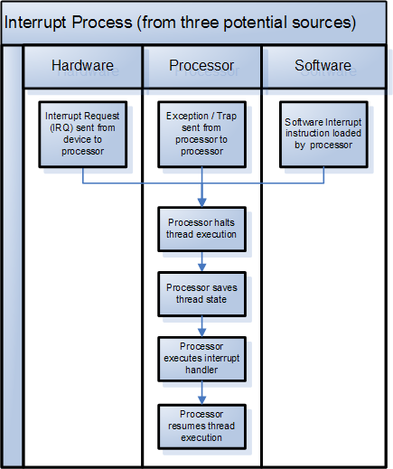
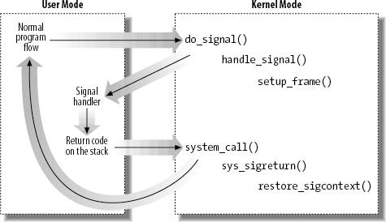

<!-- theme: gaia -->
<!-- _class: lead -->
<!-- footer: '' -->

# 开源操作系统实践
## 第五讲: 并发与操作系统、处理器和编程语言

 

向勇
清华大学计算机系
xyong@tsinghua.edu.cn
2022年7月
 

---

<!-- header: ''-->
<!-- footer: '向勇：开源操作系统实践 - 第五讲: 并发与操作系统、处理器和编程语言' -->

提纲

### 1. CPU硬件对并发的支持
2. 操作系统对并发的支持
3. Rust语言对并发的支持
4. 异步操作系统

---

<!-- header: '1. CPU硬件对并发的支持'-->

##### [中断概念](https://blog.csdn.net/qq_43811102/article/details/103334022)

程序执行中，由于异常情况，CPU上正在执行的程序会被“中断”，转到处理异常情况或特殊事件的程序去执行，结束后再返回到原被“中断”的程序处继续执行。

---

##### [Interrupt Cycle](https://binaryterms.com/interrupts-in-computer-architecture.html)

---

##### [RISC-V中断](https://www.latticesemi.com/-/media/LatticeSemi/Images/ProductImages/DesignSoftwareandIntellectualProperty/IP/IPCores04/RISC-V_SM_IP_Block_Diagram.ashx)

<!--
claim
A.transitive verb
① (assert right to) 要求…的所有权; 认领
-->

---

##### [RISC-V PLIC interrupt Flow](https://riscv.org/wp-content/uploads/2016/07/Tue0900_RISCV-20160712-Interrupts.pdf)

---

#### RISC-V N-Extention

[“N” Standard Extension for User-Level Interrupts](https://five-embeddev.com/riscv-isa-manual/latest/n.html)

Objective:
* secure embedded systems with only M-mode and U-mode present
* user-level trap handling.
    * replace conventional signal handling
    * generate user-level events such as garbage collection barriers, integer overflow, floating-point traps

Ref: Krste	Asanović, [RISC-V interrupt](https://riscv.org/wp-content/uploads/2016/07/Tue0900_RISCV-20160712-Interrupts.pdf)

---

##### Interrupts in Secure Embedded Systems

---

##### User-Level Interrupts “N” - User Trap Setup

* Natural extension of interrupt model into user permissions
* Adds user CSRs, and **uret** instruction

|Number|Privilege|Name|Description|
|:----|:----|:----|:----|
|0x000|URW|ustatus|User status register.|
|0x004|URW|uie|User interrupt-enable register.|
|0x005|URW|utvec|User trap handler base address.|

---

##### User-Level Interrupts “N” - User Trap Handling

* Natural extension of interrupt model into user permissions
* Adds user CSRs, and **uret** instruction

|Number|Privilege|Name|Description|
|:----|:----|:----|:----|
|0x040|URW|uscratch|Scratch reg. for user trap handlers.|
|0x041|URW|uepc|User exception program counter.|
|0x042|URW|ucause|User trap cause.|
|0x043|URW|ubadaddr|User bad address.|
|0x044|URW|uip|User interrupt pending.|

---

##### Interrupts in Secure Embedded Systems

(M, U modes)

* M-­mode runs secure boot and runtime monitor
* Embedded code runs in U-­mode
* Physical memory protection on U-­mode accesses
* Interrupt handling can be delegated to U-­mode code
* Provides arbitrary number of isolated subsystems

---

#### [Intel UINTR](https://lore.kernel.org/lkml/20210913200132.3396598-1-sohil.mehta@intel.com/)

* In the User Interrupts hardware architecture, a receiver is always expected to be a user space task.
* A user interrupt can be sent by another user space task, kernel or an external source (like a device).

<!--
https://lore.kernel.org/lkml/20210913200132.3396598-1-sohil.mehta@intel.com/
-->

---

#### Intel UINTR

The average normalized latency for a 1M ping-pong IPC notifications
with message size=1.

| IPC type   |   Relative Latency (normalized to User IPI) |
|:----|:----|
| User IPI   |                     1.0 |
| Signal     |                    14.8 |
| Eventfd    |                     9.7 |
| Pipe       |                    16.3 |
| Domain     |                    17.3 |

---

##### Kernel managed architectural data structures for UINTR

* UPID: User Posted Interrupt Descriptor
* UITT: User Interrupt Target Table

The interrupt state of each task is referenced via MSRs which are saved and restored by the kernel during context switch.

<!--
UPID: User Posted Interrupt Descriptor
- Holds receiver interrupt vector information and notification state (like an ongoing notification, suppressed notifications).

UITT: User Interrupt Target Table
- Stores UPID pointer and vector information for interrupt routing on the sender side. Referred by the senduipi instruction.

The interrupt state of each task is referenced via MSRs which are saved and
restored by the kernel during context switch.
-->
---

##### Instructions for UINTR

* `senduipi <index>` - **send** a user IPI to a target task based on the UITT index.
* `clui` - **Mask** user interrupts by clearing UIF (User Interrupt Flag).
* `stui` - **Unmask** user interrupts by setting UIF.
* `testui` - **Test** current value of UIF.
* `uiret` - return from a **user interrupt handler**.

---

##### API for UINTR

1)A receiver can **register/unregister** an interrupt handler using the Uintr receiver related syscalls. 
		`uintr_register_handler(handler, flags)`
		`uintr_unregister_handler(flags)`
2)A syscall also allows a receiver to **register a vector** and create a user interrupt file descriptor - uintr_fd. 
		`uintr_fd = uintr_create_fd(vector, flags)`

---

##### API for UINTR

3)Any sender with access to uintr_fd can use it to **deliver events** (in this case - interrupts) to a receiver.<!--A sender task can manage its connection with the receiver using the sender related syscalls based on uintr_fd.-->
		`uipi_index = uintr_register_sender(uintr_fd, flags)`

4a)After the initial setup, a sender task can use the SENDUIPI instruction along with the uipi_index to **generate user IPIs** without any kernel intervention.
		`SENDUIPI <uipi_index>`<!--If the **receiver is running** (CPL=3), then the user interrupt is delivered directly without a kernel transition.
If the **receiver isn't running** the interrupt is delivered when the receiver gets context switched back. If the receiver is blocked in the kernel, the user interrupt is delivered to the kernel which then unblocks the intended receiver to deliver the interrupt.-->
4b) If the **sender is the kernel or a device**, the uintr_fd can be passed onto the related kernel entity to allow them to setup a connection and then generate a user interrupt for event delivery.

---

<!-- header: ''-->
<!-- footer: '向勇：开源操作系统实践 - 第五讲: 并发性能与操作系统、处理器和编程语言' -->

提纲

1. CPU硬件对并发的支持
### 2. 操作系统对并发的支持
3. Rust语言对并发的支持
4. 异步操作系统

---

<!-- header: '2. 操作系统对并发的支持'-->

##### [操作系统服务](https://www.cnblogs.com/kexinxin/p/9939040.html)

---

##### [系统调用](https://www.jianshu.com/p/14f715a5184e)

---

##### 内核的进入与退出

---

##### [硬中断的响应过程](https://zhuanlan.zhihu.com/p/360548214)

---

##### [操作系统的中断响应过程](https://en.wikipedia.org/wiki/Interrupt#/media/File:Interrupt_Process.PNG)

---

##### 信号（[Signal](http://kernel.meizu.com/linux-signal.html))

用户态的异常处理机制

* 信号（Signal）响应时机

  * 发送信号并没有发生硬中断，只是把信号挂载到目标进程的信号 pending 队列
  * 信号执行时机：进程执行完异常/中断返回用户态的时刻

---

###### 信号处理

* 用户注册的信号处理函数都是用户态的
  * 先构造堆栈，返回用户态去执行自定义信号处理函数
  * 再返回内核态继续被信号打断的返回用户态的动作。

---

#### 进程、线程和协程

##### Multitasking

<!--
参考： https://cfsamson.github.io/book-exploring-async-basics/2_async_history.html#non-preemptive-multitasking
-->

* Non-Preemptive multitasking
  - The programmer `yielded` control to the OS
  - Every bug could halt the entire system
<!--
  - Example: Windows 95
-->
* Preemptive multitasking
  - OS can stop the execution of a process, do something else, and switch back
  - OS is responsible for scheduling tasks
<!--
  - Example: UNIX, Linux
-->

---

##### User-level Thread

<!--
参考： https://stackoverflow.com/questions/15983872/difference-between-user-level-and-kernel-supported-threads

https://cfsamson.github.io/books-futures-explained/0_background_information.html#green-threads
-->

* Advantages
  - Simple to use
  - A "context switch" is reasonably fast
  - Each stack only gets a little memory
  - Easy to incorporate [*preemption*](https://cfsamson.gitbook.io/green-threads-explained-in-200-lines-of-rust/green-threads#preemptive-multitasking)
* Drawbacks
  - The stacks might need to grow
  - Need to save all the CPU state on every switch
  - Example: [Green Threads](https://cfsamson.github.io/books-futures-explained/0_background_information.html#green-threads)
<!--
  - Complicated to implement correctly if you want to support many different platforms
-->

---

##### Kernel-supported Threads

<!--
ref: https://stackoverflow.com/questions/15983872/difference-between-user-level-and-kernel-supported-threads
https://cfsamson.github.io/books-futures-explained/0_background_information.html#threads-provided-by-the-operating-system
-->

* **Advantages**
  - Easy to use
  - Switching between tasks is reasonably fast
  - Geting parallelism for free
* **Drawbacks**
  - OS level threads come with a rather large stack
  - There are a lot of syscalls involved
  - Might not be an option on some systems, such as http server
* Example: [Using OS threads in Rust](https://cfsamson.github.io/books-futures-explained/0_background_information.html#threads-provided-by-the-operating-system)

---

##### 并发模型与调度

并发机制：

* 内核线程：内核实现
* 用户线程：用户库实现、语言支持
* 协程：用户库实现、语言支持

---

##### 并发模型与调度

上下文切换与调度器：执行流控制

* 中断上下文保存与恢复：基于中断
* 进程切换：基于时钟中断、主动让权
* 线程切换：基于时钟中断、主动让权
* 协程切换：主动让权

<!--
指令集、操作系统、用户库、编译器（语言）

---

##### 内存管理

 * 栈空间：编译器管理
 * 堆空间：操作系统管理

-->

---

##### 异常和错误处理

 * 内核中断机制：硬件与操作系统协作
   * 用户态中断：硬件、操作系统和应用协作管理
 * rust中的option：程序设计语言管理
 * 信号：操作系统和应用协作管理

---

<!-- header: ''-->
<!-- footer: '向勇：开源操作系统实践 - 第五讲: 并发性能与操作系统、处理器和编程语言' -->

提纲

1. CPU硬件对并发的支持
2. 操作系统对并发的支持
### 3. Rust语言对并发的支持
4. 异步操作系统

<!--
20210812-张汉东的报告：Rust的最新进展和社区生态

20210812-1-Rust最新进展和社区生态.pptx
-->

---

<!-- header: '3. Rust语言对并发的支持'-->

#### Rust 语言历史
<!--
P6: Rust 语言历史
-->

1. 2008年开始由Graydon Hoare私人研发
1. 2009年得到Mozilla赞助，2010年首次发布0.1.0版本，用于Servo引擎的研发
1. 2015年5月15号发布1.0版本
1. 2018年发布2018 Edition
1. 2021年2月9号，Rust基金会宣布成立。

从 2016 年开始，截止到 2021年，Rust 连续六年成为StackOverflow 语言榜上最受欢迎的语言

<!--
[Rust语言特点及其在开发中的应用](https://www.bilibili.com/video/BV1ti4y1b7xy?from=search&seid=3999632637077780986)

[编程语言中的变革者 | 敢于打造理想世界的 Rust](https://cloud.tencent.com/developer/article/1617845)

[透过 Rust 探索系统的本原：编程语言](https://cloud.tencent.com/developer/article/1816815)
很好的Rust的设计分析；
-->

---

#### Rust 语言的[目标](https://cloud.tencent.com/developer/article/1617845)

<!--
P16: rust的特征；
-->

融合优秀语言特征，创造一门安全和性能兼备的语言。

1. 内存安全（内存访问模型抽象、类型安全的类型系统）
2. 性能（所有的细节都是可以高效控制）
3. 线程安全（并发执行模型抽象）

---

###### Concept of Future

<!--
Ref: https://os.phil-opp.com/async-await/#example
-->

A future is a representation of some operation which will complete in the future.

---

###### Concept of Future

* Three phases in asynchronous task:

  1. **Executor**: A Future is **polled** which result in the task progressing
     - Until a point where it can no longer make progress
  2. **Reactor**: Register an **event source** that a Future is waiting for
     - Makes sure that it will wake the Future when event is ready
  3. **Waker**: The event happens and the Future is **woken up**
     - Wake up to the executor which polled the Future
     - Schedule the future to be polled again and make further progress

---

###### 异步机制：green thread, coroutine (future)

<!--
基于轮询的 Future的异步执行过程

- 执行器会轮询 `Future`，直到最终 `Future` 需要执行某种 I/O 
- 该 `Future` 将被移交给处理 I/O 的反应器，即 `Future` 会等待该特定 I/O 
- I/O 事件发生时，反应器将使用传递的`Waker` 参数唤醒 `Future` ，传回执行器
- 循环上述三步，直到最终`future`任务完成（resolved）
- 任务完成并得出结果时，执行器释放句柄和整个`Future`，整个调用过程就完成了
  -->

---

<!-- header: ''-->
<!-- footer: '向勇：开源操作系统实践 - 第五讲: 并发性能与操作系统、处理器和编程语言' -->

提纲

1. CPU硬件对并发的支持
2. 操作系统对并发的支持
3. Rust语言对并发的支持
### 4. 异步操作系统

<!--
-->

---

<!-- header: '4. 异步操作系统'-->

##### [异步操作系统设计](https://github.com/async-kernel/documents/blob/main/design/design.md)的整体目标

在RISC-V平台上设计并实现一个基于Rust语言的异步操作系统。

1. 在操作系统内核中实现**细粒度**的并发安全、模块化和可定制特征；
2. 利用Rust语言的**异步机制**，优化操作系统内核的并发性能；
3. 向应用程序提供**异步系统调用**接口，优化系统调用访问性能；
4. 结合LLVM中Rust语言编译器的异步支持技术，完善操作系统的**进程、线程和协程**概念，统一进程、线程和协程的调度机制；
5. 利用RISC-V**用户态中断**，优化操作系统的信号和进程通信性能；
6. 开发**原型系统**，对异步操作系统的特征进行定量性的评估。

---

##### [任务管理：进程、线程与协程](https://github.com/async-kernel/documents/blob/main/design/design.md#任务管理进程线程与协程)

- 进程：有独立的地址空间，存有页表切换开销；
  - 在异步操作系统中，内核是一个独立的进程，有自己的页表；
  - 系统调用过程会变成一种特殊和优化的进程切换。
  - 进程切换代码是在所有进程的内核态共享的。
- 线程：有独立的用户栈，切换时需要保存和恢复全部寄存器。
  - 由于内核与用户线程不在一个地址空间中，每个用户线程只有用户栈，不存在对应的内核栈；
  - 每个内核线程只有内核栈，不存在对应的用户栈。

---

##### [任务管理：进程、线程与协程](https://github.com/async-kernel/documents/blob/main/design/design.md#任务管理进程线程与协程)

- 协程：可以理解为状态机转移函数，执行时可共用同一个栈。
  - 每个线程内可以有多个协程。
  - 编译器将 async 函数变换成状态机时，函数中需要跨越 await 的变量将存放在 Future 对象中（一般在堆上），其它变量只需放在栈上或寄存器中。

---

##### [理想的协程切换过程](https://github.com/async-kernel/documents/blob/main/design/design.md#理想的协程切换过程贾越凯细化)（[协程、线程和进程的调度](https://github.com/async-kernel/documents/blob/main/design/design.md#协程线程和进程的调度)）

协程切换可表现为不同进程和不同线程中的下一个就绪协程选择。

1. 协程切换：同一进程中主动让权协程间的切换；
   * 由编译器自动生成的有限状态机切换代码完成协程切换；
2. 线程切换：同一进程中由于被抢占让权协程间的切换；
   * 切换需要进行用户堆栈保存和切换；
   * 由内核提供的线程切换代码完成线程切换；
3. 进程切换：不同进程中由于被抢占让权协程间的切换；
   * 保存当前用户堆栈，切换到内核态，完成进程地址空间；

---

##### [理想的异步系统调用](https://github.com/async-kernel/documents/blob/main/design/design.md#理想的异步系统调用接口)

* 用户态的异步系统调用会执行编译器自动生成相应的系统调用请求代码，维护协程控制块数据结构；
* 在第一次系统调用请求时和最后一次系统调用完成时，需要进入内核；
* 中间的各次系统调用只进行系统调用的请求提交和结果查询，并进行进程、线程或协程切换。
* 在当前协程的系统调用还没有结果返回且没有新的可执行用户任务时，才会进行协程切换。

---

#### 目前进展

##### 尤予阳、贺锟鹏：RISC-V的用户态中断扩展
<!-- 
ref：Evernote：20210925-第五次操作系统专题训练课安排
-->
* 在QEMU和FPGA上初步实现用户态中断的支持：
  * 用户态中断的注册通过系统调用在内核进程进行处理。
  * 用户态中断支持的信号处理过程，可完全在用户态完成，不需要内核的参与。
* 面临的挑战：
  * 中断编号：需要标识中断的类型、中断源和中断目的方标识；
  * 中断请求和响应的硬件支持：中断目的方可能处于暂停或在不同CPU上运行；

---

###### [软硬件协同的用户态中断扩展](https://gallium70.github.io/rv-n-ext-impl/intro.html)

---

###### [用户态陷入的硬件处理流程](https://lexiangla.com/teams/k100041/classes/e47ce740189811ecaccbb68950a81bc7/courses/553897ce225111ecbdf9469b8754dc9a)

---

##### 车春池、蒋周奇：[共享调度器](https://qf.rs/2021/04/23/异步内核的设计与实现.html)

在操作系统层面提供协程

* 共享调度器直接将所使用的代码、任务池资源都共享到用户，由用户运行和内核相同的代码。
* 用户进程与内核以相同的逻辑处理任务池中的任务。

---

##### 王文智：[线程与协程的统一调度](https://lexiangla.com/teams/k100041/classes/14e3d0ba33e211ecb668e28d1509205c/courses/8b52ee1233e111ecbcb4be09afb7b0ee)

1. 协程与线程灵活绑定；
2. 实现协程（future）在单CPU上并发执行；可在多CPU上并行执行；
3. 线程和协程可采取不同的调度策略；
4. 沿用线程中断的处理过程，协程可被强制中断；

---

##### 吴非凡：[异步系统调用](https://rcore-os.github.io/blog/2021/09/09/2021开源操作系统夏令营总结-异步系统调用-吴非凡/)

###### 用户视图

1. 用户利用异步系统调用函数和 Rust 的 async/await ,生成对应的 Future 树,交由对应的 UserExecutor 进行处理。
3. 对于其中的 Leaf Future ,在 UserExecutor 的执行流中,会发送系统调用,陷入内核,在内核简单注册后立即返回Pending。
4. 内核完成后,会向用户发送**用户态中断**
5. 用户态中断处理程序向 UserReactor 发送事件唤醒对应的UserTask

---

###### 内核视图

1. 内核陷入程序判断是 UserEnvTrap 在将寄存器参数和执行流交由内核中的 syscall 函数处理。
2. 对于有异步拓展的 syscall 函数首先判断系统调用的异步参数(编码后的用户任务号)是否为 0. 0 代表是同步系统调用,非零则代表是异步系统调用
3. 异步版本的系统调用会将生成的 Future 交给 KernelExecutor,并返回Future 的注册信息(成功与否) 。
4. 陷入函数退出。

---

### 总结

* 对于操作系统，开源与协作将是极具潜力的发展策略
  * 用十一年时间，RISC-V从大学项目开始，做到目前的认可程度；
  * 用十三年时间，Rust从个人项目开始，做到目前广泛关注；
* 操作系统与CPU指令集和编程语言的协作有可能带来创新的思路
  * 提高操作系统的性能
  * 降低操作系统的开发难度
  * 减少操作系统的漏洞
* 在硬件技术和编译技术的协作下，异步编程技术有可能深入影响操作系统的发展。

---

<!-- header: ''-->

<!-- theme: gaia -->
<!-- _class: lead -->

谢谢！

 
 

<!-- footer: '' -->

<!-- paginate: false -->