# 异步编程、Rust语言和异步操作系统

 1. 异步编程
 2. Rust语言的并发和异步支持
 3. 异步操作系统

## 向勇 清华大学计算机系
20210927

---

<!--

### 历史版本

1. v1
2. v2
3. v3
4. v4：把操作系统课第21讲的内容合入本文档；
5. v5：/Users/xyong/Desktop/xyong/backup/20210727-夏令营/20210805-技术报告-AsyncOS
6. v6：

### 参考文献

[第二十一讲 异步编程(Asynchronous Programming)](https://github.com/LearningOS/os-lectures/blob/2020spring/lecture21/ref.md)：2020年操作系统课的第21讲内容；

Evernote：20210730-Tokio分析、20200810-Rust的并发编程、20210315-Rust中异步函数与同步函数的混用讨论、20210205-关于异步系统调用的思考、20210205-异步IoT OS的开源框架Drogue IoT、20200921-io_uring的性能分析、20200608-Linux异步IO操作
-->


# 提纲

 1. 异步编程
 2. Rust语言的并发和异步支持
 3. 异步操作系统

---

### 1. 异步编程

1.1 基本概念和原理
1.2 OS Aproach
1.3 Programming Aproach

---

#### 1.1 基本概念和原理

<!--
20200608-Linux异步IO操作

[Linux异步IO操作](https://www.cnblogs.com/skyofbitbit/p/3654531.html)
基本 Linux I/O 模型
这里的IO模型是最基本的做法抽象；

[聊聊Linux 五种IO模型](https://www.jianshu.com/p/486b0965c296)
-->


##### 基本 Linux IO 模型


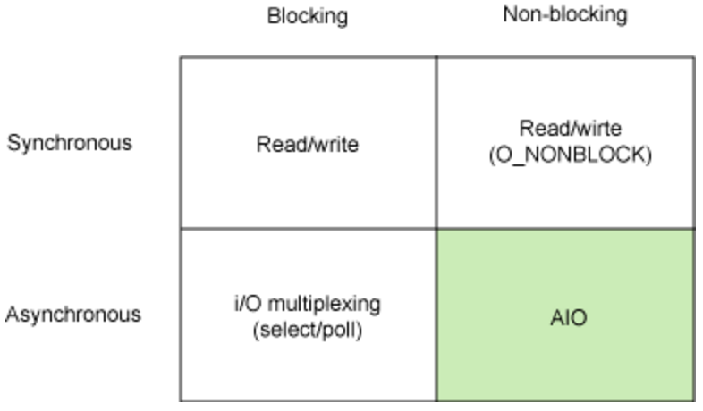

---

##### 阻塞式IO模型

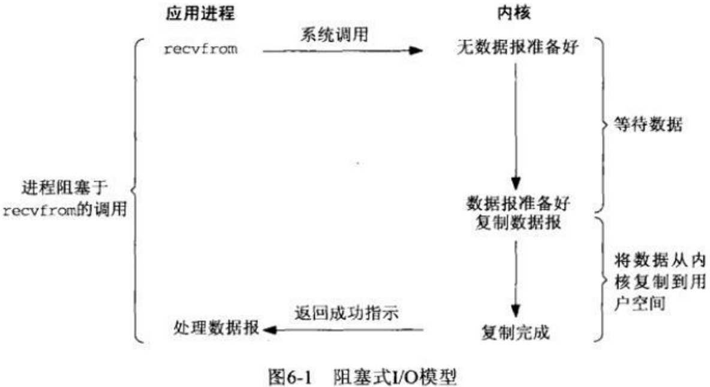

---


##### 非阻塞式IO模型


---


##### IO复用模型

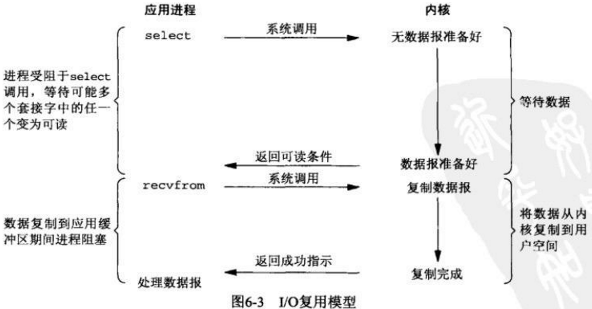

---


##### 信号驱动IO模型

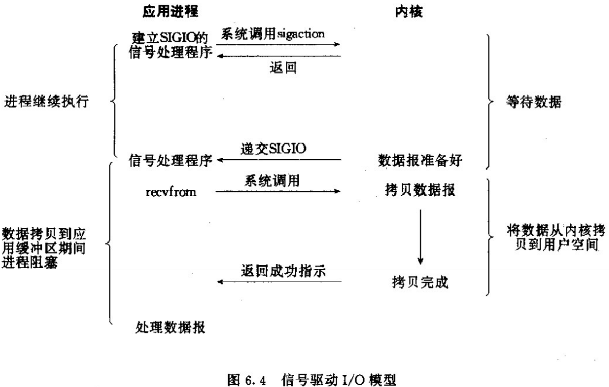

---


##### 异步IO模型

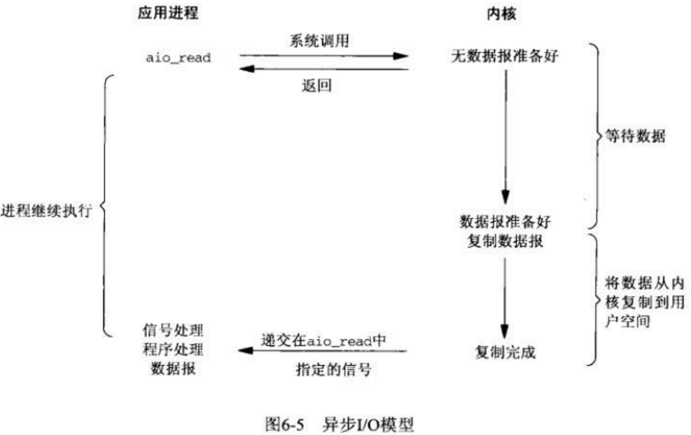

---


##### 五个IO模型的比较

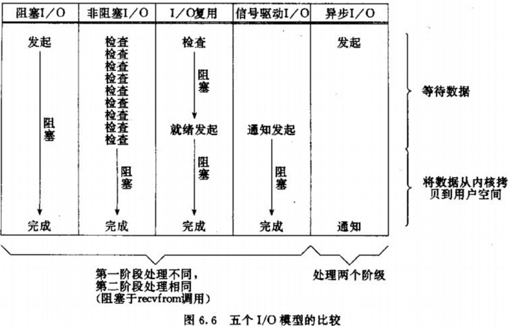

---

#### 1.2 OS Aproach

<!--
Ref: [21.1 Background](https://github.com/LearningOS/os-lectures/blob/2020spring/lecture21/ref.md#211-background)

ref: https://cfsamson.github.io/books-futures-explained/0_background_information.html#some-background-information
-->

##### Multitasking

<!--
参考： https://cfsamson.github.io/book-exploring-async-basics/2_async_history.html#non-preemptive-multitasking
-->

* Non-Preemptive multitasking
  - The programmer `yielded` control to the OS
  - Every bug could halt the entire system
  - Example: Windows 95
* Preemptive multitasking
  - OS can stop the execution of a process, do something else, and switch back
  - OS is responsible for scheduling tasks
  - Example: UNIX, Linux

---

##### User-level Thread

<!--
参考： https://stackoverflow.com/questions/15983872/difference-between-user-level-and-kernel-supported-threads

https://cfsamson.github.io/books-futures-explained/0_background_information.html#green-threads
-->

* Advantages
  - Simple to use
  - A "context switch" is reasonably fast
  - Each stack only gets a little memory
  - Easy to incorporate [*preemption*](https://cfsamson.gitbook.io/green-threads-explained-in-200-lines-of-rust/green-threads#preemptive-multitasking)
* Drawbacks
  - The stacks might need to grow
  - Need to save all the CPU state on every switch
  - Complicated to implement correctly if you want to support many different platforms
  - Example: [Green Threads](https://cfsamson.github.io/books-futures-explained/0_background_information.html#green-threads)

---

##### Kernel-supported Threads

<!--
ref: https://stackoverflow.com/questions/15983872/difference-between-user-level-and-kernel-supported-threads
https://cfsamson.github.io/books-futures-explained/0_background_information.html#threads-provided-by-the-operating-system
-->


* **Advantages**
  - Easy to use
  - Switching between tasks is reasonably fast
  - Geting parallelism for free
* **Drawbacks**
  - OS level threads come with a rather large stack
  - There are a lot of syscalls involved
  - Might not be an option on some systems, such as http server

Example: [Using OS threads in Rust](https://cfsamson.github.io/books-futures-explained/0_background_information.html#threads-provided-by-the-operating-system)

---

##### 信号（[Signal](http://kernel.meizu.com/linux-signal.html)(用户态的异步处理机制))

###### 信号（Signal）响应时机

* 发送信号并没有发生硬中断，只是把信号挂载到目标进程的信号 pending 队列
* 信号执行时机：进程执行完异常/中断返回到用户态的时刻


---

###### 信号处理

* 用户注册的信号处理函数都是用户态的
  * 先构造堆栈，返回用户态去执行自定义信号处理函数
  * 再返回内核态继续被信号打断的返回用户态的动作。

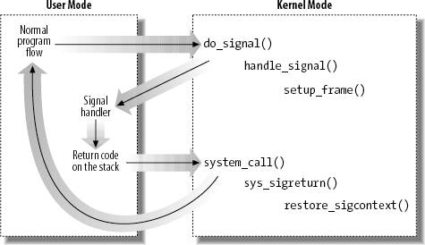

---

#### 1.3 Programming Aproach

<!--

[callback-based-approaches](https://github.com/LearningOS/os-lectures/blob/2020spring/lecture21/ref.md#callback-based-approaches)
Callback
Event queue
Epoll
-->

##### Callback based approaches

<!--
Ref: https://cfsamson.github.io/books-futures-explained/0_background_information.html#callback-based-approaches
-->

* Save a pointer to a set of instructions to run later together.
  * Advantages
    - Easy to implement in most languages
    - No context switching
    - Relatively low memory overhead
  * Drawbacks
    - Memory usage grows linearly with the number of callbacks
    - Callback hell: Hard to debug
    - Require a substantial rewrite to go from a "normal" program flow to one that uses a "callback based" flow
---

##### Event queue: Epoll, Kqueue and IOCP

<!--
参考： https://cfsamson.github.io/book-exploring-async-basics/6_epoll_kqueue_iocp.html#epoll
https://zhuanlan.zhihu.com/p/39970630 select poll epoll的区别
-->
- Epoll
  - Epoll is the Linux way of implementing an event queue
  - Epoll works very efficiently with a large number of events
- Kqueue
  - Kqueue is the MacOS way of implementing an event queue, which originated from BSD
  - In terms of high level functionality, it's similar to Epoll in concept but different in actual use
- IOCP
  - IOCP or Input Output Completion Ports is the way Windows handles this type of event queue

---

##### Epoll

<!--
参考： https://zhuanlan.zhihu.com/p/39970630
-->

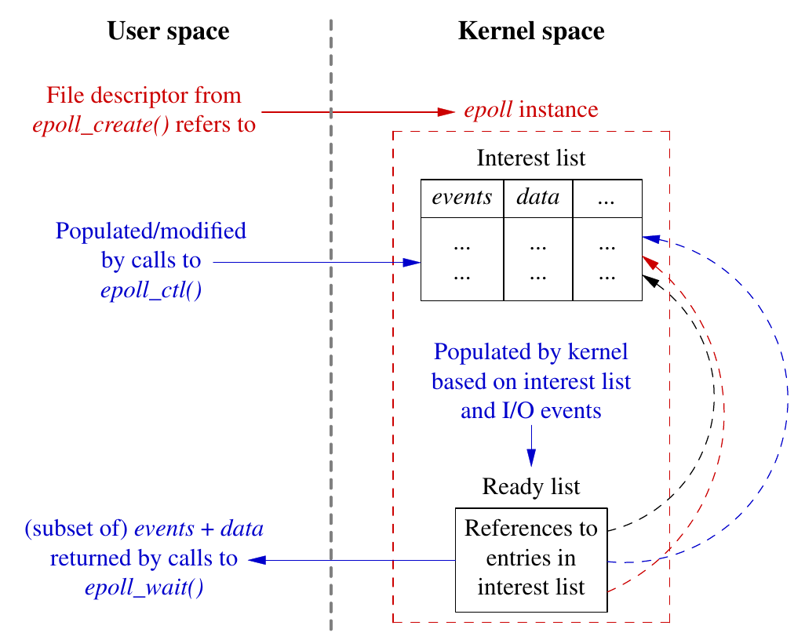

<!--

##### Read data from a socket using epoll

https://cfsamson.github.io/book-exploring-async-basics/6_epoll_kqueue_iocp.html#readiness-based-event-queues

**Workflow to read data from a socket using epoll/kqueue**

1. Create an event queue by calling the syscall `epoll_create` or `kqueue`
2. Ask the OS for a file descriptor representing a network socket
3. Register an interest in `Read` events on this socket
   - In order to receive a notification when the event is ready in the event queue we created
4. Call `epoll_wait` or `kevent` to wait for an event
   - Block (suspend) the thread it's called on
5. When the event is ready, our thread is resumed, and return from our "wait" call with data about the event
6. Call `read` on the socket we created

**Example**

- [epoll example](http://man7.org/linux/man-pages/man7/epoll.7.html)
- [Complete example](https://www.suchprogramming.com/epoll-in-3-easy-steps/)

#### 

-->

---

##### io_uring

<!--
github：[https://github.com/Linkerist/blog/issues/25](https://github.com/Linkerist/blog/issues/25)：这个是完整的原始帖子；其中的插图很直观。

[Efficient IO with io_uring](https://kernel.dk/io_uring.pdf)

[一篇文章带你读懂 io_uring 的接口与实现](https://zhuanlan.zhihu.com/p/380726590)(这个的插图很好)
-->

* io_uring 的用户态 API: `io_uring` 的实现仅仅使用了三个 syscall
  * `io_uring_setup`：设置 `io_uring` 上下文
  * `io_uring_enter`：提交并获取完成任务
  * `io_uring_register`：注册内核用户共享的缓冲区

---

###### io_uring 的IO过程

| 缩略语 | 英语                   | 中文       |
| ------ | ---------------------- |------------------------------------------------------------ |
| SQ     | Submission Queue       | 提交队列   | 一整块连续的内存空间存储的环形队列。 用于存放将执行操作的数据。 |
| CQ     | Completion Queue       | 完成队列   | 一整块连续的内存空间存储的环形队列。 用于存放完成操作返回的结果。 |
| SQE    | Submission Queue Entry | 提交队列项 | 提交队列中的一项。                                           |
| CQE    | Completion Queue Entry | 完成队列项 | 完成队列中的一项。                                           |
| Ring   | Ring                   | 环         | 比如 SQ Ring，就是“提交队列信息”的意思。 包含队列数据、队列大小、丢失项等等信息。 |

---
###### 初始化 io_uring

```
long io_uring_setup(u32 entries, struct io_uring_params __user *params)
```

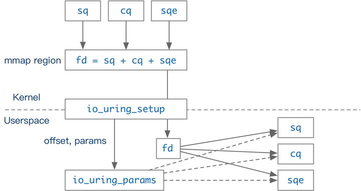

---

###### 任务的提交与完成

* `io_uring` 通过环形队列和用户交互。

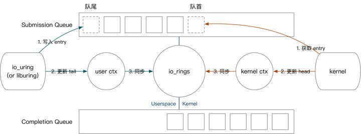

---

##### io_uring的性能


<!--
Evernote: 20200921-io_uring的性能分析

[An Introduction to the io_uring Asynchronous I/O Framework](https://blogs.oracle.com/linux/post/an-introduction-to-the-io_uring-asynchronous-io-framework)

[io_uring和epoll在echo_server场景下系统调用上下文切换数量的对比](https://mp.weixin.qq.com/s/rEtebl0HdMyKKqfSV57Bcg)
-->

###### io_uring和epoll在echo_server场景下qps数据对比

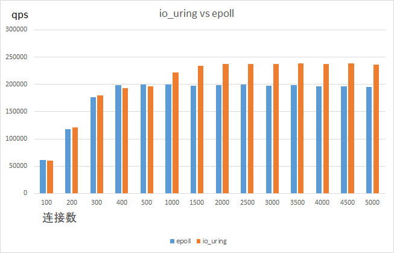

---

###### io_uring和epoll在echo_server场景下系统调用上下文切换数量的对比

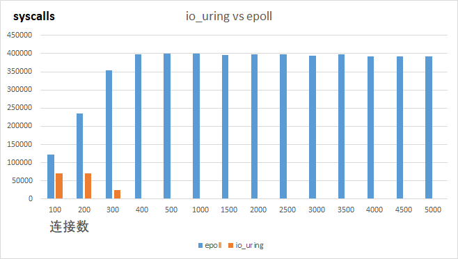


<!--
Evernote: 20210205-关于异步系统调用的思考
有人在尝试，把io_uring用Rust重写，以提高效率和安全性；
-->

---

### 2. Rust语言的并发和异步支持

2.1 Rust的并发编程
2.2 Future in Rust
2.3 Function colors in Rust

---

#### 2.1 Rust的并发编程

<!--
20200810-Rust的并发编程：[用Rust轻松搞定并发编程](https://www.jianshu.com/p/a4bc33022aa3)
Rust的ownership模型
-->


##### Rust的设计目的

两个棘手问题

1. 怎样才能安全地进行系统编程？
2. 怎样才能容易地使用并发？

---

##### ownership

1. 每一个值都具有一个“拥有域(owning scope)”；
2. 传递或返回一个值会转移ownership(移动它)到新的域(scope)中；
3. 当一个域(scope)结束时，如果域所拥有的值还没销毁，此时将自动销毁；

---

##### 借出(borrow)

Rust会检查所有借出的值，确保它们的寿命不会超过值本身的寿命；
每一个引用仅在一个有限的域(scope)中有效，编译器会自动判定；

* 不可变引用`&T`，可以共享但不能被改变。
* 可变引用`&mut T`，可以被改变但不能共享。

---

##### 通道(channel)

```rust
fn send<T: Send>(chan: &Channel<T>, t: T);
fn recv<T: Send>(chan: &Channel<T>) -> T;
```

* 通道中传输的数据类型是泛型的(`<T:Send>`是API的一部分)；

* 只要传递一个`T`给函数`send`就意味着会转移它的ownership；

---

##### 锁(Locks)
<!--

* Rust强制执行加锁的准则：访问被保护的数据前必须先持有锁。
* 在同一时间，只有一个线程能访问数据：写操作只会发生在线程具有数据的可变访问权限时，拥有该数据，或者拥有该数据的可变引用。
```rust
// create a new mutex
fn mutex<T: Send>(t: T) -> Mutex<T>;

// acquire the lock
fn lock<T: Send>(mutex: &Mutex<T>) -> MutexGuard<T>;

// access the data protected by the lock
fn access<T: Send>(guard: &mut MutexGuard<T>) -> &mut T;
```
-->

  * `Mutex`是一个类型`T`的泛型类型，`T`是锁要保护的数据。
    当你在创建一个`Mutex`时，会将数据的ownership转移到mutex中，并立即放弃对它的访问。
  * 调用`lock`函数来阻塞线程直到获取到锁。它会返回一个值，`MutexGuard<T>`。 当`MutexGuard<T>`销毁时，它会自动释放锁。
  * 访问数据的唯一方式是函数`access`，它将可变引用`MutexGuard<T>`转换为一个可变引用`T`（临时借用）。

---

#### 2.2 Future in Rust

<!--

[From callbacks to futures (deferred computation)](https://github.com/LearningOS/os-lectures/blob/2020spring/lecture21/ref.md#from-callbacks-to-futures-deferred-computation)

[21.2 Futures in Rust](https://github.com/LearningOS/os-lectures/blob/2020spring/lecture21/ref.md#from-callbacks-to-futures-deferred-computation)

[21.3 Generators and async/await](https://github.com/LearningOS/os-lectures/blob/2020spring/lecture21/ref.md#213-generators-and-asyncawait)

[21.4 Self-Referential Structs & Pin](https://github.com/LearningOS/os-lectures/blob/2020spring/lecture21/ref.md#214-self-referential-structs--pin)

[21.5 Waker and Reactor](https://github.com/LearningOS/os-lectures/blob/2020spring/lecture21/ref.md#215-waker-and-reactor)

参考： https://cfsamson.github.io/books-futures-explained/1_futures_in_rust.html#futures-in-rust
参考： https://github.com/cfsamson/books-futures-explained
参考： Evernote： 20200402-异步消息调研
-->

<!--
参考：

- video https://www.youtube.com/watch?v=skos4B5x7qE
- 中文 https://zhuanlan.zhihu.com/p/97574385
- async汇总 https://areweasyncyet.rs/
-->

Future的设计目标

- 调用 I/O 时，系统调用会立即返回，然后你可以继续进行其他工作
- I/O完成时，回到调用该异步 I/O 暂停的那个任务线上
- **一种通过对异步 I/O 的良好抽象形成的基于库的解决方案**
  - 它不是语言的一部分，也不是每个程序附带的运行时的一部分，只是可选的并按需使用的库

---

##### From callbacks to futures (deferred computation)

<!--
ref: https://cfsamson.github.io/books-futures-explained/0_background_information.html#from-callbacks-to-promises
-->

* Future is one way to deal with the complexity which comes with a callback based approach.

```rust
async function run() {
    await timer(200);
    await timer(100);
    await timer(50);
    console.log("I'm the last one");
}
```
<!--

- The `run` function as a *pausable* task consisting of several sub-tasks
  - On each "await" point it yields control to the scheduler
- When the sub-tasks changes state to either `fulfilled` or `rejected`, the task is scheduled to continue to the next step
-->

---


###### Concept of Future

<!--
Ref: https://os.phil-opp.com/async-await/#example

A future is a representation of some operation which will complete in the future.

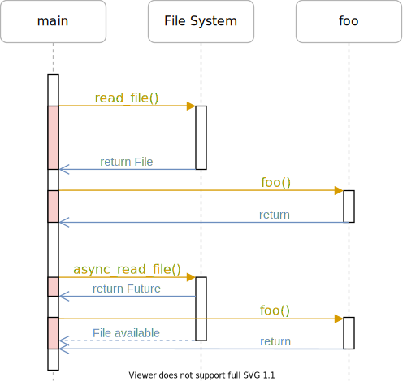
-->

* Three phases in asynchronous task:

  1. **Executor**: A Future is polled which result in the task progressing
     - Until a point where it can no longer make progress
  2. **Reactor**: Register an event source that a Future is waiting for
     - Makes sure that it will wake the Future when that event is ready
  3. **Waker**: The event happens and the Future is woken up
     - Wake up to the executor which polled the Future
     - Schedule the future to be polled again and make further progress

---

###### 基于轮询的 Future的异步执行过程

<!--
- 执行器会轮询 `Future`，直到最终 `Future` 需要执行某种 I/O 
- 该 `Future` 将被移交给处理 I/O 的反应器，即 `Future` 会等待该特定 I/O 
- I/O 事件发生时，反应器将使用传递的`Waker` 参数唤醒 `Future` ，传回执行器
- 循环上述三步，直到最终`future`任务完成（resolved）
- 任务完成并得出结果时，执行器释放句柄和整个`Future`，整个调用过程就完成了
-->

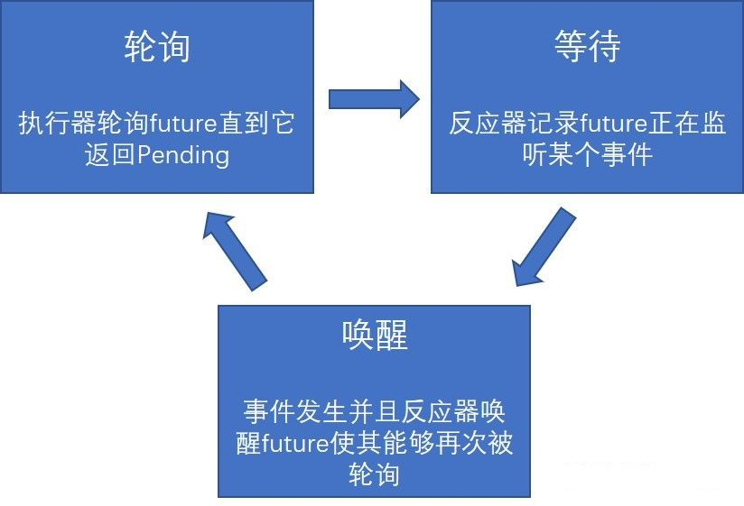

---

###### Runtimes

- Languages like C#, JavaScript, Java, GO and many others comes with a runtime for handling concurrency
- Rust uses a library for handling concurrency

- The two most popular runtimes for Futures:
  - [async-std](https://github.com/async-rs/async-std)
  - [Tokio](https://github.com/tokio-rs/tokio)

---

###### Zero-cost futures in Rust

<!--
Ref: https://aturon.github.io/blog/2016/08/11/futures/
-->

- Build up a big `enum` that represents the state machine
  - There is one allocation needed per “task”, which usually works out to one per connection
- When an event arrives, only one dynamic dispatch is required
- There are essentially no imposed synchronization costs

---

Here are the results, in number of “Hello world!"s served per second on an 8 core Linux machine.


---

##### Generators and async/await

<!--
Ref: https://cfsamson.github.io/books-futures-explained/3_generators_async_await.html#generators-and-asyncawait
-->

###### Concurrency in Rust

<!--
Ref: https://cfsamson.github.io/books-futures-explained/3_generators_async_await.html
-->

1. Stackful coroutines, better known as green threads.
2. Stackless coroutines, better known as generators.

---

###### State Machine Transformation in Future

<!--
Ref: https://os.phil-opp.com/async-await/#state-machine-transformation
https://cfsamson.github.io/books-futures-explained/3_generators_async_await.html#stackless-coroutinesgenerators
-->

- Each state represents a different pause point of the function


- Arrows represent state switches and diamond shapes represent alternative ways

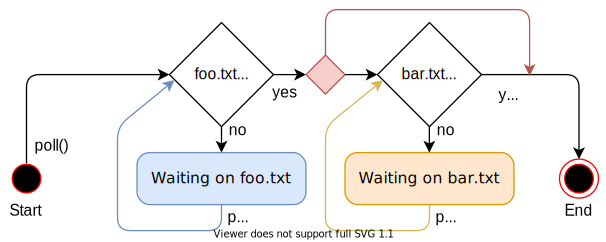

---

##### Self-Referential Structs & Pin

<!--
Ref: https://cfsamson.github.io/books-futures-explained/4_pin.html#pin
-->


```rust
async fn pin_example() -> i32 {
    let array = [1, 2, 3];
    let element = &array[2];
    async_write_file("foo.txt", element.to_string()).await;
    *element
}
```

The struct for the "waiting on write" state

```rust
struct WaitingOnWriteState {
    array: [1, 2, 3],
    element: 0x1001c, // address of the last array element
}
```

---

###### The Problem with Self-Referential Structs

<!--
Ref: https://os.phil-opp.com/async-await/#the-problem-with-self-referential-structs
-->

* memory layout of self-referential struct

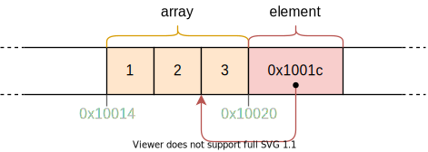

* After moving this struct to a different memory address


---

###### Defination of Pin

<!--
Ref: https://cfsamson.github.io/books-futures-explained/4_pin.html#definitions
https://github.com/rust-lang/rfcs/blob/master/text/2349-pin.md
the pinning API was proposed in RFC 2349
-->

- Pin wraps a pointer. A reference to an object is a pointer
  - **Reference type**. In order to break apart a large future into its smaller components, and put  an entire resulting future into some immovable location, we need a reference type for methods like `poll`
- Pin gives some guarantees about the *pointee* (the data it points to)
  - **Never to move before being dropped**. To store references into itself, we decree that by the time you initially `poll`, and promise to never move an immobile future again

---

###### Waker

<!--
Ref: https://cfsamson.github.io/books-futures-explained/2_waker_context.html#the-waker
-->

- The `Waker` type allows for a loose coupling between the reactor-part and the executor-part of a runtime
- By having a wake up mechanism that is *not* tied to the thing that executes the future, runtime-implementors can come up with interesting new wake-up mechanisms
- Creating a `Waker` involves creating a `vtable` which allows us to use dynamic dispatch to call methods on a *type erased* trait object we construct our selves

---

###### Reactor

<!--
Ref: https://cfsamson.github.io/books-futures-explained/6_future_example.html#the-reactor
https://docs.rs/tokio/0.1.22/tokio/reactor/index.html
-->

- To actually abstract over this interaction with the outside world in an asynchronous way
  - Receive events from the operating system or peripherals
  - Forward them to waiting tasks

- [Mio](https://github.com/tokio-rs/mio): Library of reactors in Rust
  - Provide non blocking APIs and event notification for several platforms

---

#### 2.3 Function colors in Rust

<!--

20210315-Rust中异步函数与同步函数的混用讨论

[Rust的异步是有颜色, 但没什么大不了](https://mp.weixin.qq.com/s/apgFnG9os_WzabxF_Q-XkQ)

[Rust async is colored, and that’s not a big deal](https://morestina.net/blog/1686/rust-async-is-colored)
-->

* Rust async executors provide a [`block_on()`](https://docs.rs/async-std/1.9.0/async_std/task/fn.block_on.html) primitive that invokes an async function from a non-async context and blocks until the result is available
* Rust async provides [`spawn_blocking()`](https://docs.rs/async-std/1.9.0/async_std/task/fn.spawn_blocking.html) which invokes a blocking sync function from an async context, temporarily suspending the current async function without blocking the rest of the async environment. 

---

##### Rust中的异步支持库

<!--
20210730-Tokio分析（这个只是提及）：[Tokio Internals](https://tony612.github.io/tokio-internals/)

Async-nostd

[async/await on embedded Rust](https://ferrous-systems.com/blog/async-on-embedded/)

[async-std](https://book.async.rs/)

[no_std async/await - soon on stable](https://ferrous-systems.com/blog/stable-async-on-embedded/)
-->

* Tokio
* async-nostd

---

### 3. 异步操作系统

3.1 osblog
3.2 Drogue IoT
3.3 基于Rust的异步操作系统AsyncOS构想

---

<!--
20210205-异步IoT OS的开源框架Drogue IoT
-->

#### 3.1 osblog: [RISC-V OS using Rust](http://osblog.stephenmarz.com/index.html)

This tutorial will progressively build an operating system from start to something that you can show your friends or parents -- if they're significantly young enough.

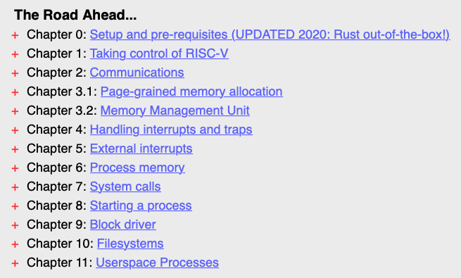

---

#### 3.2 Drogue IoT

[Drogue Cloud](https://book.drogue.io/drogue-cloud/dev/index.html)


---

##### abstraction of protocols in Drogue

[Data plane in Drogue](https://book.drogue.io/drogue-cloud/dev/architecture/data.html)

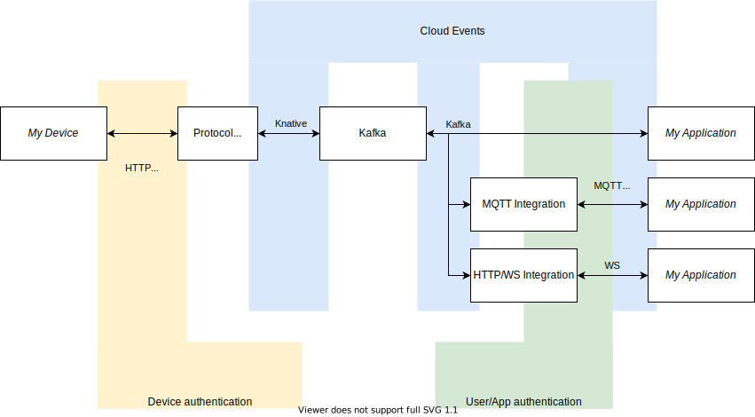

---

##### [Introducing Drogue Device](https://blog.drogue.io/introducing-drogue-device/)

 * Actor-based: State is held by an actor, accessed/mutated only by that actor, in response to messages.
 * Cooperative Scheduling: Using Rust's async/await support, actors attempt to be non-blocking and share the processor.
 * Message-Passing: Support notifications, requests/responses, and an event-bus.

---

[Actor System](https://book.drogue.io/drogue-device/dev/concepts.html#_actor_system)

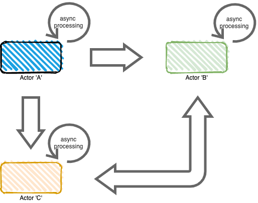

---

[Drogue Actor Model](https://book.drogue.io/drogue-device/dev/concepts.html#_drogue_actor_model)

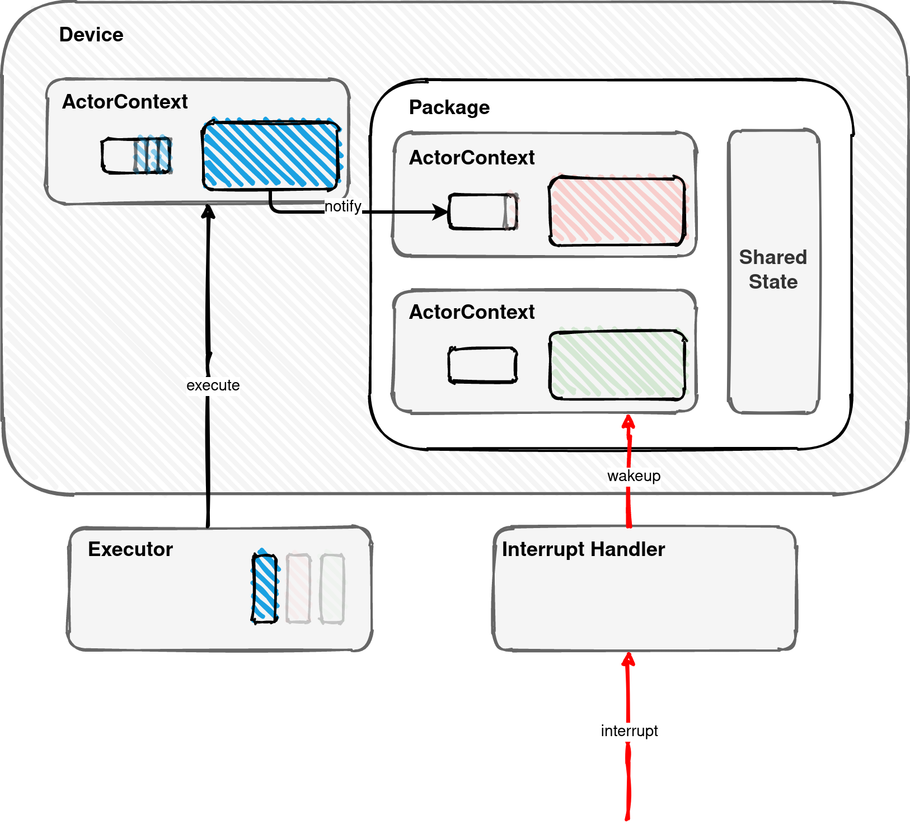

---

#### 3.3 基于Rust的异步操作系统AsyncOS构想

**在RISC-V平台上设计并实现一个基于Rust语言的异步操作系统。**

1. 在操作系统内核中实现细粒度的并发安全、模块化和可定制特征；
  2. 利用Rust语言的异步机制，优化操作系统内核的并发性能；
  4. 完善操作系统的进程、线程和协程概念，统一进程、线程和协程的调度机制；
  5. 利用RISC-V平台的用户态中断技术，向应用程序提供的异步系统调用接口；
  6. 开发原型系统，设计用户态测试用例库和操作系统动态分析跟踪工具，对异步操作系统的特征进行定量性的评估。

---

##### [任务管理：进程、线程与协程](https://github.com/async-kernel/documents/blob/main/design/design.md#任务管理进程线程与协程)

 * 进程：每个进程有独立的地址空间，进程切换将导致页表切换；
   * 内核是一个独立的进程（内核进程），它仅运行在内核态；内核进程实现系统调用服务实现和资源管理；
   * 用户进程的地址空间分成用户地址空间和内核地址空间两部分；内核地址空间仅包括支持进程切换的必要功能；
   * 系统调用将导致进程切换，从而统一系统调用和进程间通信；依赖用户态中断，可实现不通过内核进程的进程间通信；
---

##### [任务管理：进程、线程与协程](https://github.com/async-kernel/documents/blob/main/design/design.md#任务管理进程线程与协程)

 * 协程：作为CPU调度的基本单位，协程是基于状态转移的异步函数执行流；
    * 协程在主动让出CPU时，解除与栈的绑定关系；
    * 主动让出CPU的就绪协程进入运行状态前需要与空闲栈绑定；
    * 由于被抢占而让出CPU时，协程将继续占用所绑定的栈；
 * 线程：栈与协程必须绑定后才能在CPU上执行。栈与协程的绑定形成了线程的概念。
   * 相同进程内主动让权时的协程切换，可使用相同的栈；
   * 相同进程内被抢占协程的切换，会导致栈的切换；

---

##### [协程、线程和进程的调度](https://github.com/async-kernel/documents/blob/main/design/design.md#协程线程和进程的调度)

* 已有工作：华中科大蒋周奇、车春池：飓风内核的[共享调度器](https://github.com/HUST-OS/tornado-os#飓风内核开发中)
* 共享调度器的特征
  * 协程是CPU调度的基本单位；
  * 协程具备优先级属性；
  * 整个系统内的所有协程依据优先级进行统一调度；
  * 协程切换：相同进程内的主动让权协程间的切换；
  * 线程切换：相同进程内被抢占协程的切换；
  * 进程切换：不同进程间的协程切换；
  * 调度器代码由内核进程维护，可在用户态执行；

---

##### 用户态中断机制

* 用户态中断是由硬件实现
* 协程可通过ecall指令向指定进程发送用户态中断请求；
* 在软件的参与下，硬件可直接向指定进程发送用户态中断请求；
* 处于运行状态的进程会立即响应和处理发给自己的用户态中断；
* 处于暂停状态的进程会在进入运行状态时优先响应和处理发给自己的用户态中断；

---

##### 用户态中断实现


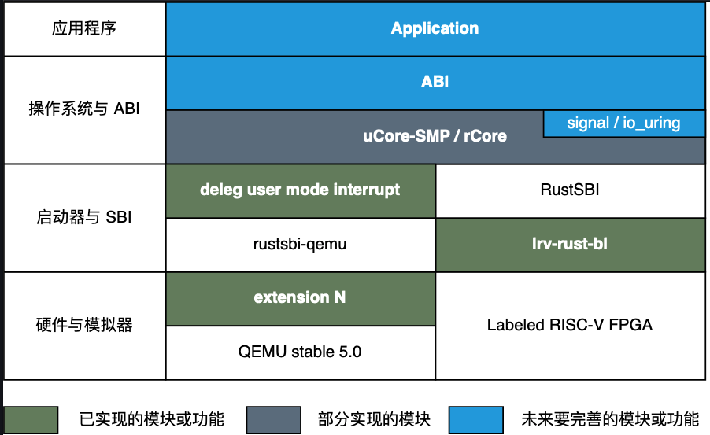

---

##### [异步系统调用](https://github.com/async-kernel/documents/blob/main/design/design.md#异步系统调用)

* 系统调用分为同步和异步两种
  * 同步系统调用：用户进程发出系统调用请求后进入等待状态；内核进程执行系统调用服务功能后唤醒用户进程；用户进程获取系统调用结果并继续执行；
  * 异步系统调用：用户进程中的某协程发出系统调用请求后主动让权（可继续执行其他协程）；内核进程执行系统调用服务功能后通过用户态中断唤醒用户进程；用户进程响应用户态中断，获取系统调用结果并继续对应协程执行；

---
<!-- _paginate: true -->

##### [异步系统调用的执行过程](https://github.com/async-kernel/documents/blob/main/design/design.md#异步系统调用的执行过程)

* 第一次异步系统调用时：
  1. 用户进程准备系统调用参数、发出系统调用请求；
  2. 内核进程将映射共享内存、发起相应服务协程的异步执行；
  3. 内核进程执行完服务协程后，在响应队列保存返回值，并通过用户态中断通知应用进程；
* 第二次异步系统调用时：
  1. 用户进程在请求队列准备系统调用参数；在共享内存的响应队列中查看第一次系统调用的结果；
  2. 内核进程在完成第一个服务协程后，在共享内存的响应队列中保存返回值，主动查询新的系统调用请求，并执行；如果没有新的请求，则让出CPU；

