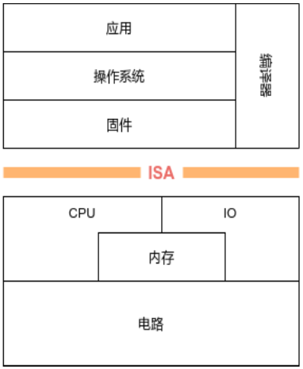
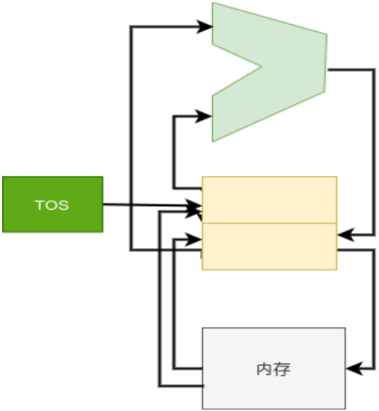
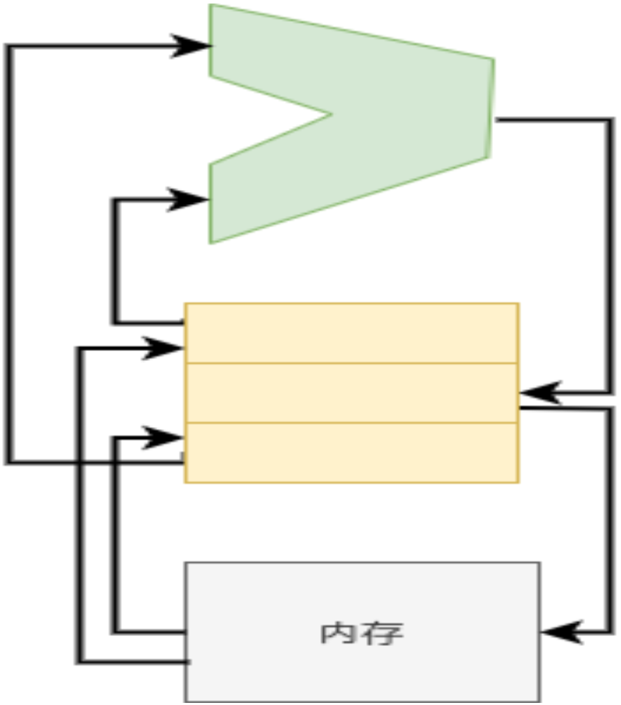
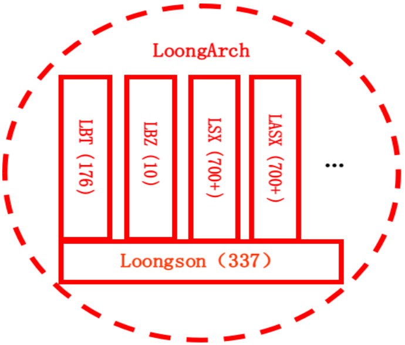
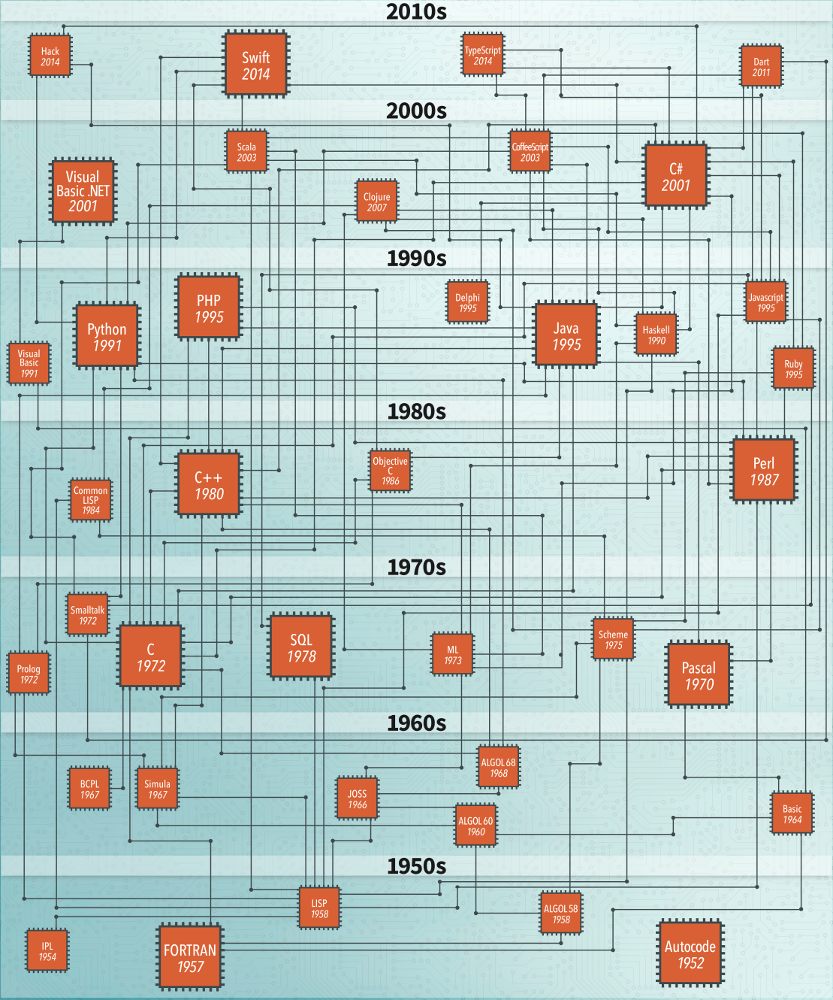
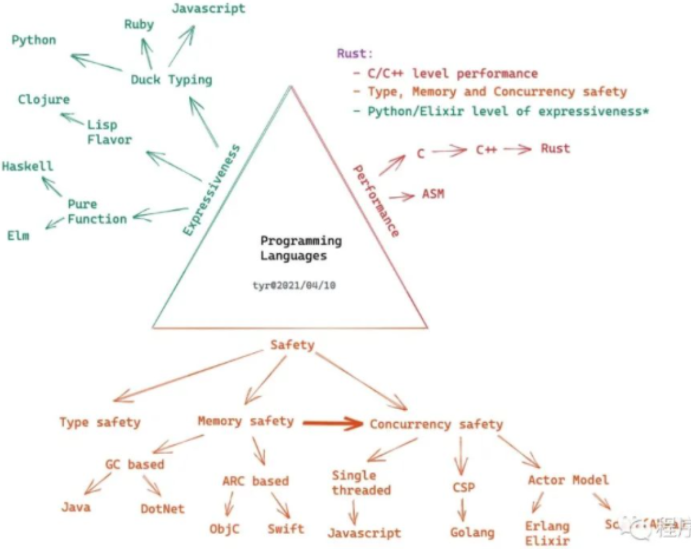
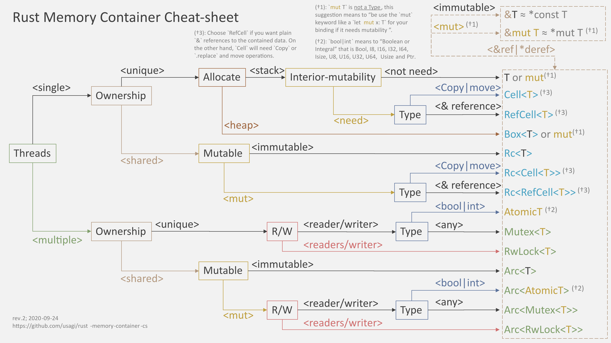

## 第八讲：操作系统与处理器指令集和编程语言

1. 背景
2. 处理器指令集
3. 程序设计语言基础
4. Rust语言
5. 操作系统与程序设计语言和指令集的协同

## 向勇 清华大学计算机系
20211007

---

<!-- header: '8.1 背景'-->

### 8.1 背景

计算机系统的定义：信息处理，分硬件和软件两部分；

* 处理器指令集：利用硬件为软件提供的表达信息处理服务的接口；
  * RISC与CISC
* 程序设计语言：利用已有软件和硬件的信息处理服务能力，表达计算机系统可理解和执行的信息处理方法（算法和服务）的接口；
  * ASM、C、C++、Lisp、GO、Rust、Java、python、Ruby、
* 操作系统：管理软硬件资源，为应用程序提供系统调用（一类信息处理服务）服务的软件；
  * VxWorks、RT-Thread、Unix、Windows、macOS、Linux、Android、ChromeOS、Fuchsia

它们都是提供信息处理服务能力的。

---

<!-- header: '8.2 处理器指令集 - 指令集基础'-->

### 8.2 处理器指令集

<!--
中科院计算所 张福新：[龙芯指令集介绍](https://gitee.com/oscomp/seminar5-20210404/blob/main/README.md)

[20210404-张福新-loongarch.pdf](https://cloud.tsinghua.edu.cn/library/dfeaca43-865b-4e7d-bdd3-b1e003885933/work/20200928-操作系统比赛准备/20210404-技术报告)

P4～13:指令集基础
-->

* 指令集基础
* 操作数模式
* 指令集设计
* 指令集比较
* LoongArch指令集

<!--
#### 指令集基础
-->

---


##### 什么是指令集?



 * ISA
    * Instruction Set Architecture
* 软硬件之间的 ‘合同’
  * 硬件所支持的操作(指令)、运行模式和存储界面等的功能定义
  * 上述硬件资源的访问方式
* 不约定具体实现方式和效果
  * 指令快慢
  * 功耗大小等
---

##### 指令集和人类语言的对比
 * 相似之处
    * 都是用于沟通
       * 指令集:硬件和软件沟通
       * 人类语言:人和人
    * 有许多可类比的特性
       * 单词 vs 指令
       * 语法 vs ABI
       * 不同的指令集 vs 不同的语言
 * 差异之处
   * 指令集是精确描述，没有二义性

---

##### 指令集的设计考虑
 * 指令实现
   * 指令格式
   * 操作数模型
   * 数据类型和寻址模式
 * 硬件与软件实现的权衡
   * 应用领域、设计目标
 * 二进制程序接口(ABI)
   * 寄存器等资源使用方式
 * 系统资源管理
   * 虚拟化、安全、扩展等需求


---

##### 指令格式
 * 定长
   * 优点:实现简单，下一个 PC 易计算
   * 缺点:代码密度
     * 相同源代码，RISC 二进制常常比 CISC 大 20-30%
 * 变长
   * 优点:可实现高代码密度
   * 缺点:实现复杂
 * 折中:两个长度
   * MIPS16 和 Arm Thumb
 * 编码:MIPS 3 种格式 vs. LoongArch 11 种 vs. X86 很多种

---

<!-- header: '8.2 处理器指令集 - 操作数模式'-->

<!--
#### 操作数模式
-->

##### 操作数模型: memory only


 * 操作数来自哪里?
   * 如何指定它们?
   * 例：A = B + C 的实现
 * Memory Only
   * add B,C,A
   * mem[A] = mem[B] + mem[C]
---

##### 操作数模型: 累加器


 * Accumulator
   * load B; add C; store A
   * ACC = mem[B]; ACC+=mem[C]; mem[A]=ACC
---

##### 操作数模型: 栈操作



 * Stack
     * push B; push C; add; pop A;
     * stk[tos++]=mem[B];
     * stk[tos++]=mem[C];
     * stk[pos++]=stk[–tos]+stk[–tos];
     * mem[A]=stk[–tpos]

---

##### 操作数模型: 寄存器 load-store



 * register load-store
     * load R1,B; load R2,C;
     * add R1, R1, R2; store R1, A;
     * R1=mem[B]; R2=mem[C];
     * R1 = R1 + R2; mem[A]=R1;

---

##### 数据类型和寻址模式
 * 寄存器数量、位宽、虚地址空间大小
     * xx 位处理器
 * 寻址模式: 指定地址的方式
     * register-indirect: 地址 = 寄存器值
     * displacement: 地址 = 寄存器值 + 立即数偏移
     * index-base: 地址=寄存器1值+寄存器2值
     * PC-relative: 地址 =PC + 立即数偏移
     * Scaled: 地址=寄存器1值+寄存器2值*立即数1+ 立即数 2
     * auto-increasement: 寄存器存的地址用完自动增加
     * 等等

---
<!-- header: '8.2 处理器指令集 - 指令集设计'-->

<!--
#### 指令集设计的要求
-->


##### 硬件和软件实现的权衡

 * 与场景需求、设计目标相关
     * 高性能 vs. 低功耗
 * 用简单指令合成还是硬件提供?
     * 硬件做比软件有效益才合算，如字节逆序、数0数1等指令
     * X86 的字符串拷贝指令被认为是 bad，不比软件高效
     * 慎重添加可能影响实现效率的复杂指令
 * 总体趋势是硬件指令不断增加
     * 晶体管数量持续增加
     * 向量、DSP、AI 等负载的有效加速

---

<!-- header: '8.2 处理器指令集 - ‘好’ 指令集的三要素'-->

#### ‘好’ 指令集的三要素
 * 可编程性
     * 是不是能够有效地表达程序?
 * 可实现性
     * 是不是易于实现高性能?
     * 逐步发展到
         * 是不是易于实现低功耗?
         * 是不是易于实现低成本?
         * 是不是易于实现高可靠?
 * 兼容性
     * 软硬件技术发展时是否易于保持可编程性和可实现性?

---

##### 可编程性
 * 1985 年之前主要是面向人类
    * 尽量接近高级语言?
    * X86 call/rep movsb, Sparc save/restore, VAX insqueue等
 * 1985 之后主要面向编译器
    * 提供完备的底层原语而不是综合方案
        * 编译器擅长把复杂结构分解为简单原语
        * 从一堆复杂指令选择最优不容易
    * 原则
        * 规整
        * 正交、可组合

---

##### 可实现性
 * 不是每种指令集都能高效实现
 * 某些指令集特性使得一些实现技术的应用变得困难
     * 变长指令、复杂格式：译码复杂
 * 可实现性随着技术发展变化
     * 延迟槽在单发射静态调度时能有效提升性能，在超标量动态调度时变成负担

---

##### 兼容性
 * 兼容性非常重要
     * Intel获胜的关键之一
     * Intel推安腾失败，无法动摇自己的生态
 * 兼容性需要指令集设计进行前瞻思考
     * 为了有限的收益引入某些基础性的特性可能带来巨大负担
         * 贴近高级语言：SPARC寄存器窗口
         * 面向当时流水线过度优化：延迟槽
 * 兼容性可以通过技术弥补
     * 二进制翻译

---

<!-- header: '8.2 处理器指令集 - 指令集比较'-->

<!--
#### 指令集比较

P14～23:指令集比较
-->

##### RISC vs. CISC

 * CISC
     * VAX/IBM 360&370/X86/Motorola 68000...
 * RISC
     * MIPS/SPARC/POWER/PA-RISC/ALPHA/ARM/RISC-V...
 * 80 年代中期开始的 ‘圣战’
     * RISC赢了技术战争
     * CISC赢了商业战争
 * RISC/CISC界限趋于模糊
     * 现代商业RISC指令集大都超过1000条指令
     * X86内部实现RISC核心

---

##### 面向高级语言的指令集?

<!--
[What about Java Physical Machine?](https://stackoverflow.com/questions/4007579/what-about-java-physical-machine)
-->

 * VAX 等早期指令集有大量面向高级语言特性的设计
     * 缩小语义鸿沟?
 * [JAVA处理器](https://stackoverflow.com/questions/4007579/what-about-java-physical-machine)
     * 不时有人提出类似想法
 * 编译器能够很好地用基础指令实现高级语言的一些特性
     * 面向对象?
     * 定制特性的收益常常比较有限
 * 部分基础性的支持被采纳
     * 边界检查

---

<!-- header: '8.2 处理器指令集 - LoongArch指令集'-->

<!--
#### LoongArch指令集

P25～28:LoongArch指令集
-->

##### LoongArch概况



 * 充分考虑兼容需求的自主指令系统
 * 约2000条指令
     * 基础指令337条
     * 虚拟机扩展10条
     * 二进制翻译扩展170+
     * 128位向量扩展700+
     * 256位向量扩展700+

---

##### LoongArch特点

 * 用户态指令
     * 保持典型RISC风格: 定长、32通用定/浮点、load-store 结构
     * 提升效率
         * 取消延迟槽
         * 新增以PC为源操作的运算指令
         * 实现位操作等多数指令集选择增加的指令
 * ABI
     * 更多的可用寄存器
     * 相对 PC 的重定位
 * 系统态
     * 吸取实践经验，完全重新设计:规整、可扩展

---

#### 融合型体系结构
 * 指令融合
     * 提取主流指令集的主要特征，实现高效的 ‘并集’
 * 加速器融合
     * 各类领域专用处理与 CPU 的融合
 * 软硬件跨层融合
     * 打破传统软硬界面寻求更高效率

---

<!-- header: '8.3 程序设计语言基础'-->

### 8.3 程序设计语言基础

<!--
[NASAC2018—系统软件教育论坛](https://s4plus.ustc.edu.cn/conferences/list.htm)：编程语言及原理类课程教学探索 张昱（中国科学技术大学）[2YuZhang.pdf](https://s4plus.ustc.edu.cn/_upload/article/files/57/c6/a2ce9bd84b2ab411967842a1334d/dee3907e-01a6-40a9-9613-275981eb50cc.pdf)

编程语言基础课[实验代码仓库](https://github.com/ustc-pldpa/2018s)

P8：程序设计语言基础：不同语言特征及 其语义和实现影响因素

P10: 各种语言背后的通用概念和理论

P14: 编程语言的基本知识点
-->

---

<!--
#### 程序设计语言概念

P17～18:编程语言概念
-->


#### 程序设计语言的[演变](https://www.thesoftwareguild.com/wp-content/uploads/2017/09/Programming-Languages-Through-the-Years-Infographic.pdf)



---

#### 程序设计语言的通用概念

 * 概念上，涵盖命令式语言、函数式语言、面向对象语言、并发和并行语言以及逻辑语言的各种基本语言设施，包括控制结构、作用域、内存管理、高阶函数、继承、并发机制、新型并行编程模型等
 * 理论上，介绍各种基础语言设施的形式化语义，包括静态语义和操作语义，以及相应的程序验证技术，如Hoare逻辑和类型系统等

---

#### 程序设计语言分类


---

#### 程序设计语言中的基本概念


---

#### 程序设计语言基础课的[编程作业](https://github.com/ustc-pldpa/2018s)

<!--
P19: 编程语言实验
-->


---

<!-- header: '8.4 Rust语言'-->

### 8.4 Rust语言

<!--
20210812-张汉东的报告：Rust的最新进展和社区生态

20210812-1-Rust最新进展和社区生态.pptx
-->

---


#### Rust 语言历史
<!--
P6: Rust 语言历史
-->

1. 2008年开始由Graydon Hoare私人研发
1. 2009年得到Mozilla赞助，2010年首次发布0.1.0版本，用于Servo引擎的研发
1. 2015年5月15号发布1.0版本
1. 2018年发布2018 Edition
1. 2021年2月9号，Rust基金会宣布成立。

从 2016 年开始，截止到 2021年，Rust 连续六年成为StackOverflow 语言榜上最受欢迎的语言


<!--
[Rust语言特点及其在开发中的应用](https://www.bilibili.com/video/BV1ti4y1b7xy?from=search&seid=3999632637077780986)

[编程语言中的变革者 | 敢于打造理想世界的 Rust](https://cloud.tencent.com/developer/article/1617845)

[透过 Rust 探索系统的本原：编程语言](https://cloud.tencent.com/developer/article/1816815)
很好的Rust的设计分析；
-->

---

#### Rust 语言的[目标](https://cloud.tencent.com/developer/article/1617845)

<!--
P16: rust的特征；
-->

融合优秀语言特征，创造一门安全和性能兼备的语言。

1. 内存安全（内存访问模型抽象、类型安全的类型系统）
2. 性能（所有的细节都是可以高效控制）
3. 线程安全（并发执行模型抽象）
---

#### Rust语言设计哲学
<!--
P17: Rust的设计原则；
-->

1. 内存安全
2. 零成本抽象
3. 语言一致性
4. 实用性
---

#### 编程语言设计上的取舍

<!--
[透过 Rust 探索系统的本原：编程语言](https://cloud.tencent.com/developer/article/1816815)
-->



---

#### Rust语言架构

<!--
P18: Rust语言架构；
-->


---

#### [rust memory container](https://github.com/usagi/rust-memory-container-cs/blob/master/3840x2160/rust-memory-container-cs-3840x2160-light-back-low-contrast.png)



---

<!--
#### Rust语言特征

P19: Rust的语言特征：
-->

##### Rust的语言特征：内存安全

<!--
https://web.ecs.syr.edu/courses/cis352/slides/22rust4up.pdf
-->

内存安全：所有权、借用、不可变与可变
内存分配和方法分发：栈和堆；

 * Ownership
    * A variable binding takes ownership of its data. [lifetimes]
        * A piece of data can only have one owner at a time.
    * When a binding goes out of scope, the bound data is released automatically.
        * For heap-allocated data, this means de-allocation.
    * Data must be guaranteed to outlive its references.
```rust
let v1 = vec![1, 2, 3];
let v2 = v1; // Ownership of the Vec object moves to v2.
println!("", v1[2]); // error: use of moved value ‘v1‘
```
<!--
[透过 Rust 探索系统的本原：编程语言](https://cloud.tencent.com/developer/article/1816815)
-->

---


---

##### Rust的语言特征：线程安全

 * 线程安全：原子类型
 * 错误处理：空指针和异常处理；
 * trait：类型的行为的抽象；
 * safe与unsafe：开发者和编译器间的信任；

---

##### Rust的语言特征：性能

异步机制：green thread, coroutine

<!--
基于轮询的 Future的异步执行过程

- 执行器会轮询 `Future`，直到最终 `Future` 需要执行某种 I/O 
- 该 `Future` 将被移交给处理 I/O 的反应器，即 `Future` 会等待该特定 I/O 
- I/O 事件发生时，反应器将使用传递的`Waker` 参数唤醒 `Future` ，传回执行器
- 循环上述三步，直到最终`future`任务完成（resolved）
- 任务完成并得出结果时，执行器释放句柄和整个`Future`，整个调用过程就完成了
  -->


---

##### Rust的语言特征：其他

* 宏
* FFI：混合编程；
* 包管理

---

#### Rust语言社区生态
<!--
P20～39: Rust语言社区生态
-->

截止目前，crates.io上面已经有62981个crate，总下载量已经达到7,654,973,261次。
Crates.io最流行的几个场景依次如下：

1. 命令行工具（3133 crates）
1. no-std库（2778 crates）
1. 开发工具（测试/debug/linting/性能检测等，2652 crates）
1. Web编程（1776 crates）
1. API绑定（方便Rust使用的特定api包装，比如http api、ffi相关api等，1738 crates）
1. 网络编程（1615 crates）
1. 数据结构（1572 crates）

除此之外，还有嵌入式开发、加密技术、异步开发、算法、科学计算、WebAssembly、编码、文本处理、并发、GUI、游戏引擎、可视化、模版引擎、解析器、操作系统绑定等其他分类，也有不少库。

---

<!-- header: '8.5 操作系统与程序设计语言和指令集的协同'-->

### 8.5 操作系统与程序设计语言和指令集的协同

---

#### 并发模型与调度

并发机制：

* 内核线程：内核实现
* 用户线程：用户库实现、语言支持
* 协程：用户库实现、语言支持

上下文切换与调度器：执行流控制

* 协程切换：主动让权
* 中断上下文保存与恢复：基于中断
* 线程切换：基于时钟中断、主动让权
* 进程切换：基于时钟中断、主动让权

<!--
指令集、操作系统、用户库、编译器（语言）
-->

---

#### 内存管理

 * 栈空间：编译器管理
 * 堆空间：操作系统管理

---

#### 异常和错误处理

 * 内核中断机制：硬件与操作系统协作
   * 用户态中断：硬件、操作系统和应用协作管理
 * rust中的option：程序设计语言管理
 * 信号：操作系统和应用协作管理

