## 操作系统与处理器指令集和编程语言

1. 背景
2. 处理器指令集
3. 程序设计语言基础
4. Rust语言
5. 操作系统与程序设计语言和指令集的协同
6. 异步操作系统构想


## 向勇 清华大学计算机系

20211029
致谢：清华大学计算机 陈渝

---

<!-- header: '1. 背景'-->

### 1. 背景

---
#### 计算机系统

计算机系统的定义：信息处理，分硬件和软件两部分；

* 处理器指令集：利用硬件为软件提供的表达信息处理服务的接口；
  * RISC与CISC
* 程序设计语言：利用已有软件和硬件的信息处理服务能力，表达计算机系统可理解和执行的信息处理方法（算法和服务）的接口；
  * ASM、C、C++、Lisp、GO、Rust、Java、python、Ruby、
* 操作系统：管理软硬件资源，为应用程序提供系统调用服务的软件；
  * VxWorks、RT-Thread、Unix、Windows、macOS、Linux、Android、ChromeOS、Fuchsia

它们都是提供信息处理服务能力的。

---

#### 当前操作系统的复杂度

* OS太大太复杂， Linux有近3千万行C为主的源代码
  * 2021.3：Linux 5.12代码达到2880万行 

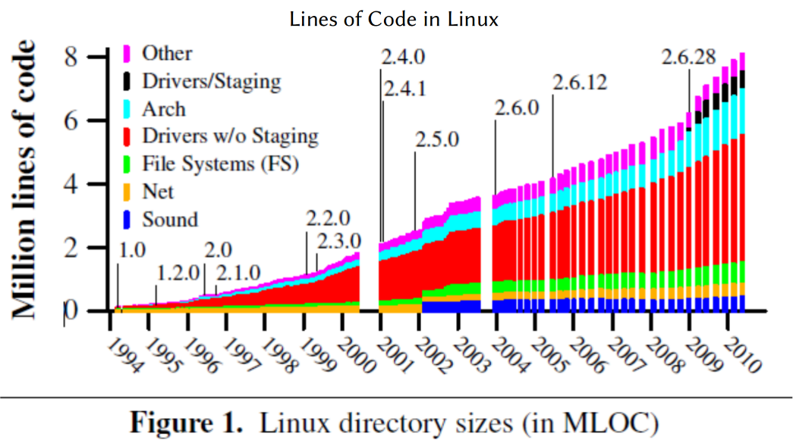

* Faults in linux: ten years later,ASPLOS 2011

---

#### 当前操作系统的漏洞问题

* Linux漏洞有扩大化的趋势
* 发现Linux漏洞难度加大

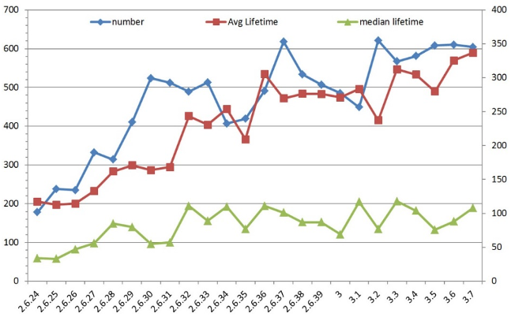

---

#### 当前硬件体系结构的理解

* 单核 -> 多核 -> 众核
* 通用 -> 同构 -> 异构 -> 专用/定制
* 集中 -> 分布 vs 分布 -> 集中

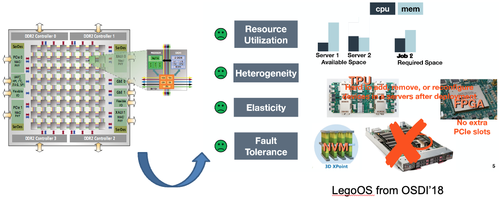

---

#### 当前操作系统的发展变化

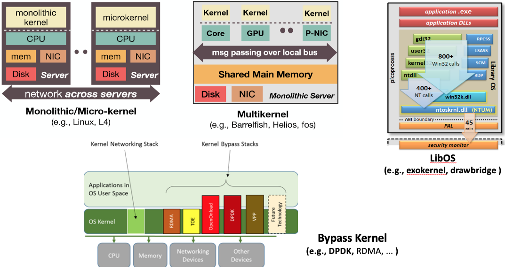

---

#### Top CWEs per Programming Language 2020

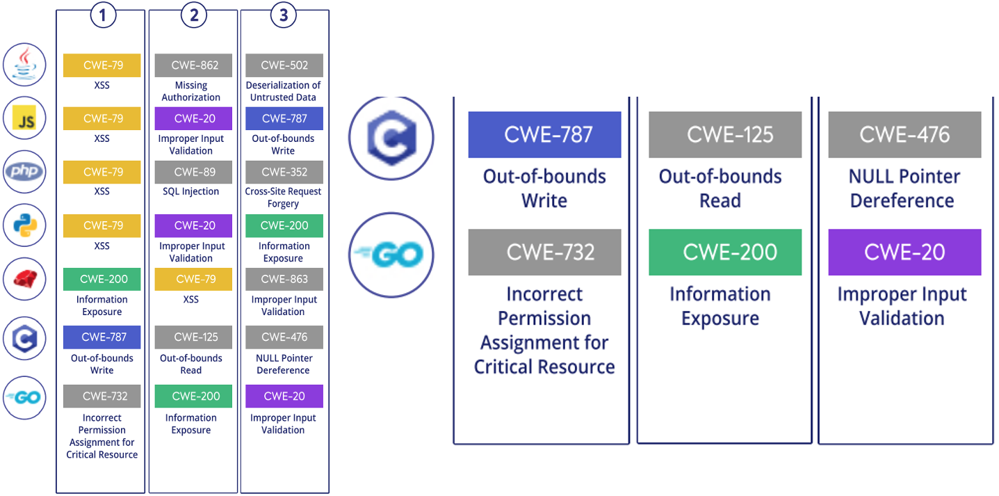

---

#### 当前操作系统的探索

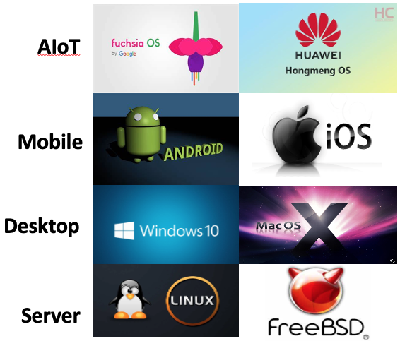


---

#### 用各种编程语言写操作系统的尝试

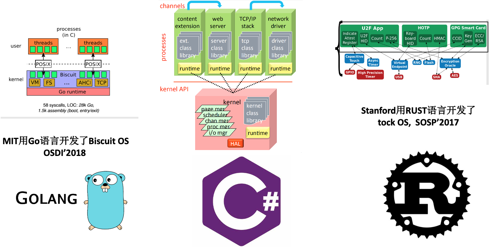

---

#### [Open Software / Standards Work!](https://riscv.org/wp-content/uploads/2018/05/13.00-13.15-RISC-V-ISA-Foundation-Overview-Barcelona-7May2018-1.pdf)

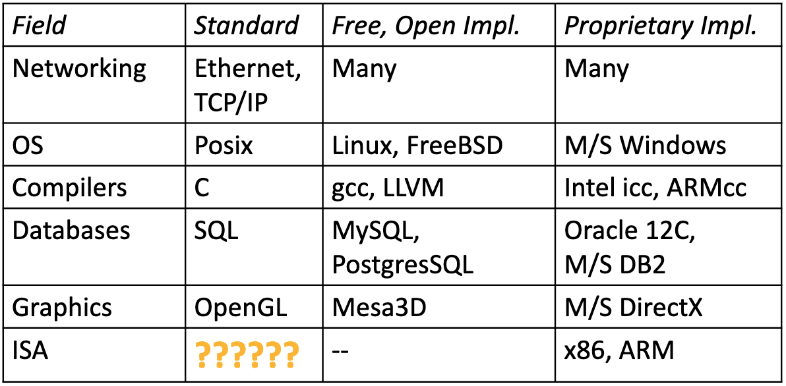

* Why are there no successful free & open ISA standards and free 
  & open implementations, like other fields?

---

#### 

<!-- header: '2. 处理器指令集 - 指令集基础'-->

### 2. [处理器指令集](https://gitee.com/oscomp/seminar5-20210404/blob/main/README.md)

<!--
中科院计算所 张福新：[龙芯指令集介绍](https://gitee.com/oscomp/seminar5-20210404/blob/main/README.md)

[20210404-张福新-loongarch.pdf](https://cloud.tsinghua.edu.cn/library/dfeaca43-865b-4e7d-bdd3-b1e003885933/work/20200928-操作系统比赛准备/20210404-技术报告)

P4～13:指令集基础
-->

* 指令集基础
* 操作数模式
* 指令集设计
* 指令集比较
* RISC-V指令集

<!--
#### 指令集基础
-->

---


##### 什么是指令集?


 * ISA
    * Instruction Set Architecture
* 软硬件之间的 ‘合同’
  * 硬件所支持的操作(指令)、运行模式和存储界面等的功能定义
  * 上述硬件资源的访问方式
* 不约定具体实现方式和效果
  * 指令快慢
  * 功耗大小等
---

##### 指令集和人类语言的对比
 * 相似之处
    * 都是用于沟通
       * 指令集:硬件和软件沟通
       * 人类语言:人和人
    * 有许多可类比的特性
       * 单词 vs 指令
       * 语法 vs ABI
       * 不同的指令集 vs 不同的语言
 * 差异之处
   * 指令集是精确描述，没有二义性

---

##### 指令集的设计考虑
 * 指令实现
   * 指令格式
   * 操作数模型
   * 数据类型和寻址模式
 * 硬件与软件实现的权衡
   * 应用领域、设计目标
 * 二进制程序接口(ABI)
   * 寄存器等资源使用方式
 * 系统资源管理
   * 虚拟化、安全、扩展等需求


---

##### 指令格式
 * 定长
   * 优点:实现简单，下一个 PC 易计算
   * 缺点:代码密度
     * 相同源代码，RISC 二进制常常比 CISC 大 20-30%
 * 变长
   * 优点:可实现高代码密度
   * 缺点:实现复杂
 * 折中:两个长度
   * MIPS16 和 Arm Thumb
 * 编码:MIPS 3 种格式 vs. LoongArch 11 种 vs. X86 很多种

---

<!-- header: '2. 处理器指令集 - 操作数模式'-->

<!--
#### 操作数模式
-->

##### 操作数模型: memory only

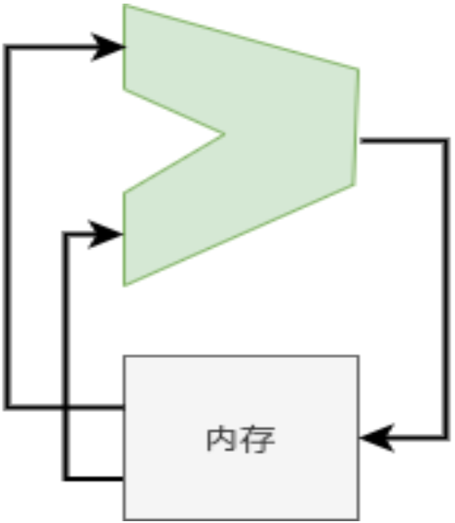


 * 操作数来自哪里?
   * 如何指定它们?
   * 例：A = B + C 的实现
 * Memory Only
   * add B,C,A
   * mem[A] = mem[B] + mem[C]
---

##### 操作数模型: 累加器


 * Accumulator
   * load B; add C; store A
   * ACC = mem[B]; ACC+=mem[C]; mem[A]=ACC
---

##### 操作数模型: 栈操作


 * Stack
     * push B; push C; add; pop A;
     * stk[tos++]=mem[B];
     * stk[tos++]=mem[C];
     * stk[pos++]=stk[–tos]+stk[–tos];
     * mem[A]=stk[–tpos]

---

##### 操作数模型: 寄存器 load-store


 * register load-store
     * load R1,B; load R2,C;
     * add R1, R1, R2; store R1, A;
     * R1=mem[B]; R2=mem[C];
     * R1 = R1 + R2; mem[A]=R1;

---

##### 数据类型和寻址模式
 * 寄存器数量、位宽、虚地址空间大小
     * xx 位处理器
 * 寻址模式: 指定地址的方式
     * register-indirect: 地址 = 寄存器值
     * displacement: 地址 = 寄存器值 + 立即数偏移
     * index-base: 地址=寄存器1值+寄存器2值
     * PC-relative: 地址 =PC + 立即数偏移
     * Scaled: 地址=寄存器1值+寄存器2值*立即数1+ 立即数 2
     * auto-increasement: 寄存器存的地址用完自动增加
     * 等等

---
<!-- header: '2. 处理器指令集 - 指令集设计'-->

<!--
#### 指令集设计的要求
-->


##### 硬件和软件实现的权衡

 * 与场景需求、设计目标相关
     * 高性能 vs. 低功耗
 * 用简单指令合成还是硬件提供?
     * 硬件做比软件有效益才合算，如字节逆序、数0数1等指令
     * X86 的字符串拷贝指令被认为是 bad，不比软件高效
     * 慎重添加可能影响实现效率的复杂指令
 * 总体趋势是硬件指令不断增加
     * 晶体管数量持续增加
     * 向量、DSP、AI 等负载的有效加速

---

<!-- header: '2. 处理器指令集 - ‘好’ 指令集的三要素'-->

#### ‘好’ 指令集的三要素
 * 可编程性
     * 是不是能够有效地表达程序?
 * 可实现性
     * 是不是易于实现高性能?
     * 逐步发展到
         * 是不是易于实现低功耗?
         * 是不是易于实现低成本?
         * 是不是易于实现高可靠?
 * 兼容性
     * 软硬件技术发展时是否易于保持可编程性和可实现性?

---

##### 可编程性
 * 1985 年之前主要是面向人类
    * 尽量接近高级语言?
    * X86 call/rep movsb, Sparc save/restore, VAX insqueue等
 * 1985 之后主要面向编译器
    * 提供完备的底层原语而不是综合方案
        * 编译器擅长把复杂结构分解为简单原语
        * 从一堆复杂指令选择最优不容易
    * 原则
        * 规整
        * 正交、可组合

---

##### 可实现性
 * 不是每种指令集都能高效实现
 * 某些指令集特性使得一些实现技术的应用变得困难
     * 变长指令、复杂格式：译码复杂
 * 可实现性随着技术发展变化
     * 延迟槽在单发射静态调度时能有效提升性能，在超标量动态调度时变成负担

---

##### 兼容性
 * 兼容性非常重要
     * Intel获胜的关键之一
     * Intel推安腾失败，无法动摇自己的生态
 * 兼容性需要指令集设计进行前瞻思考
     * 为了有限的收益引入某些基础性的特性可能带来巨大负担
         * 贴近高级语言：SPARC寄存器窗口
         * 面向当时流水线过度优化：延迟槽
 * 兼容性可以通过技术弥补
     * 二进制翻译

---

<!-- header: '2. 处理器指令集 - 指令集比较'-->

<!--
#### 指令集比较

P14～23:指令集比较
-->

##### RISC vs. CISC

 * CISC
     * VAX/IBM 360&370/X86/Motorola 68000...
 * RISC
     * MIPS/SPARC/POWER/PA-RISC/ALPHA/ARM/RISC-V...
 * 80 年代中期开始的 ‘圣战’
     * RISC赢了技术战争
     * CISC赢了商业战争
 * RISC/CISC界限趋于模糊
     * 现代商业RISC指令集大都超过1000条指令
     * X86内部实现RISC核心

---

##### 面向高级语言的指令集?

<!--
[What about Java Physical Machine?](https://stackoverflow.com/questions/4007579/what-about-java-physical-machine)
-->

 * VAX 等早期指令集有大量面向高级语言特性的设计
     * 缩小语义鸿沟?
 * [JAVA处理器](https://stackoverflow.com/questions/4007579/what-about-java-physical-machine)
     * 不时有人提出类似想法
 * 编译器能够很好地用基础指令实现高级语言的一些特性
     * 面向对象?
     * 定制特性的收益常常比较有限
 * 部分基础性的支持被采纳
     * 边界检查

---

<!-- header: '2. 处理器指令集 - LoongArch指令集'-->

#### RISC-V指令集

<!--
Ref: [RISC-V ISA & Foundation Overview](https://riscv.org/wp-content/uploads/2018/05/13.00-13.15-RISC-V-ISA-Foundation-Overview-Barcelona-7May2018-1.pdf)
-->
---

##### [RISC-V ISA Principles](https://passlab.github.io/CSCE513/notes/lecture04_RISCV_ISA.pdf)

 * Generally kept very simple and extendable
 * Separated into multiple specifications
   * User-Level ISA spec (compute instructions)
   * Compressed ISA spec (16-bit instructions)
   * Privileged ISA spec (supervisor-mode instructions)
   * More ... 
 * ISA support is given by RV + word-width + extensions supported
   * E.g. RV32I means 32-bit RISC-V with support for the I(nteger) instruction set

---

##### [What’s Different about RISC-V?](https://riscv.org/wp-content/uploads/2018/05/13.00-13.15-RISC-V-ISA-Foundation-Overview-Barcelona-7May2018-1.pdf)

* Simple
   * Far smaller than other commercial ISAs 
* Clean-slate design
   * Clear separation between user and privileged ISA
   * Avoids μarchitecture or technology-dependent features 
* A modular ISA
   * Small standard base ISA, and Multiple standard extensions 
* Designed for extensibility/specialization
   * Variable-length instruction encoding
   * Vast opcode space available for instruction-set extensions 
* Stable
   * Base and standard extensions are frozen
   * Additions via optional extensions, not new versions 

---

##### [RISC-V Privileged Architectures](https://github.com/riscv/riscv-isa-manual/releases/download/Ratified-IMFDQC-and-Priv-v1.11/riscv-privileged-20190608.pdf)

Different implementation stacks supporting various forms of privileged execution.

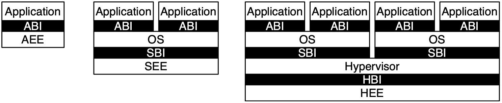

---

##### RISC-V Base Plus Standard Extensions

* Four base integer ISAs
   * RV32E, RV32I, RV64I, RV128I
   * Only <50 hardware instructions needed for base 
* Standard extensions
   * M: Integer multiply/divide
   * A: Atomic memory operations (AMOs + LR/SC)
   * F: Single-precision floating-point
   * D: Double-precision floating-point
   * G = IMAFD, “General-purpose” ISA
   * Q: Quad-precision floating-point
   * C: compressed 16b encodings for 32b instructions

All the above are a fairly standard RISC encoding in a fixed 32-bit instruction format

---

##### RISC-V ISA

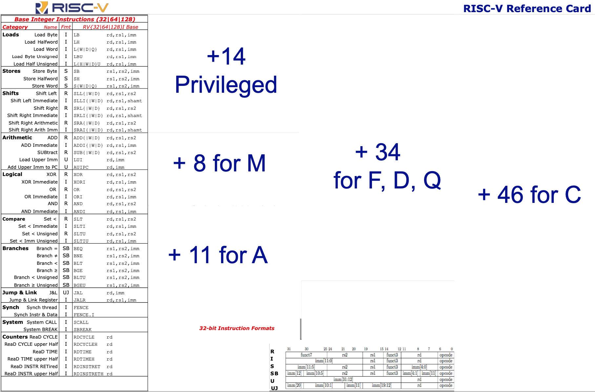

---

<!-- header: '3. 程序设计语言基础'-->

### 3. 程序设计语言基础

<!--
[NASAC2018—系统软件教育论坛](https://s4plus.ustc.edu.cn/conferences/list.htm)：编程语言及原理类课程教学探索 张昱（中国科学技术大学）[2YuZhang.pdf](https://s4plus.ustc.edu.cn/_upload/article/files/57/c6/a2ce9bd84b2ab411967842a1334d/dee3907e-01a6-40a9-9613-275981eb50cc.pdf)

编程语言基础课[实验代码仓库](https://github.com/ustc-pldpa/2018s)

P8：程序设计语言基础：不同语言特征及 其语义和实现影响因素

P10: 各种语言背后的通用概念和理论

P14: 编程语言的基本知识点
-->

---

<!--
#### 程序设计语言概念

P17～18:编程语言概念
-->


#### 程序设计语言的[演变](https://www.thesoftwareguild.com/wp-content/uploads/2017/09/Programming-Languages-Through-the-Years-Infographic.pdf)


---

#### 程序设计语言的通用概念

 * 概念上，涵盖命令式语言、函数式语言、面向对象语言、并发和并行语言以及逻辑语言的各种基本语言设施，包括控制结构、作用域、内存管理、高阶函数、继承、并发机制、新型并行编程模型等
 * 理论上，介绍各种基础语言设施的形式化语义，包括静态语义和操作语义，以及相应的程序验证技术，如Hoare逻辑和类型系统等

---

#### 程序设计语言分类

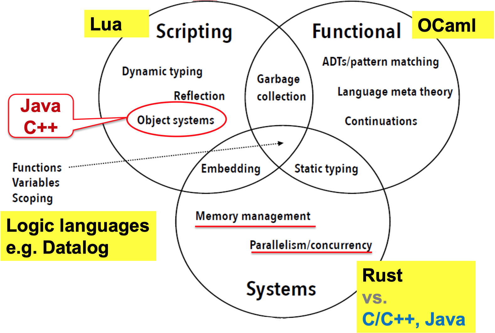

---

#### 程序设计语言中的基本概念

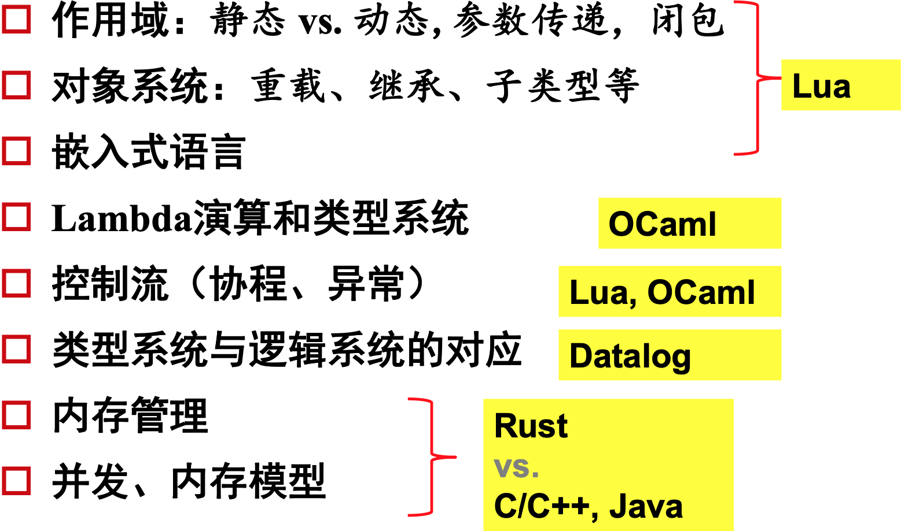

---

<!--
#### 程序设计语言基础课的[编程作业](https://github.com/ustc-pldpa/2018s)

P19: 编程语言实验

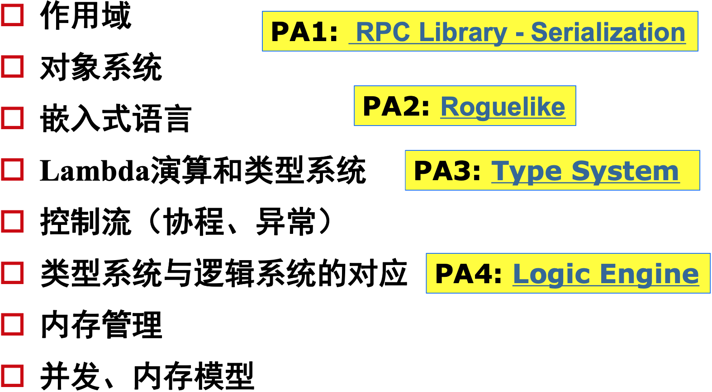


---
-->

<!-- header: '4. Rust语言'-->

### 4. Rust语言

<!--
20210812-张汉东的报告：Rust的最新进展和社区生态

20210812-1-Rust最新进展和社区生态.pptx
-->

---


#### Rust 语言历史
<!--
P6: Rust 语言历史
-->

1. 2008年开始由Graydon Hoare私人研发
1. 2009年得到Mozilla赞助，2010年首次发布0.1.0版本，用于Servo引擎的研发
1. 2015年5月15号发布1.0版本
1. 2018年发布2018 Edition
1. 2021年2月9号，Rust基金会宣布成立。

从 2016 年开始，截止到 2021年，Rust 连续六年成为StackOverflow 语言榜上最受欢迎的语言


<!--
[Rust语言特点及其在开发中的应用](https://www.bilibili.com/video/BV1ti4y1b7xy?from=search&seid=3999632637077780986)

[编程语言中的变革者 | 敢于打造理想世界的 Rust](https://cloud.tencent.com/developer/article/1617845)

[透过 Rust 探索系统的本原：编程语言](https://cloud.tencent.com/developer/article/1816815)
很好的Rust的设计分析；
-->

---

#### Rust 语言的[目标](https://cloud.tencent.com/developer/article/1617845)

<!--
P16: rust的特征；
-->

融合优秀语言特征，创造一门安全和性能兼备的语言。

1. 内存安全（内存访问模型抽象、类型安全的类型系统）
2. 性能（所有的细节都是可以高效控制）
3. 线程安全（并发执行模型抽象）
---
<!--

#### Rust语言设计哲学
P17: Rust的设计原则；

1. 内存安全
2. 零成本抽象
3. 语言一致性
4. 实用性
---
-->

#### 编程语言设计上的取舍

<!--
[透过 Rust 探索系统的本原：编程语言](https://cloud.tencent.com/developer/article/1816815)
-->


---

#### Rust语言架构

<!--
P18: Rust语言架构；
-->

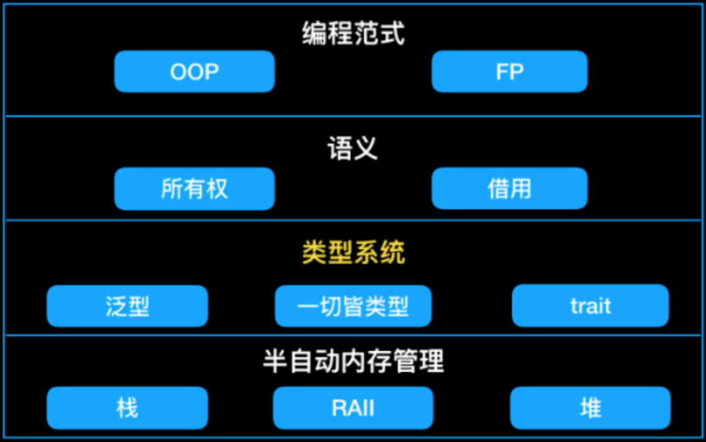

---

#### [rust memory container](https://github.com/usagi/rust-memory-container-cs/blob/master/3840x2160/rust-memory-container-cs-3840x2160-light-back-low-contrast.png)


---

<!--
#### Rust语言特征

P19: Rust的语言特征：
-->

##### Rust的语言特征：内存安全

<!--
https://web.ecs.syr.edu/courses/cis352/slides/22rust4up.pdf
-->

内存安全：所有权、借用、不可变与可变
内存分配和方法分发：栈和堆；

 * Ownership
    * A variable binding takes ownership of its data. [lifetimes]
        * A piece of data can only have one owner at a time.
    * When a binding goes out of scope, the bound data is released automatically.
        * For heap-allocated data, this means de-allocation.
    * Data must be guaranteed to outlive its references.
```rust
let v1 = vec![1, 2, 3];
let v2 = v1; // Ownership of the Vec object moves to v2.
println!("", v1[2]); // error: use of moved value ‘v1‘
```
<!--
[透过 Rust 探索系统的本原：编程语言](https://cloud.tencent.com/developer/article/1816815)
-->

---

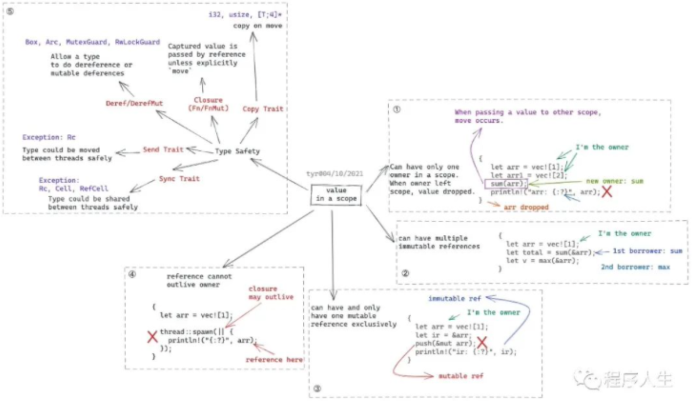

---

##### Rust的语言特征：线程安全

 * 线程安全：原子类型
 * 错误处理：空指针和异常处理；
 * trait：类型的行为的抽象；
 * safe与unsafe：开发者和编译器间的信任；

---

##### Rust的语言特征：性能

###### Concept of Future

<!--
Ref: https://os.phil-opp.com/async-await/#example
-->

A future is a representation of some operation which will complete in the future.


---

###### Concept of Future

* Three phases in asynchronous task:

  1. **Executor**: A Future is polled which result in the task progressing
     - Until a point where it can no longer make progress
  2. **Reactor**: Register an event source that a Future is waiting for
     - Makes sure that it will wake the Future when that event is ready
  3. **Waker**: The event happens and the Future is woken up
     - Wake up to the executor which polled the Future
     - Schedule the future to be polled again and make further progress

---

###### 异步机制：green thread, coroutine (future)

<!--
基于轮询的 Future的异步执行过程

- 执行器会轮询 `Future`，直到最终 `Future` 需要执行某种 I/O 
- 该 `Future` 将被移交给处理 I/O 的反应器，即 `Future` 会等待该特定 I/O 
- I/O 事件发生时，反应器将使用传递的`Waker` 参数唤醒 `Future` ，传回执行器
- 循环上述三步，直到最终`future`任务完成（resolved）
- 任务完成并得出结果时，执行器释放句柄和整个`Future`，整个调用过程就完成了
  -->


---

##### Rust的语言特征：其他

* 宏
* FFI：混合编程；
* 包管理

---

#### Rust语言社区生态
<!--
P20～39: Rust语言社区生态
-->

截止目前，crates.io上面已经有62981个crate，总下载量已经达到7,654,973,261次。
Crates.io最流行的几个场景依次如下：

1. 命令行工具（3133 crates）
1. no-std库（2778 crates）
1. 开发工具（测试/debug/linting/性能检测等，2652 crates）
1. Web编程（1776 crates）
1. API绑定（方便Rust使用的特定api包装，比如http api、ffi相关api等，1738 crates）
1. 网络编程（1615 crates）
1. 数据结构（1572 crates）

此外，还有嵌入式开发、加密技术、异步开发、算法、科学计算、WebAssembly、编码、并发、GUI、游戏引擎、可视化、模版引擎、解析器、操作系统绑定等分类。

---

<!-- header: '5. 操作系统与程序设计语言和指令集的协同 - CPU对并发的支持'-->

### 5. 操作系统与程序设计语言和指令集的协同

1. CPU对并发的支持
2. 操作系统对并发的支持
3. 进程、线程和协程


---

#### CPU对并发的支持

##### [中断概念](https://blog.csdn.net/qq_43811102/article/details/103334022)

程序执行中，由于异常情况，CPU上正在执行的程序会被“中断”，转到处理异常情况或特殊事件的程序去执行，结束后再返回到原被“中断”的程序处继续执行。


---

##### [Interrupt Cycle](https://binaryterms.com/interrupts-in-computer-architecture.html)


---

##### [RISC-V中断](https://www.latticesemi.com/-/media/LatticeSemi/Images/ProductImages/DesignSoftwareandIntellectualProperty/IP/IPCores04/RISC-V_SM_IP_Block_Diagram.ashx)


---

##### [RISC-V PLIC interrupt Flow](https://riscv.org/wp-content/uploads/2016/07/Tue0900_RISCV-20160712-Interrupts.pdf)

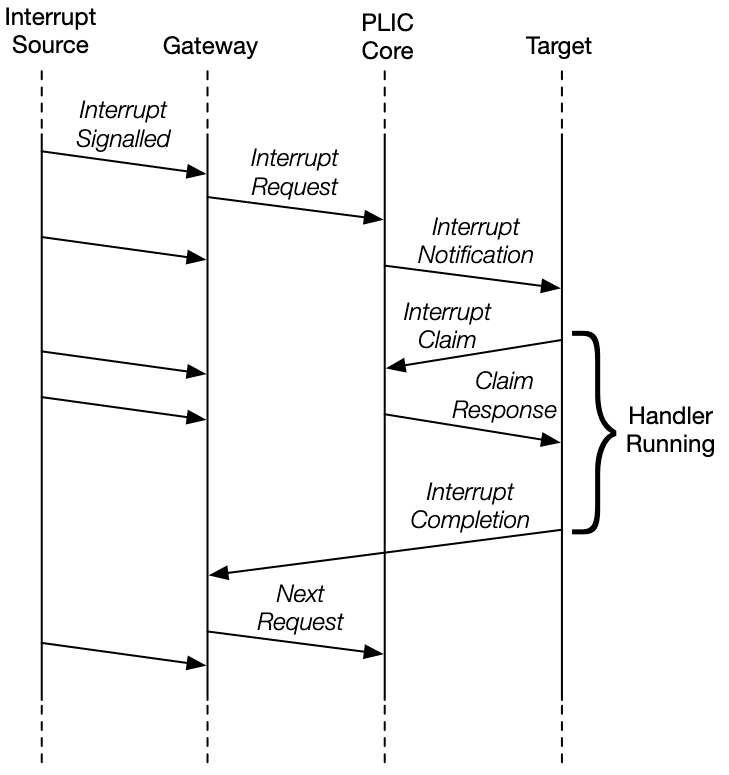

<!-- header: '5. 操作系统与程序设计语言和指令集的协同 - 操作系统对并发的支持'-->

---

#### 操作系统对并发的支持

##### [操作系统服务](https://www.cnblogs.com/kexinxin/p/9939040.html)


---

##### [系统调用](https://www.jianshu.com/p/14f715a5184e)


---

##### 内核的进入与退出


---

##### [硬中断的响应过程](https://zhuanlan.zhihu.com/p/360548214)


---

##### [操作系统的中断响应过程](https://en.wikipedia.org/wiki/Interrupt#/media/File:Interrupt_Process.PNG)

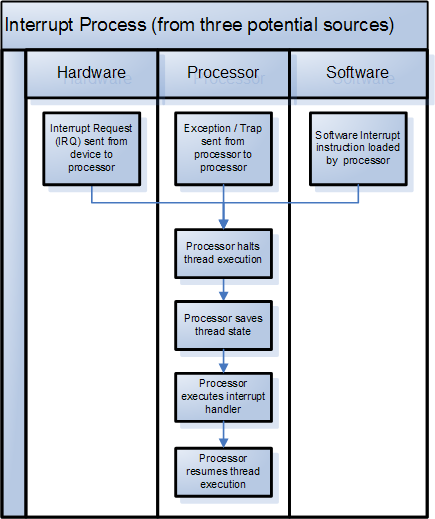

---

##### 信号（[Signal](http://kernel.meizu.com/linux-signal.html))

用户态的异常处理机制

* 信号（Signal）响应时机

  * 发送信号并没有发生硬中断，只是把信号挂载到目标进程的信号 pending 队列
  * 信号执行时机：进程执行完异常/中断返回用户态的时刻


---

###### 信号处理

* 用户注册的信号处理函数都是用户态的
  * 先构造堆栈，返回用户态去执行自定义信号处理函数
  * 再返回内核态继续被信号打断的返回用户态的动作。


---

<!-- header: '5. 操作系统与程序设计语言和指令集的协同 - 进程、线程和协程'-->

#### 进程、线程和协程

##### Multitasking

<!--
参考： https://cfsamson.github.io/book-exploring-async-basics/2_async_history.html#non-preemptive-multitasking
-->

* Non-Preemptive multitasking
  - The programmer `yielded` control to the OS
  - Every bug could halt the entire system
  - Example: Windows 95
* Preemptive multitasking
  - OS can stop the execution of a process, do something else, and switch back
  - OS is responsible for scheduling tasks
  - Example: UNIX, Linux

---

##### User-level Thread

<!--
参考： https://stackoverflow.com/questions/15983872/difference-between-user-level-and-kernel-supported-threads

https://cfsamson.github.io/books-futures-explained/0_background_information.html#green-threads
-->

* Advantages
  - Simple to use
  - A "context switch" is reasonably fast
  - Each stack only gets a little memory
  - Easy to incorporate [*preemption*](https://cfsamson.gitbook.io/green-threads-explained-in-200-lines-of-rust/green-threads#preemptive-multitasking)
* Drawbacks
  - The stacks might need to grow
  - Need to save all the CPU state on every switch
  - Complicated to implement correctly if you want to support many different platforms
  - Example: [Green Threads](https://cfsamson.github.io/books-futures-explained/0_background_information.html#green-threads)

---

##### Kernel-supported Threads

<!--
ref: https://stackoverflow.com/questions/15983872/difference-between-user-level-and-kernel-supported-threads
https://cfsamson.github.io/books-futures-explained/0_background_information.html#threads-provided-by-the-operating-system
-->


* **Advantages**
  - Easy to use
  - Switching between tasks is reasonably fast
  - Geting parallelism for free
* **Drawbacks**
  - OS level threads come with a rather large stack
  - There are a lot of syscalls involved
  - Might not be an option on some systems, such as http server

Example: [Using OS threads in Rust](https://cfsamson.github.io/books-futures-explained/0_background_information.html#threads-provided-by-the-operating-system)

---

##### 并发模型与调度

并发机制：

* 内核线程：内核实现
* 用户线程：用户库实现、语言支持
* 协程：用户库实现、语言支持

上下文切换与调度器：执行流控制

* 协程切换：主动让权
* 中断上下文保存与恢复：基于中断
* 线程切换：基于时钟中断、主动让权
* 进程切换：基于时钟中断、主动让权

<!--
指令集、操作系统、用户库、编译器（语言）

---

##### 内存管理

 * 栈空间：编译器管理
 * 堆空间：操作系统管理

-->

---

##### 异常和错误处理

 * 内核中断机制：硬件与操作系统协作
   * 用户态中断：硬件、操作系统和应用协作管理
 * rust中的option：程序设计语言管理
 * 信号：操作系统和应用协作管理

---

<!-- header: '6. 异步操作系统构想 - 异步操作系统构想'-->

### 6. 异步操作系统构想

#### 异步操作系统构想

##### [异步操作系统设计](https://github.com/async-kernel/documents/blob/main/design/design.md)的整体目标

在RISC-V平台上设计并实现一个基于Rust语言的异步操作系统。

1. 在操作系统内核中实现细粒度的并发安全、模块化和可定制特征；
2. 利用Rust语言的异步机制，优化操作系统内核的并发性能；
3. 向应用程序提供的异步系统调用接口，优化操作系统的系统调用访问性能；
4. 结合LLVM中Rust语言编译器的异步支持技术，完善操作系统的进程、线程和协程概念，统一进程、线程和协程的调度机制；
5. 利用RISC-V平台的用户态中断技术，优化操作系统的信号和进程通信性能；
6. 开发原型系统，对异步操作系统的特征进行定量性的评估。

---

##### [任务管理：进程、线程与协程](https://github.com/async-kernel/documents/blob/main/design/design.md#任务管理进程线程与协程)

- 进程：每个进程有独立的地址空间，因此有页表切换开销；
  - 在异步操作系统中，内核被视为一个独立的进程，有自己的独立的页表；
  - 系统调用过程会变成一种特殊和优化的进程切换。
  - 进程切换代码是在所有进程的内核态共享的。
- 线程：每个线程有独立的用户栈，切换时需要保存和恢复全部寄存器。
  - 由于内核与用户线程不在一个地址空间中，每个用户线程只有用户栈，不存在对应的内核栈；
  - 每个内核线程只有内核栈，不存在对应的用户栈。
- 协程：可以理解为状态机转移函数，执行时可共用同一个栈。
  - 每个线程内可以有多个协程。
  - 编译器将 async 函数变换成状态机时，函数中需要跨越 await 的变量将存放在 Future 对象中（一般在堆上），其它变量只需放在栈上或寄存器中。

---

##### [理想的协程切换过程](https://github.com/async-kernel/documents/blob/main/design/design.md#理想的协程切换过程贾越凯细化)（[协程、线程和进程的调度](https://github.com/async-kernel/documents/blob/main/design/design.md#协程线程和进程的调度)）

在统一了进程、线程和协程的管理数据结构后，协程切换可表现为不同进程和不同线程中的下一个就绪协程选择。

1. 协程切换：同一进程中主动让权协程间的切换；
   * 这时的协程切换相当于当前线程内的函数调用；
   * 由编译器自动生成的有限状态机切换代码完成协程切换；
2. 线程切换：同一进程中由于被抢占让权协程间的切换；
   * 由于被抢占时堆栈可能非空，这时的切换需要进行用户堆栈保存和切换；
   * 由内核提供的线程切换代码完成线程切换；
3. 进程切换：不同进程中由于被抢占让权协程间的切换；
   * 由操作系统内核完成进程切换；
   * 保存当前用户堆栈，切换到内核态，完成进程地址空间；

---

##### [理想的异步系统调用](https://github.com/async-kernel/documents/blob/main/design/design.md#理想的异步系统调用接口)

* 用户态的异步系统调用会执行编译器自动生成相应的系统调用请求代码，维护协程控制块数据结构；
* 在第一次系统调用请求时和最后一次系统调用完成时，需要进入内核；
* 中间的各次系统调用只进行系统调用的请求提交和结果查询，并进行进程、线程或协程切换。
* 在当前协程的系统调用还没有结果返回且没有新的可执行用户任务时，才会进行协程切换。

<!-- header: '6. 异步操作系统构想 - 目前进展'-->

---

#### 目前进展

##### 尤予阳、贺锟鹏：RISC-V的用户态中断扩展
<!-- 
ref：Evernote：20210925-第五次操作系统专题训练课安排
-->
在QEMU和FPGA上初步实现用户态中断的支持：
* 用户态中断的注册通过系统调用在内核进程进行处理。
* 用户态中断支持的信号处理过程，可完全在用户态完成，不需要内核的参与。

面临的挑战：

* 中断编号：需要标识中断的类型、中断源和中断目的方标识；
* 中断请求和响应的硬件支持：中断目的方可能处于暂停或在不同CPU上运行；

---

###### [软硬件协同的用户态中断扩展](https://gallium70.github.io/rv-n-ext-impl/intro.html)


---

###### [用户态陷入的硬件处理流程](https://lexiangla.com/teams/k100041/classes/e47ce740189811ecaccbb68950a81bc7/courses/553897ce225111ecbdf9469b8754dc9a)


---

##### 车春池、蒋周奇：[共享调度器](https://qf.rs/2021/04/23/异步内核的设计与实现.html)

在操作系统层面提供协程

* 共享调度器直接将所使用的代码、任务池资源都共享到用户，由用户运行和内核相同的代码。
* 用户进程与内核以相同的逻辑处理任务池中的任务。

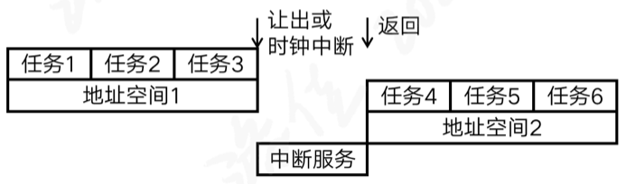

---

##### 王文智：[线程与协程的统一调度](https://lexiangla.com/teams/k100041/classes/14e3d0ba33e211ecb668e28d1509205c/courses/8b52ee1233e111ecbcb4be09afb7b0ee)

1. 协程与线程灵活绑定；
2. 实现协程（future）在单CPU上并发执行；在多CPU上执行，可并行执行；
3. 线程和协程可采取不同的调度策略；
4. 沿用线程中断的处理过程，协程可被强制中断；


---

##### 吴非凡：[异步系统调用](https://rcore-os.github.io/blog/2021/09/09/2021开源操作系统夏令营总结-异步系统调用-吴非凡/)

###### 用户视图

1. 用户利用异步系统调用函数和 Rust 的 async/await ,生成对应的 Future 树,交由对应的 UserExecutor 进行处理。
2. UserExecutor 取出一个 UserTask,判断是否已经注册到UserReactor 。对没注册的任务 poll 一次后,若为 pending则注册到 UserReactor。对于其他注册的任务,查询UserReactor,若准备就绪就 Poll 一次并更新在 UserReactor的状态。
3. 对于其中的 Leaf Future ,在 UserExecutor 的执行流中,会发送系统调用,陷入内核,在内核简单注册后立即返回Pending。
4. 内核完成后,会向用户发送用户态中断
5. 用户态中断处理程序向 UserReactor 发送事件唤醒对应的UserTask

---

###### 内核视图

1. 内核陷入程序判断是 UserEnvTrap 在将寄存器参数和执行流交由内核中的 syscall 函数处理。
2. 对于有异步拓展的 syscall 函数首先判断系统调用的异步参数(编码后的用户任务号)是否为 0. 0 代表是同步系统调用,非零则代表是异步系统调用
3. 异步版本的系统调用会将生成的 Future 交给 KernelExecutor,并返回Future 的注册信息(成功与否) 。
4. 陷入函数退出。

---

### 总结

* 对于操作系统，开源与协作将是极具潜力的发展策略
  * 在十一年的时间里，RISC-V从大学项目开始，做到目前的认可程度；
  * 在十三年的时间里，Rust从个人项目开始，做到目前广泛关注；
* 操作系统与CPU指令集和编程语言的协作有可能带来创新的思路
  * 提高操作系统的性能
  * 降低操作系统的开发难度
  * 减少操作系统的漏洞
* 在硬件技术和编译技术的协作下，异步编程技术有可能深入影响操作系统的发展。
